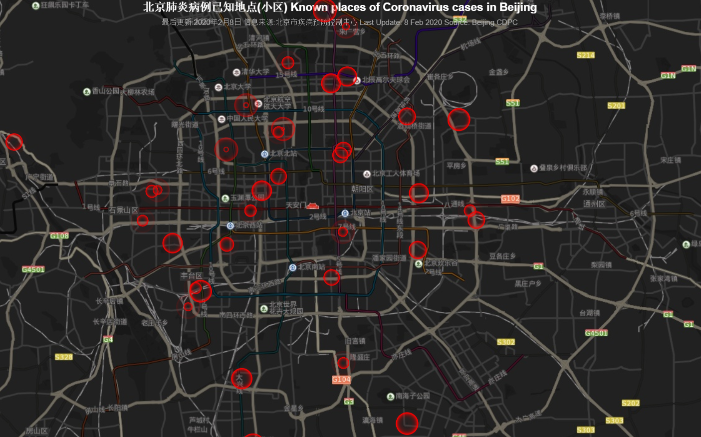

## 太长不看版 (TL;DR)

截止到2月8日24时，北京市新冠肺炎病例呈一下特点：

* 疫情持续由输入期向传播期过渡，目前绝大多数新增病例为已有病例的密切接触者；家庭成员之间的防护措施不可忽略
* 目前有个别病例并无接触史，可能在市内公共场所被传染；理清这些病例的外出接触史十分重要
* 输入性病例占比降低，各大企事业单位延长假期，城市间控制人员流动对疫情的防控有积极作用
* 朝阳和海淀病例总数和新增病例较多，防控压力较大

北京市官方开始发布新增病例活动的场所和小区，我已经将数据做成<a href="/2019ncov_map/beijing.html">在线地图</a>，并将持续更新。祝大家健康平安！

The following patterns have been observed for new novel coronavirus cases in Beijing:

* New cases in Beijing has become more likely to be infected in the city, rather than from other cities; Most of new cases are the close contacts of previously confirmed cases, meaning protection within families is also important
* A few cases do not have any contact history, suggesting that they might have been infected in public places in Beijing; tracking these places down is crucial
* Prolonging the holiday and placing travel control helped to lower the number of imported cases
* Chaoyang and Haidian district are facing pressures due to a relatively large number of new cases and existing cases

Beijing government has started to publish places where the new cases were found. I have gathered the data and made a <a href="/2019ncov_map/beijing.html">map</a>. This will be updated daily. Hope you all stay safe and healthy!

## 更新介绍 (Introduction)

本文是对北京市官方发布的新冠肺炎疫情数据分析的第二篇。由于市卫健委在2月2日后停止发布病例明细，我也将不会更新个体病例的分析。本文更新了病例接触史，各区县疫情情况，并且新加入了已知病例曾经活动过的小区和场所的地图。

This is the second data analysis post of the novel coronavirus cases in Beijing. Beijing Municipal Health Commission had stopped publishing the details of individual cases (e.g. age, sex, time of the first symptoms, etc.). As such, I will not be updating the case analysis. This post will be focusing on the analysis of contact history, the number of cases in each district and the known places of novel coronavirus cases in Beijing.

## 接触史 (Contact History)

    
    

截至到2月8日，北京市新增新冠肺炎病例持续由外省输入向市内传播过度。2月7日和8日的绝大多数感染病例无湖北和其他省份接触史。这些病例大部分为之前病例的密切接触者。但是值得注意的是，从2月2日开始，陆续开始出现无已知接触史的病例（图中蓝色柱）。这些病例暗示着病毒已在市内某些公共场所传播。调查清楚这些病例的活动接触史，对防控工作十分重要。人们已经陆续返工，但输入性病例并没有大幅度增加。这说明各单位延长假期，城市间减少人员流动对疫情传入的控制有一定成效。

New cases in Beijing has become more likely to be infected in the city, rather than bringing in the virus from Hubei or other cities. Most of the new cases in 7 and 8 of February did not have travel history in other cities and they tend to be close contacts of the previously infected cases. However, there has been an increasing number of cases who have neither known contact nor travel history (blue bars in the chart). This suggests they may have been infected in public places in Beijing. Tracking down their activities is vital to prevent further outbreaks of the disease. The holiday season has come to the end. But there is no substantial increase of cases in people who have travel history (i.e. imported cases), suggesting that prolonging the holiday and placing travel control helped to contain the disease.

## 各区县情况 (Cases by District)

    
    

截止到2月8日，朝阳的新冠肺炎病例已超过海淀，两区病例增长均较快。朝阳区和海淀区人口密集，流动量大，仍将是防控重点。西城，大兴和丰台区在最近一星期内增长较快，但目前速度放缓。来京人员病例数量在本周经过一短时间的增长后开始放缓。其他城区确诊病例均少于20例，其中密云本周新增5例，平谷无病例。

Chaoyang has surpassed Haidain in the number of confirmed cases. Both districts are facing a speedy increase in new cases. Due to the high population density and mobility, these two districts will continue to be the focus of the prevention and control of the disease. Xicheng, Daxing and Fengtai saw a rapid growth earlier this week but has slowed down since then. So did the number of non-resident cases. All other districts have less than 20 confirmed cases. Miyun, which previously had no case, saw 5 new cases this week. No confirmed case has been reported in Pinggu so far.

## 发病例活动小区或场所 (Known Places of the New Cases)

以下地图是由从北京市疾病预防控制中心发布的新冠肺炎新发病例活动小区或场所信息所制，只包含自2月5日起官方发布的地点。2月5日之前确诊的病例的活动地点并没有官方数据。确诊病例已收入定点医院进行救治，小区居民不用过度担心和焦虑，但仍请做好必要的防护措施。我会每天定时更新地图。实时地图，请戳<a href="/2019ncov_map/beijing.html">这里</a>。

The map below is constructed using data from Beijing Center for Diseases Prevention and Control. They have been publishing known places of the new cases since 5 Feb. Data for the cases before the date is not available. Confirmed cases all have been hospitalised but necessary protection and caution is still required for residents nearby. I will be updating the map daily, please <a href="/2019ncov_map/beijing.html">click here</a> for the latest map.

## 数据说明 (About the Data)

病例接触史及各区县疫情数据来自于北京市卫健委-新型冠状病毒感染的肺炎疫情防控专栏的[疫情通报](http://wjw.beijing.gov.cn/wjwh/ztzl/xxgzbd/gzbdyqtb/index_1.html)单元。已知病例曾经活动过的小区和场所来自北京市疾病预防控制中心的新型冠状病毒防控[疫情防控](http://www.bjcdc.org/ColumnAction.do?dispatch=getEjPage&id=4473&cID=4493)单元。两个数据源的数据主要是文字介绍和图片化的表格，经我录入整理后分析。整理好的数据我以上传到[Github](https://github.com/presstofan/2019-nCov-data-collection)。我将会持续更细。欢迎下载使用，但请遵守[知识共享许可协议](https://creativecommons.org/licenses/by/4.0/)。地图可视化由百度地图提供，并感谢Lchiffon制作的[REmap R library](https://github.com/Lchiffon/REmap)。

Data for contact history of the novel Coronavirus cases and number of cases in each districts was gathered from [Beijing Municipal Health Commission](http://wjw.beijing.gov.cn/wjwh/ztzl/xxgzbd/gzbdyqtb/). Known places of the cases were gathered from [Beijing Center for Diseases Prevention and Control](http://www.bjcdc.org/ColumnAction.do?dispatch=getEjPage&id=4473&cID=4493). The data is mainly in the form of text or image. I have manually (or with the help of scripts) collected them into databases, which I have published in [this GitHub repo](https://github.com/presstofan/2019-nCov-data-collection). Please feel free to use it under the [Creative Common License](https://creativecommons.org/licenses/by/4.0/). Special thanks to Lchiffon, the author of [REmap](https://github.com/Lchiffon/REmap), which utilises Baidu Map to make the visualisation possible.
