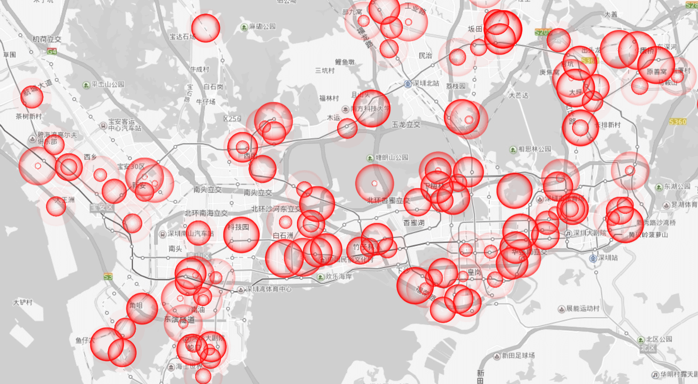

## 太长不看版 (TL;DR)

截止到2月15日，通过对官方发布的数据进行分析可知深圳市新冠肺炎病例呈以下特点：

* 与北京相同，没有证据证明男性或者女性更加易感
* 随着时间的推移，感染人群的平均年龄开始下降，儿童病例增多
* 人们的防范意识逐渐提高，发病到入院时间逐渐降低，有利于疫情的防控
* 输入性病例及其密切基础者仍占确诊病例的主体；市内公共空间传播的风险较小
* 南山，福田，龙岗和宝安病例较多，但增长速度放缓
* （2月25日更新）年龄较大的患者康复所需时间更长; 80岁患者在25天内治愈出院的概率只有20岁患者的一半

深圳市官方持续发布新增病例活动的场所和小区，我已经将数据做成<a href="/2019ncov_map/shenzhen.html">在线地图</a>，并将持续更新。祝大家一切安好！

The following patterns have been observed for COVID-19 cases in Shenzhen:

* Similar to Beijing, there is no evidence to suggest either males or females are more susceptible to the virus
* The average age of cases has been decreasing with more children being infected
* The time between the onset of symptoms and admission has been reducing, thanks to the increasing awareness of the disease and effort in prevention and control
* Most of the cases found in Shenzhen are people who have travel history in Hubei or other provinces or/and contact history of other infected cases; the risk of being infected in public places in Shenzhen remains low
* Nanshan, Futian, Longgang and Baoan have the most number of cases. However, the growth rate has been dropping
* (Updated on 25 Feb) Older patients take longer time to recover; the chance of recovery within 25 days for a 80-year-old patient is only half of that of a 20-year-old

Shenzhen government has been publishing places where the new cases were found. I have gathered the data and made a <a href="/2019ncov_map/shenzhen.html">map</a>. This will be updated daily. Hope you all stay safe and healthy!

## 性别 (Sex)

已获得的406例病例中，52.0%为女性，统计学不显著。没有证据证明男性或者女性更加易感。

Of the first 406 cases, 52.0% is female. The difference is not statistically significant.

## 年龄 (Age)

目前深圳新冠肺炎病例（共406例）年龄分布如下。30-40岁以及60-65岁人数较多，同北京数据一样呈现双峰分布。30-40年龄段人员流动性大，更可能表现为输入性病例。而中老年人病例数量较多则有可能是因为该人群更加易感。随着样本数量增大，曲线将更加接近病毒感染的真是状况，以上猜测也将得到证明（证伪）。

Below chart shows the age distribution of the first 406 cases in Shenzhen. It tentatively shows two peaks, one at age 30-40 and one at age 60-65. This is similar to what we have observed for the first 175 cases in Beijing. The peak consists of younger people could be linked to their mobility while the older group might be more susceptible to infection. With a bigger sample size, the noise can be reduced and we can take another look to confirm this.

    
    

随着时间的推移，更多年轻人被感染（尤其是有很多儿童）。这导致了病例的平均年龄有所下降。这些年轻病例有可能是输入性病例的密切接触者（家人）。另一种可能是病毒在年轻人体内潜伏期更长，出现症状较晚。我们需要研究个体病例之间的联系而解决这一问题。

Over time, we saw more young people being infected (particularly those younger than 10 years old), dragging down the average age. Those young people could be the close contact of the imported cases. But it is also likely to be the case that young people have longer incubation period, delaying the onset of the symptoms. Understanding the relation between cases would help us to test these hypotheses.

    
    

## 发病到入院时间 (Time Between First Symptoms and Hospital Admission)

发病到入院时间越短，病毒传播的风险则越小。截止到2月15日，病例从发病到入院的平均天数为4天。随着人们防范意识的提高，这一数据从最初的9天，下降到了目前的1天。然而，在很长一段时间内，仍有不少病例从发病到入院的时间大于一个星期，这一定程度上加剧的病毒的传播（尤其是家庭成员间）。无亲属感染的病例发病到入院的平均时间为4.7天，而有亲属感染的病例发病到入院的平均时间仅为3.1天。亲属中出现病例后，密切接触者通常会被医学观察，这减少了从发病到入院的时间，降低了传播风险。同时，这也说明无亲属感染的病例更倾向于拖延就诊时间，增加了传播风险。

Shorter time between the onset of symptoms and hospital admission leads to lower risk of spreading the disease. Until now, the average time between first symptoms and admission is 4 days. This was reduced from 9 days at the beginning of the outbreak to 1 day now, thanks to the increasing awareness of the virus and effort of prevention and control. However, there were a couple of days when many cases spent more than a week with symptoms before admitting into hospitals, leading to a high risk of spreading. Cases who do not have infected relatives spent a longer period (4.7 days) with symptoms before being hospitalised than those with infected relatives (3.1 days). The latter group were usually quarantined when their close contacts were diagnosed and this speeds up the admission process. While the former group tend to delay seeking medical advice when developing symptoms.

    
    

    
    

## 接触史 (Contact History)

与北京不同，深圳的病例目前仍然以输入性病例为主，伴随家庭成员间传播。但是值得注意的是，从1月23日开始，陆续开始出现无已知接触史的病例（图中蓝色柱）。这些病例暗示着病毒可能在市内某些公共场所小范围传播。调查清楚这些病例的活动接触史，对防控工作十分重要。

Unlike Beijing, Shenzhen COVID-19 cases tend to be people with travel history in Hubei other other provinces and the close contacts of infected people. However, there has been an increasing number of cases who have neither known contact nor travel history (blue bars in the chart) since 13 Jan. This suggests they may have been infected in public places in Shenzhen. Tracking down their activities is vital to prevent further outbreaks of the disease.

    
    

## 康复时间 (Recovery Time)

{}
康复时间分析模型在2月25日更新。深圳市政府在26日停止发布病例出院的详细信息。

Recovery Time model was last updated on 25 Feb. Shenzhen government had stopped published detail information on discharged patients from 26 Feb.
{}

截止到2月25日，共有262位病人顺利出院（样本共417例）。已出院的病人住院时间的中位数为17天。通过Cox Proportional Hazards模型建模分析发现以下关系：

1. 年龄较大的患者住院时间较长。一名20岁的患者在25天内康复的概率为86%。而80岁患者在25天内康复的概率只有42%。
2. 利用病人康复出院数据建立模型可以更好的预测疫情对医疗资源的消耗情况。随着出院人数的增多，这一模型将更加精确。

262 COVID-19 patients have been discharged from hospitals by 25 Feb (out of the total 417 cases in the sample). The median number of days they spent in hospital is 17. Using Cox Proportional Hazards model, I was able to recover the following patterns:

1. Older patients need longer time to recover. A 20-year-old patient has a 86% chance of recovering within 25 days while an 80-year-old patient only has 42% of chance.
2. Building models using the existing data is useful to predict the demand for medical resources. The accuracy of this model will improve as more patients being discharged.

    
    

## 各城区情况 (Cases by District)

目前深圳病例数量排名前四的是南山，福田，龙岗和宝安。截止到2月15日，以上各区病例数量均多于60例，但在增长趋势缓慢。其他各区近期并无明显增长。

Nanshan, Futian, Longgang and Baoan have the most number of cases in Shenzhen. However, the cases have been growing at a slower pace now. There is no significant growth in new cases in the other districts.

    
    

## 发病例活动小区或场所 (Known Places of the New Cases)

以下地图是由从深圳市卫生健康委员会发布的新冠肺炎新发病例活动小区或场所信息所制，包含自1月31日起官方发布的地点。确诊病例已收入定点医院进行救治，小区居民不用过度担心和焦虑，但仍请做好必要的防护措施。我会每天定时更新地图。实时地图，请戳<a href="/2019nCov_map/shenzhen.html">这里</a>。

The map below is constructed using data from Shenzhen Municipal Health Commission. They have been publishing known places of the new cases since 31 jan. Confirmed cases all have been hospitalised but necessary protection and caution is still required for residents nearby. I will be updating the map daily, please <a href="/2019nCov_map/shenzhen.html">click here</a> for the latest map.

## 数据说明 (About the Data)

病例详细信息, 各区县疫情数据以及已知病例曾经活动过的小区和场所来自于深圳市卫生健康委员会-[疫情信息](http://wjw.sz.gov.cn/yqxx/)单元。数据源的数据主要是文字介绍和图片化的表格，经我录入整理后分析。整理好的数据我已经上传到[Github](https://github.com/presstofan/2019-nCov-data-collection)。我将会持续更新。欢迎下载使用（[知识共享许可协议](https://creativecommons.org/licenses/by/4.0/))。地图可视化由百度地图提供，并感谢Lchiffon制作的[REmap R library](https://github.com/Lchiffon/REmap)。

Data for details of the COVID-19 cases, number of cases in each districts and known places of the cases were gathered from [Shenzhen Municipal Health Commission](http://wjw.sz.gov.cn/yqxx/). The data is mainly in the form of text or image. I have manually (or with the help of scripts) collected them into databases, which I have published in [this GitHub repo](https://github.com/presstofan/2019-nCov-data-collection). Please feel free to use it under the [Creative Common License](https://creativecommons.org/licenses/by/4.0/). Special thanks to Lchiffon, the author of [REmap](https://github.com/Lchiffon/REmap), which utilises Baidu Map to make the visualisation possible.
