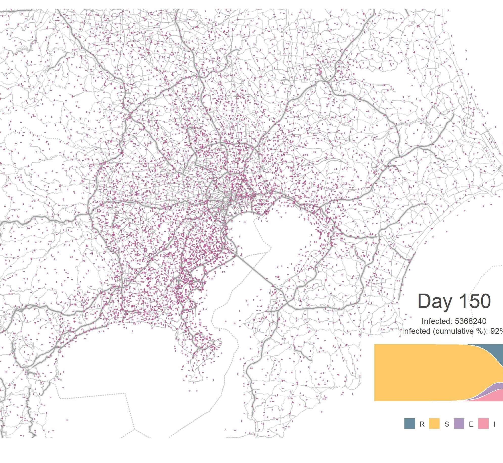

{}

## Introduction

A couple weeks ago, I have written an [article]() about simulating coronavirus outbreak in Tokyo using Origin-Destination (OD) matrix, population mesh data and a simple [SIR model](http://www.public.asu.edu/~hnesse/classes/sir.html) with some assumptions. I shared in on the subreddit [dataisbeautiful](https://www.reddit.com/r/dataisbeautiful/) and have received many constructive comments. Some of them are suggestions about the model itself as the SIR model does not account for the potential incubation period that COVID-19 has shown. In the previous model, I have also played down the effect of local transmission in order to focus on the pattern of transmission across different locations. This resulted in a manageable but simplistic model. Although "all models are wrong", it doesn't mean that we can't improve it and experiment further. Therefore, I have made the following updates to the previous model, hoping to understand it better: 1) update the SIR model to [SEIR model](http://www.public.asu.edu/~hnesse/classes/seir.html) by including an extra "Exposed" compartment; 2) simulate the local transmission in addition to the cross-location transmission; 3) expand the simulated area to cover the Greater Tokyo Area as many commuters don't live in central Tokyo and 4) add more scenarios including lockdown to simulate the measures we can take to manage the outbreak.

Some readers have also asked me to share the code behind the simulations, which I have decided to include in this slightly more technical article. I will start by explaining the model, then the data (including the data cleaning process) and finally the simulation itself. I will include code in each section. The data cleaning, simulation and visualisation are based on R code but I believe they can also be achieved using Python with some tweaking. The complete code is available in this [repository](https://github.com/presstofan/covid-19-city-sim).

I am not an epidemiologist and the simulation is by no means an accurate prediction of the outbreak. However, I found this exercise very useful in helping me understand the science behind the models and contextualise the numbers and parameters reported in papers and by media. Feel free to adapt the code below and run your own simulations but if you could point back to this article that would be great!

## Model

### SEIR Model

We will use the SEIR model to model the dynamics of the spread of coronavirus. It is a variant of the [compartmental models in epidemiology](https://en.wikipedia.org/wiki/Compartmental_models_in_epidemiology) and cited in [research](https://www.thelancet.com/journals/lancet/article/PIIS0140-6736(20)30260-9/fulltext) of SARS-CoV-2 (the virus that causes COVID-19). The general idea is that the population can be divided into four compartments, **S**usceptible (those who can catch the disease) **E**xposed (those who are exposed to the disease but don't have symptoms yet, i.e. in the incubation period), **I**nfected (those who show symptoms and are infective) and **R**ecovered (those who have recovered and become immune). In some literature, **R** is also called as Removed, which includes those who are sadly dead from the disease or isolated and therefore no longer susceptible to the disease.


To use this model, we have to assume there is an incubation period and people are not infective during the this period. The latter assumption is less known. We also need to assume that once people have recovered, they won't get it again. Again, at the time of the writing, we simply don't have enough data to determine this conclusively. I will list all the assumptions I made for the simulations in the Assumptions section below. First, let's define this process using the following differential equations:

$$\frac{dS}{dt} = -\beta \frac{SI}{N}$$
$$\frac{dE}{dt} = \beta \frac{SI}{N} - \sigma E$$
$$\frac{dI}{dt} = \sigma E - \gamma I$$
$$\frac{dR}{dt} = \gamma I$$
$$N = S + E + I + R, $$

where $S$ is the stock of susceptible population, $I$ is the stock of the infected population, and $R$ is the stock of recovered population. The four compartments add up to the total population of $N$. $\beta$, $\sigma$ and $\gamma$ are the transition rates between different compartments. For example, the transition rate between Susceptible and Exposed is $\beta$, which can be defined as the average number of contacts per person times the probability of disease transmission in one contact between a susceptible and an infective subject. Between Exposed and Infected, the transition rate is $\sigma$, which is simply the rate of becoming infected. If the duration of the incubation period is $D$, then $\sigma = \frac{1}{D}$, since the exposed group see one infected in $D$ units of time. Similarly, $\gamma$ denotes the transition rate between Infected and Recovered/Removed, where $\frac{1}{\gamma}$ is the time during which they are infective. $R_{0}$, the basic reproduction number of the virus that has been wildly quoted, can be derived from $\beta$ and $\gamma$.

$$R_{0} = \frac{\beta }{\gamma }$$

$R_{0}$ is defined as the number of secondary infections caused by a single primary infection; in other words, it determines the number of people infected by contact with a single infected person before his/her recovery (or death, isolation).

Now we have the basic model, but how can we account for the mobility of the population within the city? Here the Origin-Destination matrix comes into play.

### Population Mobility Model

Let's imagine we divide the city into a mesh and treat each square as a separate location, where we can apply the SEIR model individually. If a location has exposed or infected cases, the outbreak will follow the dynamic described by the model. In addition, people also travel to other locations, carrying the disease with them and causing (additional) infection. To simulate this process, urban data scientist [Gevorg Yeghikyan](https://lexparsimon.github.io/coronavirus/) found a good solution based on a [Nature article](https://www.nature.com/articles/s41467-017-02064-4). The number of newly exposed cases in Location $j$ can be defined as below:

$$E\_{j,t+1} = E\_{j,t}+\frac{\beta\_{j,t}S\_{j,t}I\_{j,t}}{N\_{j}} + \frac{S\_{j,t}\sum\_km\_{j,k}^tx\_{k,t}\beta\_{k,t}}{N\_{j}+\sum\_km\_{j,k}^t}, $$

where $x\_{k,t}$ denotes the proportion of infected population at Location $k$ at time $t$. $m\_{j,k}$ is the number of people travelling from Location $k$ to Location $j$ in one unit of time. This just means that at a given time and a given location, the number of infected cases consist of people who are infected within the location ($\frac{\beta\_{j,t}S\_{j,t}I\_{j,t}}{N\_{j}}$) and those who arrive from other locations ($\frac{S\_{j,t}\sum\_km\_{j,k}^tx\_{k,t}\beta\_{k,t}}{N\_{j}+\sum\_km\_{j,k}^t}$), which is calculated accounting for the flow of population. The flow of population can be expressed using the Origin-Destination (OD) matrix, which is a $M$ by $M$ matrix where $M$ is the number of locations in the simulated area. We will look at this type of matrix in the Data section.

From here, the simulations can be built using simple matrix calculation and loops. We are essentially creating a combination of a series Markov processes, one is the process of Susceptible -> Exposed -> Infected -> Recovered and the other is the process of disease spreading from one location to another. The simulations run through the Markov chain iteratively and we treat each iteration as a day.

### Model Assumptions

Before we put everything together, we will need to make a few assumptions and set the parameters for the model.

* The whole simulated population is susceptible.
* The average transition rate between Susceptible and Exposed ($\beta$) is **0.75**; in the simulation, we assume the $\beta$ in each location is the same. This is probably not true given that people in each location may show a different pattern of interaction and therefore different $\beta$. For example, the virus might be more likely to spread in schools and shopping centres than a low-density residential area. In addition, we assume the $\beta$ is time-invariant which is probably not the case in reality.
* The transition rate between Infected and Recovered/Removed ($\gamma$) is **0.3**, meaning the average number of days during which people are infective is just over 3 days.
* There is an incubation period of 5 days (i.e. $\sigma$ is **0.2**), during which those who are exposed are not infective.
* The above means that we assume the average $R_{0}$ is 2.5, which sits in the lower-middle end of the [range of estimates by scientists](https://academic.oup.com/jtm/article/27/2/taaa021/5735319).
* We assume that people's mobility won't change when they have the disease unless measures are taken.
* The outbreak starts from a populous and well-connected area (e.g. Shinjuku) with an initial **10** infected cases.

Some of these are strong assumptions and we simply don't know the disease well enough to say definitively. Given the data we have, these are compromises we have to make to build a manageable model. However, once we have the model, we could tweak the parameters and run multiple simulations to investigate further.

## Data

To model the spread of the disease we need to know the pattern of movement in a typical day. I have found the [*Traffic Flow: Person Trip OD Amount Data*](http://nlftp.mlit.go.jp/ksj-e/gml/datalist/KsjTmplt-S05-b.html) from Japan National Land Numeric Information website. The dataset has OD (origin-destination) amounts by the purpose and by the transportation means between zones derived from surveys on person trips in three major metropolitan areas (Tokyo urban area, Kinki Urban Area, and Chukyo urban area). First, let's go to the link above and download the data (due to the open data agreement I cannot redistribute the data). We will use a subset of the Tokyo metropolitan area data. A couple of files will be downloaded but we just need three shapefiles:

* `S05-b-10_SYUTO-1-g_PersonTripODAmount.shp`
* `S05-b-10_SYUTO-2-g_PersonTripODAmount.shp`
* `S05-b-10_SYUTO-3-g_PersonTripODAmount.shp`

Then we need to extract the trip data from the shapefiles:

```r
# clean OD flow data
library(raster)
library(rgdal)

covert_sp <- function(path, filename){
  shp <- readOGR(dsn = paste0(path, filename))
  dfFlow <- shp@data
  temp <- raster::geom(shp) %>% as.data.frame()
  temp_orig <- temp[seq(2,nrow(temp),2), c("x", "y")]
  names(temp_orig) <- c("orig_x", "orig_y")
  temp_dest <- temp[seq(1,nrow(temp),2),  c("x", "y")]
  names(temp_dest) <- c("dest_x", "dest_y")
  temp_comb <- cbind(temp_orig, temp_dest)
  dfFlow <- cbind(dfFlow, temp_comb)
  return(dfFlow)
}

path <- "japan_map/S05-b-10_SYUTO_GML/"
filename1 <- "S05-b-10_SYUTO-1-g_PersonTripODAmount.shp"
filename2 <- "S05-b-10_SYUTO-2-g_PersonTripODAmount.shp"
filename3 <- "S05-b-10_SYUTO-3-g_PersonTripODAmount.shp"

dfFlow1 <- covert_sp(path, filename1)
dfFlow2 <- covert_sp(path, filename2)
dfFlow3 <- covert_sp(path, filename3)

dfFlow <- rbind(dfFlow1, dfFlow2, dfFlow3)
```

`dfFlow` contains 35 variables (see below) and we will need to do some simple calculation to get the number of trips by different types of transportation.

<details>
<summary>SHOW VARIABLES (dfFlow)</summary>
<p>

| Variable | Description                      |
|----------|----------------------------------|
| S05b_001 | Area                             |
| S05b_002 | Survey Year                      |
| S05b_003 | Origin                           |
| S05b_004 | Destination                      |
| S05b_005 | #Rail Work Trip                  |
| S05b_006 | #Rail School Trip                |
| S05b_007 | #Rail Free Trip                  |
| S05b_008 | #Rail Business Trip              |
| S05b_009 | #Rail Home Trip                  |
| S05b_010 | #Rail Total Trip                 |
| S05b_011 | #Bus Work Trip                   |
| S05b_012 | #Bus School Trip                 |
| S05b_013 | #Bus Free Trip                   |
| S05b_014 | #Bus Business Trip               |
| S05b_015 | #Bus Home Trip                   |
| S05b_016 | #Bus Total Trip                  |
| S05b_017 | #Automobile Work Trip            |
| S05b_018 | #Automobile School Trip          |
| S05b_019 | #Automobile Free Trip            |
| S05b_020 | #Automobile Automobileiness Trip |
| S05b_021 | #Automobile Home Trip            |
| S05b_022 | #Automobile Total Trip           |
| S05b_023 | #Bicycle Work Trip               |
| S05b_024 | #Bicycle School Trip             |
| S05b_025 | #Bicycle Free Trip               |
| S05b_026 | #Bicycle Bicycleiness Trip       |
| S05b_027 | #Bicycle Home Trip               |
| S05b_028 | #Bicycle Total Trip              |
| S05b_029 | #Walk Work Trip                  |
| S05b_030 | #Walk School Trip                |
| S05b_031 | #Walk Free Trip                  |
| S05b_032 | #Walk Walkiness Trip             |
| S05b_033 | #Walk Home Trip                  |
| S05b_034 | #Walk Total Trip                 |
| S05b_035 | #Total Trip                      |

</p>
</details>

```r
# get the total number of trips by transportation means
library(tidyverse)

cols <- names(dfFlow)[5:35]
dfFlow[cols] <- sapply(dfFlow[cols],as.character)
dfFlow[cols] <- sapply(dfFlow[cols],as.numeric)

dfFlow_sub <- dfFlow %>%
  mutate(orig_code = as.character(S05b_003),
         dest_code = as.character(S05b_004),
         ntrip = S05b_035,
         ntrip_bus = S05b_016,
         ntrip_rail = S05b_010,
         ntrip_car = S05b_017,
         ntrip_public = ntrip_bus + ntrip_rail,
         ntrip_school = (S05b_006 + S05b_012 + S05b_018 + S05b_024 + S05b_030),
         ntrip_work = (S05b_005 + S05b_011 + S05b_017 + S05b_023 + S05b_029) +  # work
           S05b_008 + S05b_014 + S05b_020 + S05b_026 + S05b_032, # business trips
         ntrip_no_public = ntrip - ntrip_public,
         ntrip_no_rail = ntrip - ntrip_rail,
         ntrip_no_bus = ntrip - ntrip_bus,
         ntrip_no_car = ntrip - ntrip_car,
         ntrip_no_public_car = ntrip - ntrip_public - ntrip_car,
         ntrip_no_work = ntrip - ntrip_work,
         ntrip_no_work_school = ntrip - ntrip_work - ntrip_school) %>%
  select(orig_code, dest_code, 
         ntrip, ntrip_no_public, ntrip_no_rail, ntrip_no_bus, ntrip_no_car,
         ntrip_no_public_car, ntrip_no_work, ntrip_no_work_school,
         orig_x, orig_y, dest_x, dest_y)
```

We also need to know the population in each of the simulated locations. This kind of information is available through the format of raster file, which I got from [WorldPop](https://www.worldpop.org/geodata/summary?id=6381). The original resolution is 100 m<sup>2</sup>. Simulating at this resolution in the Greater Tokyo Area would generate hundreds of millions of cells, which is not practical. Therefore, I used a much lower resolution at 3 km<sup>2</sup>. If you download the data (`jpn_ppp_2020.tif`), you will find that it actually covers the whole of Japan. We will crop the Greater Tokyo Area and save it for later use. This area is one of the most populous city clusters on earth with a population close to 40 million.

```r
# read and inspect the raster file
japan_pop <- raster("japan_map/jpn_ppp_2020.tif")
japan_pop@crs

# crop the raster to only cover Great Tokyo Area
cropbox1 <- extent(138.92915, 140.77516,
                   34.97162, 36.24657)

tokyo <- crop(japan_pop, cropbox1)

# lower the resolution to 3sqkm 
tokyo_3km <- aggregate(tokyo, fact=30, fun=sum)
res(tokyo_3km)

# save it to disk
writeRaster(tokyo_3km, filename = "japan_map/greater_tokyo_3km.tif", format="GTiff", overwrite=TRUE)

# read the cropped raster file
tokyo <- raster("japan_map/greater_tokyo_3km.tif")

# extract the population and coordinates from each cell of the raster file
dfPop <- cbind(xyFromCell(tokyo, 1:ncell(tokyo)), values(tokyo)) %>% as.data.frame()
names(dfPop) <- c("x", "y", "pop")
dfPop$id <- 1:nrow(dfPop)
dfPop$pop <- replace_na(dfPop$pop, 0)
dfPop$pop <- round(dfPop$pop)
```

When comparing `dfPop` and `dfFlow`, we see they are not on the same level of granularity. The population data is at a finer level than the OD flow data which is at zone-level (i.e. sub-district). We will have to match these two datasets by making a couple of simple assumptions. If we assume Zone A contains Location 1, 2, and 3, and Zone B contains Location 4 and 5. There are 6 unique links between locations (e.g. 1-4, 1-5, 2-4, 2-5, 3-4, 3-5). Let's say there are 60 trips from Zone A to Zone B according to `dfFlow`. We then assume the trips are evenly distributed between these locations and assign 10 for each of the links. The actual number of trips between locations is scaled by the population of the cell in order to reconcile the discrepancy between the two data source. The script below handles the data cleaning described above.

```r
library(RANN)

# match the cells in the population raster file with the area code in
# the mobility OD flow file
area_coord <- dfFlow_sub %>%
  select(orig_code, orig_x, orig_y) %>%
  filter(!duplicated(orig_code))

nearest <- nn2(data = area_coord[, c("orig_x", "orig_y")],
               query = dfPop[, c("x", "y")],
               searchtype = "standard",
               k = 1)
sum(nearest[["nn.idx"]]==0)
dfPop$code <- as.character(area_coord[nearest$nn.idx, "orig_code"])

# creating the OD matrix
create_OD_matrix <- function(pop_df, flow_df,
                             trip_var = "ntrip", filter_trip_var = NULL,
                             normalised = TRUE, reduce_OD = NULL) {
  
  # use cartesian product to find all the combination of cell id
  # but here we use area code
  dfOD <- expand.grid(pop_df$code, pop_df$code)
  names(dfOD) <- c("orig_code", "dest_code")
  dfOD$orig_code <- as.character(dfOD$orig_code)
  dfOD$dest_code <- as.character(dfOD$dest_code)
  dfOD <- left_join(dfOD,
                    flow_df[, c("orig_code", "dest_code", trip_var, filter_trip_var)],
                    by = c("orig_code", "dest_code"))
  
  od_vector <- dfOD[, trip_var]
  od_vector[is.na(od_vector)] <- 0
  
  # now each cell in od_vector has the same flow number as the larger area, which is not right
  # we need to divide the flow number by number of unique flow between two areas
  # this is the average flow between a pair of cells from two areas
  # note that we also need to account for the cells without population
  
  id_vector <- expand.grid(pop_df$id, pop_df$id)
  names(id_vector) <- c("orig_id", "dest_id")
  id_vector <- left_join(id_vector, pop_df[, c("id", "code")], by = c("orig_id" = "id"))
  names(id_vector) <- c("orig_id", "dest_id", "orig_code")
  id_vector <- left_join(id_vector, pop_df[, c("id", "code")], by = c("dest_id" = "id"))
  names(id_vector) <- c("orig_id", "dest_id", "orig_code", "dest_code")
  ## filter out the cells without population (e.g. water)
  id_vector <- left_join(id_vector, pop_df[, c("id", "pop")], by = c("orig_id" = "id"))
  id_vector <- left_join(id_vector, pop_df[, c("id", "pop")], by = c("dest_id" = "id"))
  ## get the number of duplicated orig_code dest_code match
  id_vector_by_orig_code <- id_vector %>%
    filter(pop.x != 0 & pop.y != 0)  %>%
    group_by(orig_code, dest_code) %>%
    summarise(n = n())
  scale_vector <- left_join(id_vector, id_vector_by_orig_code, by = c("orig_code", "dest_code")) %>%
    .[, "n"] # this will generate some NAs because the water-to-water flow
  
  if (is.null(filter_trip_var)){
    # calculated the average flow per cell and then scale it by row (origin)
    od_vector <- od_vector / scale_vector
    OD <- matrix(od_vector, nrow = nrow(pop_df), ncol = nrow(pop_df), byrow = FALSE)
    if (normalised == TRUE) {
      OD <- OD / rowSums(OD, na.rm = T) * pop_df$pop
      if (!is.null(reduce_OD)) {
        OD <- OD * reduce_OD
      }
    }
    OD[is.na(OD)] <- 0
    return(OD)
  } else {
    # we still need to calculate the all trip OD matrix so that we can normalise the OD_filter
    # by the rowSum(OD), this act as a transportation alpha vector
    od_vector <- od_vector / scale_vector
    od_vector[is.na(od_vector)] <- 0
    OD <- matrix(od_vector, nrow = nrow(pop_df), ncol = nrow(pop_df), byrow = FALSE)
    od_vector_filter <- dfOD[, filter_trip_var]
    od_vector_filter[is.na(od_vector_filter)] <- 0
    od_vector_filter <- od_vector_filter / scale_vector
    OD_filter <- matrix(od_vector_filter, nrow = nrow(pop_df), ncol = nrow(pop_df), byrow = FALSE)
    if (normalised == TRUE) {
      OD_filter <- OD_filter / rowSums(OD, na.rm = T) * pop_df$pop # scale it using the all trip OD
      if (!is.null(reduce_OD)) {
        OD_filter <- OD_filter * reduce_OD
      }
      OD_filter[is.na(OD_filter)] <- 0
      return(OD_filter)
    }
  }
}

OD_alltrip <- create_OD_matrix(dfPop, dfFlow_sub, "ntrip")
OD_no_public <- create_OD_matrix(dfPop, dfFlow_sub, "ntrip", "ntrip_no_public")
OD_essential <- create_OD_matrix(dfPop, dfFlow_sub, "ntrip", reduce_OD = 0.1)

saveRDS(OD_alltrip, "OD_alltrip.rds")
saveRDS(OD_no_public, "OD_no_public.rds")
saveRDS(OD_essential, "OD_essential.rds")

```

In addition to the complete OD matrix, we have also generated some scenario-based OD matrices for the simulations. E.g. no public transport and only essential travel (10% of the total trip). Combining these two datasets we have something below. The heatmap shows the population density while the lines are OD flows from one location.


## Simulation

Let's put everything together. The idea is simple but there are quite a few lines of code. I will introduce them bit by bit. First, we will set up the parameters (and load the population and OD matrix if needed):

```r
library(tidyverse)

# parameters
zone0_infected <- 10 # number of initial infected cases
zone0_id <- 1586 # the id of the location where the initial infected cases appeared (this one is in Shinjuku)
beta <- 0.3 # the parameter controlling how often a susceptible-infected contact results in a new exposure
gamma <- 0.1 # the rate an infected recovers and moves into the resistant phase (1/Recovery_Time)
sigma <- 0.2 # the rate at which an exposed person becomes infective (1/Incubation_Time)
OD <- OD_alltrip # load the OD matrix
N_k <- dfPop$pop # population for each cell
N_k_sum <- sum(N_k) # total population simulated
locs_len <- nrow(dfPop) # number of cells simulated
max_sim <- 500 # maximum number of day simulated

# set up parameters for each cell
beta_vec <- rep(beta, locs_len) # same transmission rate at each cell
sigma_vec <- rep(sigma, locs_len) # same incubation-infectious transition rate at each cell
gamma_vec <- rep(gamma, locs_len) # same recovery rate at each cell

# set up the SEIR matrix
SEIR <- matrix(nrow = locs_len, ncol = 4) # initiate an empty SEIR matrix
colnames(SEIR) <- c("S", "E", "I", "R") # rename the vectors
SEIR[, "S"] <- N_k # assign the number of susceptible people in each cell
SEIR[, "E"] <- 0 # assign the number of exposed people in each cell
SEIR[, "I"] <- 0 # assign the number of infected people in each cell
SEIR[, "R"] <- 0 # assign the number of recovered people in each cell
```

Now, we have a fully susceptible population. Let's introduce some infected cases. We will assume all 10 infected are in Shinjuku and no one is exposed at the beginning.

```r
# first infection
first_infections <- (dfPop$id == zone0_id) * zone0_infected

# update the SEIR matrix
SEIR[, "S"] <- SEIR[, "S"] - first_infections
SEIR[, "I"] <- SEIR[, "I"] + first_infections

# row normalize the SEIR matrix for keeping track of group proportions
SEIR_n <- SEIR / rowSums(SEIR)
SEIR_n[is.na(SEIR_n)] <- 0

# make copy of the SEIR matrix
SEIR_sim <- SEIR
SEIR_nsim <- SEIR_n
```

We will then simulate two dynamics of exposure to the disease here - those who are exposed by contact with infected cases from 1) other locations and 2) the same location, using the model described earlier.

```r
# New Exposed
infected_mat <- replicate(locs_len, SEIR_nsim[, "I"])
OD_infected <- round(OD * infected_mat) # people who are infected that travel to other locations
inflow_infected <- colSums(OD_infected)
total_inflow_infected <- sum(inflow_infected)
print(paste0("Total infected inflow: ", total_inflow_infected))
new_exposed <-
  beta_vec * SEIR_sim[, "S"] * inflow_infected / (N_k + colSums(OD)) + # exposed by contacting with imported infected cases
  beta_vec * SEIR_sim[, "S"] * SEIR_sim[, "I"] / N_k # exposed by contacting with local infected cases
new_exposed[is.na(new_exposed)] <- 0
total_new_exposed <- round(sum(new_exposed))
print(paste0("New exposed: ", total_new_exposed))
new_exposed <- ifelse(new_exposed > SEIR_sim[, "S"], SEIR_sim[, "S"], new_exposed) # make sure the N exposed is not bigger than N susceptible
```

Following the SEIR model dynamic, people who are exposed will then become infected after a couple of days. They will be able to pass the virus to others during this phase. After that, they will stop being infective (hopefully by recovering), moving to the last compartment (Recovered). This completes one iteration (i.e. a day) and we will normalise the SEIR matrix to keep track of the proportion in each compartment.

```r
# New I
new_infected <- sigma_vec * SEIR_sim[, "E"]
total_new_infected <- round(sum(new_infected, na.rm = T))
print(paste0("New infected: ", total_new_infected))

# New R
new_recovered <- gamma_vec * SEIR_sim[, "I"]
total_new_recovered <- round(sum(new_recovered, na.rm = T))
print(paste0("New recovered: ", total_new_recovered))
SEIR_sim[, "S"] <- SEIR_sim[, "S"] - new_exposed
SEIR_sim[, "E"] <- SEIR_sim[, "E"] + new_exposed - new_infected
SEIR_sim[, "I"] <- SEIR_sim[, "I"] + new_infected - new_recovered
SEIR_sim[, "R"] <- SEIR_sim[, "R"] + new_recovered
SEIR_sim <- ifelse(SEIR_sim < 0, 0, SEIR_sim)

# recompute the normalized SEIR matrix
SEIR_nsim <- SEIR_sim / rowSums(SEIR_sim)
SEIR_nsim[is.na(SEIR_nsim)] <- 0
S <- sum(SEIR_sim[, "S"]) / N_k_sum
E <- sum(SEIR_sim[, "E"]) / N_k_sum
I <- sum(SEIR_sim[, "I"]) / N_k_sum
R <- sum(SEIR_sim[, "R"]) / N_k_sum
```

To simulate this process for multiple days, we just need to put them into a loop, which will stop if there is no more new exposed case. Another thing that we factor into the simulation is the measures we can take to manage the outbreak. We will consider two types of measures in this model: 1) those can reduce the transmission rate ($\beta$) (e.g. washing hands, wearing face masks) and 2) those can reduce the OD matrix (e.g. reduce public transport). The complete code is available in this [repository](https://github.com/presstofan/covid-19-city-sim).

## Visualisation

Once we have the simulated results, we will need to visualise them. It would be helpful to show the map of the simulated area and have some kind of markers to illustrate the spread of the infected cases. We also want a sub-plot that shows the proportion of each compartment to tell us which stage we are in. Below is what I have come up with.



First, let's generate some dots that represent the infected cases. We need the raster file to give us the coordinate of the centroid of each location and from which we can generate random dots within a certain radius to represent the number of infected cases in that location. The function below does just that. It checks the value in each cell of the raster file and generates numbers of dots that is proportional to that value and scatter them within the cell.

```r
 generate_dots <- function(ras, dot_scale = 200) {
    # given a raster, generate dots in each raster cell that represent the value
    # of that raster cell
    dx <- diff(c(xmin(ras), xmax(ras))) / ncol(ras) / 1.5 # 2/3 of horizontal width
    dy <- diff(c(ymin(ras), ymax(ras))) / nrow(ras) / 1.5 # 2/3 of vertical width
    r <- sqrt(dx^2 + dy^2)
    xy_mat <- coordinates(ras)                            # 2-column matrix of coordinates of cells centroid
    n_cell <- nrow(xy_mat)                                # number of cells
    n_dot_vec <- (values(ras) / dot_scale) %>%
      ceiling %>%
      ifelse(is.na(.), 0, .)                              # a vector of number of dots for each cell
    if (sum(n_dot_vec) >= 1) {
      dfDots <- data.frame(dot_id = 1:sum(n_dot_vec), x = NA, y = NA)
      dot_id <- 0
      for (i in 1:n_cell){
        x <- xy_mat[i, "x"]
        y <- xy_mat[i, "y"]
        n_dot <- n_dot_vec[i]
        if (n_dot > 0) {
          for (d in 1:n_dot){
            dot_id <- dot_id + 1
            dfDots[dot_id, "x"] <- x + runif(1, -r, r)
            dfDots[dot_id, "y"] <- y + runif(1, -r, r)
          }
        }
      }
    } else {
      dfDots <- NULL
    }
    return(dfDots)
  }
```

We will now set up the parameters for the plot and load the base map. The base map is the Greater Tokyo Area map in the background you saw earlier. We will use the `get_stamenmap` function from the `ggmap` package to retrieve the map covering this area. Be careful with the `zoom` level as we may end up downloading a much more granular map that we actually need.

```r
library(raster)
library(rgdal)
library(tidyverse)
library(RANN)
library(openxlsx)
library(ggmap)
library(ggplot2)
library(reshape2)
library(grid)
library(gridExtra)

dot_scale <- 100
plot_path <- "sim_all_seir/"
raster_map <- tokyo
sim_output <- sim_all_seir
every_n_day <- 5
dot_scale <- 1000
dot_size <- .7
dot_alpha <- .7
output_dpi <- 200
day <- 150
  
# read base map of the city area
map_box <- raster_map@extent %>% as.matrix() # get the coordinates of the area
base_map <- get_stamenmap(map_box, zoom = 10, maptype = "terrain-lines", color = "bw")
```

Now let's put everything together. The key idea is to use `ggmap` to plot the dots on the base map and then stitch it together with the statistic graph (which is created using `ggplot2`) and the annotation texts. Again, the complete code can be found in the [repository](https://github.com/presstofan/covid-19-city-sim).

``` r
# generate plot for each day
df_pop_norm <- sim_output$curves
infected_by_day <- sim_output$infected_by_day

total_days <- df_pop_norm$day
days <- total_days[seq(1, length(total_days), every_n_day)]
plot_id <- 0

for (day in days) {

  print(paste0("plotting day ", day, "/", max(df_pop_norm$day)))
  plot_id <- plot_id + 1
  infected_vec <- infected_by_day[[day]]
  values(raster_map) <- infected_vec

  n_infected <- round(sum(infected_vec))

  # creating dots for plots
  # create 1 dot for every x cases in the raster cell
  dfDots <- generate_dots(raster_map, dot_scale)

  if (!is.null(dfDots)) {
    g_map <- ggmap(base_map, extent = "device", darken = 0) +
      geom_point(data = dfDots,
                  aes(x = x,
                      y = y),
                  size = dot_size,
                  alpha = dot_alpha,    # make it transparent
                  color = "#bc5090",
                  shape = 19,
                  fill = "#bc5090") +
      annotate("text", x = 140.58100, y = 35.38100,
                label = paste0("Day ", day), colour = "#484848", size = 10) +
      annotate("text", x = 140.58100, y = 35.32100,
                label = paste0("Infected: ", n_infected), colour = "#484848", size = 4) +
      annotate("text", x = 140.58100, y = 35.29100,
                label = paste0("Infected (cumulative %): ",
                              round((1 - df_pop_norm$s_p[day]) * 100), "%"),
                colour = "#484848", size = 4) +
      ggtitle(title) +
      theme(plot.title = element_text(hjust = .5, lineheight = .5, size = 15, colour= "#484848"))
  } else {
    g_map <- ggmap(base_map, extent = "device") +
      annotate("text", x = 140.58100, y = 35.38100,
                label = paste0("Day ", day), colour = "#484848", size = 10) +
      annotate("text", x = 140.58100, y = 35.32100,
                label = paste0("Infected: ", n_infected), colour = "#484848", size = 4) +
      annotate("text", x = 140.58100, y = 35.29100,
                label = paste0("Infected (cumulative %): ",
                              round((1 - df_pop_norm$s_p[day]) * 100), "%"),
                colour = "#484848", size = 4) +
      ggtitle(title) +
      theme(plot.title = element_text(hjust = .5, lineheight = .5, size = 15, colour= "#484848"))
  }


  dfLine <- df_pop_norm[1:day, ] %>%
    melt(., id.vars = "day", variable.name = "group") %>%
    mutate(group = fct_relevel(group, "r_p", "s_p", "e_p", "i_p")) %>%
    mutate(group = recode(group, `r_p` = "R", `s_p` = "S", `e_p` = "E", `i_p` = "I"))

  g_line <- ggplot(dfLine, aes(x = day, y = value, fill = group)) +
    geom_area(alpha=0.6 , size=.5, colour="white") +
    scale_fill_manual(values=c("#003f5c", "#ffa600", "#7a5195", "#ef5675")) +
    xlim(min(df_pop_norm$day), day) +
    ylim(0, 1) +
    theme_bw() +
    theme(panel.grid.major = element_blank(),
          panel.grid.minor = element_blank(),
          panel.border = element_blank(),
          panel.background = element_blank(),
          axis.title.x = element_blank(),
          axis.text.x = element_blank(),
          axis.ticks.x = element_blank(),
          axis.line.x = element_blank(),
          axis.title.y = element_blank(),
          axis.text.y = element_blank(),
          axis.ticks.y = element_blank(),
          axis.line.y = element_blank(),
          legend.position="bottom",
          legend.title = element_blank(),
          legend.text = element_text(colour= "#484848",
                                      size= 10))

  g <-
    g_map +
    ggmap::inset(ggplotGrob(g_line),
                  xmin = 140.25100, xmax = 140.87516,
                  ymin = 34.97162, ymax = 35.27100)

  ggsave(file = paste0(plot_path, str_pad(plot_id, 3, "left", "0"), ".jpg"),
          plot = g, width = 10, height = 10, dpi = output_dpi)
```

## Scenario-based Simulations

Let's use the model to generate a couple of simulation. First, we will assume no measure is taken to manage the outbreak.



Without any intervention, the virus quickly spread from central Tokyo to nearby districts and cities. The outbreak peaks at Day 92 with an infection rate of 10.7%. By Day 160, almost all the population has been infected. This is really bad. The transportation system in Tokyo is very good, perhaps too good that it also helps to spread the disease by efficiently moving people around the city. Let's shut it down from Day 40 and see what will happen.



The pattern looks similar to the "All as usual" scenario. However, we managed to delay to peak to Day 101 and reduce it to 7.7%. Although public transport is down, people are still able to travel by other means. We can definitely do better. Now, we will limit the travel to essential trips only. We will assume the essential trips account for 10% of the total trips.



We see a further delayed and reduced peak. But this still means we have a peak of 4.8% infected population in Day 112. If we assume 20% of them need hospitalisation, the number is still big enough to overwhelm the health care system. This is because even though we shut down the most of the city transportation, there is still going to be a few cases that slip through. Once they have passed the virus to people from other locations, the disease is going to spread within those locations. In a more ideal scenario, we not only reduce the mobility but also cut down the transmission rate within locations. We can achieve this by washing our hands more often, wearing masks, keeping distance from other people, etc. Let's assume these measures can help us to cut down the transmission rate ($\beta$) by one third.



This scenario is much better. We successfully delay the peak to Day 163, giving us more time to prepare. The peak is also reduced to 1.9%, meaning much less burden to the health care system, which leads to a lower fatality rate. The below graph shows the infection curves by different scenarios.

<div>
    <a href="https://plotly.com/~presstofan/90/" target="_blank" title="tokyo_sim_comparison_curves_seir" style="display: block; text-align: center;"></a>
    <script data-plotly="presstofan:90" src="https://plotly.com/embed.js" async></script>
</div>

So clearly the lockdown is effective. But it is also painful for society and the economy. Can we get away with just a limited period of lockdown? The simulation below suggests that we can't. If we get back to normal at Day 60, after just 20 days of lockdown, the number of infected cases jump up quickly and reaches 6% infection peak in Day 131. In comparison, we only see 1.2% of the population infected in Day 131 if we keep the lockdown measures. So half measures don't work.



That said, we can't just lock down forever and people need to get back to their life. I see a couple of options here. First, the social distancing and lockdown measure further reduce the transmission rate until the point where $R_{0}$ is below 1. The virus will then die out. Second, vaccines become available and remove most of the population from the Susceptible compartment. With no one out there to be infected, it will also fade away. Given that there will be [a long time](https://www.theguardian.com/world/2020/apr/05/when-will-a-coronavirus-vaccine-be-ready) before a coronavirus vaccine is ready, the first option is our best bet. At the time of writing, [3Blue1Brown](https://www.youtube.com/channel/UCYO_jab_esuFRV4b17AJtAw), one of my favourite data science video blog, just made a couple of simulations that explore this further. Their simulations are agent-based and the animations are beautifully done and I feel compelled to recommend it. Finally, if you have any questions or want to discuss the simulations further, feel free to leave a comment below. Stay safe!


