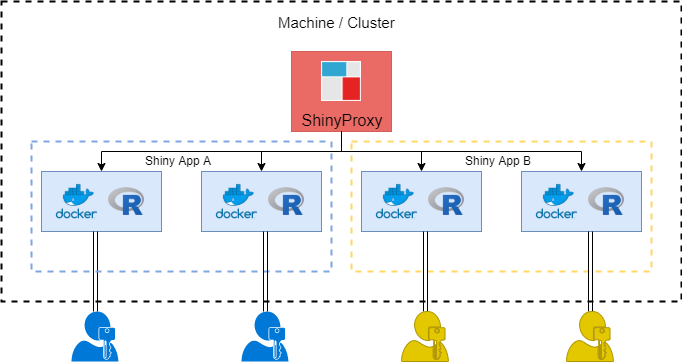
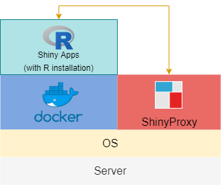
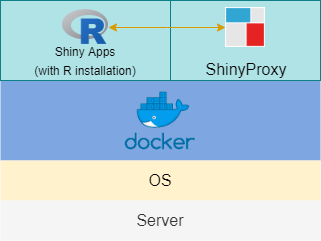

{}
Depending on what you are looking for and your experience with Docker technology and ShinyProxy, you may want to check my other tutorials:

* For learning the framework and testing containerised Shiny apps locally: This post

* For securely deploying Shiny apps on Clouds (single node, the docker-compose way): [Securing and Monitoring ShinyProxy Deployment of R Shiny Apps]()

* For deploying secure, scalable, production-grade Shiny apps with Docker Swarm: [Effectively Deploying and Scaling Shiny Apps with ShinyProxy, Traefik and Docker Swarm]()

{}

{}

## Background

[R Shiny](https://shiny.rstudio.com/) is a powerful tool for building data products, from data visualisations to predictive models. Built by RStudio, this package is highly integrated with the RStudio IDE, making it the primary choice for production. Although it is relatively easy to build a Shiny app and make it run on our local machines, deploying the app on the cloud for production could be a daunting task. There are many ways of deploying Shiny apps and they all have their advantages and drawbacks, thus need to be decided on a case-by-case basis. For example, building a client-facing model prediction app would have its unique requirements. Important features to consider are customisation of the UI, authentication, access control, security, performance and cost-efficiency. In this post, I will provide a quick review of different deployment strategies and guide you through one of my favourite methods using ShinyProxy with Docker.

### shinyapps.io

[shinyapps.io](https://www.shinyapps.io/) is an RStudio service that provides an easy solution to publish Shiny apps. RStudio fully manages all the back-end DevOps so no need to set up the environment, R server or worrying about scaling. If you are using RStudio IDE and signed up for a shinyapps.io account, it is just a few clicks away to deploy your apps. However, it can be quite pricey as their pricing plans are based on Active Hours, which are the number of hours users are active on the apps. So three clients use the app for 1 hour each would lead to 3 Active Hours. Although the app would normally be in the sleep mode if no one is using it, the wakening/sleeping cycle may take a few minutes so even someone briefly logs on and off the app, it is likely to cost 0.1-0.5 Active Hours. The service is also not competitively priced if you only look at the computing power for your cash. For example, the Starter plan (Up to 1GB RAM) will cost you &#36;9 per month with a limited number of Active Hours. While the t2.micro instance from AWS (also 1GB RAM) costs less than &#36;8 with almost unlimited access. VM from DigitalOcean is even cheaper. A summary of shinyapps.io pricing plan is below:

| Plan         |     Cost     | Number of Apps | Active Hours | Custom Domain | Authentication | Multiple CPU | RAM per Instance |
|--------------|:------------:|:--------------:|:------------:|:-------------:|:--------------:|:------------:|:----------------:|
| Free         |  $0 / month  |        5       |      25      |       No      |       No       |      No      |    Up to 1 GB    |
| Starter      |  $9 / month  |       25       |      100     |       No      |       No       |      No      |    Up to 1 GB    |
| Basic        |  $39 / month |    Unlimited   |      500     |       No      |       No       |      Yes     |    Up to 8 GB    |
| Standard     |  $99 / month |    Unlimited   |     2,000    |       No      |       Yes      |      Yes     |    Up to 8 GB    |
| Professional | $299 / month |    Unlimited   |    10,000    |      Yes      |       Yes      |      Yes     |    Up to 8 GB    |

Here are some pros and cons.

Pros:

* Very easy to use: You can deploy your apps in a minute without knowledge about server and front-end.
* Security: Each Shiny application runs in its own protected environment and access is always SSL encrypted. Authentication is available in the premium plans.
* Scalability: Very easy to scale your apps if usage increases. However, see there is a catch (see the cons below).
* Support and future development: You can get support from the RStudio team if you subscribe to the premium plans. They are also constantly investing in the development of back-end components. For example, the [persistent storage system](https://www.reddit.com/r/RStudio/comments/a4sipx/is_shinyapps_dying/) sounds exciting.

Cons:

* Limitations in the basic plans (e.g. less Active Hours, no authentication, single instance, etc.)
* Less cost-efficient than the DIY options. You are of course paying for the fully managed platform!
* Scalability: It can only offer instance up to 8GB of RAM and according to them: shinyapps.io does not make any guarantees regarding the number of CPU cores, or the speed of the CPUs that are allocated to the deployed applications. So it might not be suitable for super computationally intensive apps.
* Very basic UI with limited customisability

In my opinion, shinyapps.io is more suitable for small personal projects or data science team who just want to focus on getting the model right and do not need massive computing power in each instance. If this is suitable for your need, check out their well-written [documentation](https://docs.rstudio.com/shinyapps.io/) for details.

### Shiny Server or Shiny Server Pro on own premise or cloud

There are two versions of Shiny Server (both of them are developed by RStudio), one is the [Shiny Server Open Source](https://rstudio.com/products/shiny/shiny-server/), and the other is the commercially licensed [Shiny Server Pro](https://rstudio.com/products/shiny-server-pro/). The former is free while the latter will set you back $9,995 / year with its base plan (20 concurrent users). The key difference is that Shiny Server Pro natively supports a variety of password authentication schemes and a centralized management console for all your apps. But crucially, with Shiny Server Pro, you can launch multiple R processes per app, which can then serve multiple users concurrently. While the open-source version only supports one R process per app. Since R is single-threaded, sharing an R process would mean that users cannot do anything (not even load the UI) if R is occupied by other users. For computationally intensive apps (e.g. actions may take up to more than 10 seconds to run), this delay is unbearable. There are some ways to get around it, for example, the 'async' described in this [article](https://blog.rstudio.com/2018/06/26/shiny-1-1-0/). However, it is more effective when your apps have a small number of severe performance bottlenecks'. In the ideal world, we would still want multiple R processes for any app that could be used by multiple users at the same time. Shiny Server Pro and its enhanced solution [RStudio Connect](https://rstudio.com/products/connect/) can solve this issue. But if you only have one app, it probably doesn't warrant the cost.

### ShinyProxy on own infrastructure or cloud

[ShinyProxy](https://www.shinyproxy.io/) is an open-source deployment solution developed by OpenAnalytics. The server side of it is run on Java and powered by Docker. This gives ShinyProxy the following advantages:

* Java is a relatively well-tested and reliable language for building the back-end.
* With Docker, each user session has its own isolated workspace and R process, circumventing the limitation of the single thread described above.
* With Docker, you can plug and play different versions of R and Shiny together. This also means whatever you run locally can be run on the cloud.
* Resources such as CPU usage and RAM can be easily controlled by Docker, making it more flexible for computationally intensive apps.

An example of the architecture can be found in the graph below:



Bundling together with [Spring Boot](https://spring.io/projects/spring-boot) web application, ShinyProxy also provides other key enterprise features such as built-in functionality for LDAP authentication and authorisation, logging and user statistic tracking.

ShinyProxy is a powerful tool which provides enterprise features while being open-sourced. However, setting it up might not be straightforward for people who are still finding their way in Docker and relevant tools. In the remainder of the post, I will provide a step-by-step guide to show you how to deploy your Shiny app using ShinyProxy.

## Preparation

### Installing Java

ShinyProxy requests Java to run and the official document recommends using OpenJDK like [Zulu](https://www.azul.com/downloads/zulu-community/?&architecture=x86-64-bit&package=jdk). I have successfully built the app using Oracle Java so that should also be fine. But make sure your version of Java is Java 8 (or higher). In the command line, run:

```{sh}
java -version
```

You will get something like this. For Oracle Java, Java 8 has a version code of 1.8.xx.

```{sh}
java version "1.8.0_231"
Java(TM) SE Runtime Environment (build 1.8.0_231-b11)
Java HotSpot(TM) 64-Bit Server VM (build 25.231-b11, mixed mode)
```

If you have are using the OpenJDK, you will get something like below:

```{sh}
openjdk version "1.8.0_72"
OpenJDK Runtime Environment (Zulu 8.13.0.5-linux64) (build 1.8.0_72-b15)
OpenJDK 64-Bit Server VM (Zulu 8.13.0.5-linux64) (build 25.72-b15, mixed mode)
```

{}
You need Java 8 (or higher) to run ShinyProxy.
{}

### Installing Docker

Simply follow the instruction on [this page](https://docs.docker.com/docker-for-windows/install/) to download the latest Docker Windows Desktop from Docker Hub. Docker is a really powerful tool but I won't cover anything beyond the basics in this post. So if you are interested, please check the tutorials online.

Please note the following system requirement:

* Windows 10 64-bit: Pro, Enterprise, or Education (Build 15063 or later).
* Hyper-V and Containers Windows features must be enabled.
* The following hardware prerequisites are required to successfully run Client Hyper-V on Windows 10:
  * 64-bit processor with [Second Level Address Translation (SLAT)](https://en.wikipedia.org/wiki/Second_Level_Address_Translation)
  * 4GB system RAM
  * BIOS-level hardware virtualization support must be enabled in the BIOS settings. For more information, see [Virtualization](https://docs.docker.com/docker-for-windows/troubleshoot/#virtualization-must-be-enabled).

If you are using Windows 7 or older version of macOS, you can try the [Docker Toolbox](https://docs.docker.com/toolbox/toolbox_install_windows/). It will create a small Linux VM (VirtualBox). This VM hosts Docker Engine for you on your Windows system. If you have a newer OS, then chances are you can use its native virtualization and does not require VirtualBox to run Docker.

### Setting up Docker

ShinyProxy needs to connect to the Docker daemon to spin up the containers for the Shiny apps. By default, ShinyProxy will do so on port 2375 of the docker host. In order to allow for connections on port 2375, the startup options need to be edited.

For Windows 10, we need to alter this startup option file:
`C:\ProgramData\Docker\config\daemon.json`

If you just installed Docker, you probably need to create this JSON file in the path above. Add the following lines to the JSON file:

daemon.json

```{json}
{
    "hosts": ["tcp://127.0.0.1:2375"]
}
```

Then, go to the Docker Desktop Settings and in the `General` panel make sure the "Expose Daemon on tcp://localhost:2375 without TLS" is checked and restart Docker Desktop.

{}
Don't forget to set up port 2375 and expose Daemon on tcp://localhost:2375 without TLS
{}

### Testing Docker

To make sure Docker has been correctly set up, download the platform-independent ShinyProxy JAR file from [here](https://www.shinyproxy.io/downloads/) and put it in a folder that you can remember. Open a shell or command-line tool and navigate to that folder and run the following codes to download the example Docker image:

```{sh}
docker pull openanalytics/shinyproxy-demo
```

You can check whether you already have `openanalytics/shinyproxy-demo` image on your system by running:

```{sh}
docker images | grep shinyproxy
```

You should see an entry about the docker image `openanalytics/shinyproxy-demo` listed in your available images. Now, run:

```{sh}
java -jar shinyproxy-2.3.0.jar
```

After a few seconds, you can open your browser at `http://localhost:8080` and the example Shiny apps! The default account name is 'tesla' and the password is 'password'. Note that we would normally need an `application.yml` file to configure ShinyProxy (e.g. this file includes information such as the name of the Docker image it should look for, etc.). But since we are running the example, the default settings of ShinyProxy will work. We will need to set up an `application.yml` file later though.

## Building Shiny app Docker images

ShinyProxy uses one or more Docker images to serve Shiny apps to end-users. Such Docker images typically include:

* the R software
* all the necessary dependencies (e.g. R packages your app depends on)
* all the scripts (e.g. ui.R, server.R and modules) and resources (e.g. images) used by your app

We will follow the example provided by ShinyProxy. All the files mentioned below can be found in this [repo](https://github.com/openanalytics/shinyproxy-template). You can clone this repo if you don't want to create the files below from scratch.

### Writing a Docker File

A Dockerfile is a text document that contains all the commands a user could call on the command line to assemble an image. Using docker build users can create an automated build that executes several command-line instructions in succession. Below is an example of a Dockerfile made by Open Analytics. I have included comments before each line to describe what they do.

Dockerfile

```{Dockerfile}

# build the Docker image from the base image 'openanalytics/r-base'
# this is an Ubuntu 16.04 LTS with a recent R version.
# this image is available on Docker hub at https://hub.docker.com/r/openanalytics/r-base/
FROM openanalytics/r-base

# add the maintainer of this Docker image (this should be you in this case)
LABEL maintainer "Tobias Verbeke <tobias.verbeke@openanalytics.eu>"

# system libraries of general use
RUN apt-get update && apt-get install -y \
    sudo \
    pandoc \
    pandoc-citeproc \
    libcurl4-gnutls-dev \
    libcairo2-dev \
    libxt-dev \
    libssl-dev \
    libssh2-1-dev \
    libssl1.0.0

# system library dependency for the euler app
# the R package Rmpfr requires the system library libmpfr-dev to be available
# note that if you don't need to use the Rmpfr package, you can delete this line
RUN apt-get update && apt-get install -y \
    libmpfr-dev

# install basic shiny functionality to R
RUN R -e "install.packages(c('shiny', 'rmarkdown'), repos='https://cloud.r-project.org/')"

# install R dependencies of the euler app
RUN R -e "install.packages('Rmpfr', repos='https://cloud.r-project.org/')"

# copy the example euler app (with the ui.R and server.R files)
# onto the image in folder /root/euler
RUN mkdir /root/euler
COPY euler /root/euler

# copy the Rprofile.site set up file to the image.
# this make sure your Shiny app will run on the port expected by
# ShinyProxy and also ensures that one will be able to connect to
# the Shiny app from the outside world
COPY Rprofile.site /usr/lib/R/etc/

# instruct Docker to expose port 3838 to the outside world
# (otherwise it will not be possible to connect to the Shiny application)
EXPOSE 3838

# finally, instruct how to launch the Shiny app when the container is started
CMD ["R", "-e", "shiny::runApp('/root/euler')"]

```

### Building the Docker image

We also need a `Rprofile.site` file which will make sure the Shiny app runs on the port expected by ShinyProxy and also ensures that one will be able to connect to the Shiny app from the outside world. Create a file named `Rprofile.site` with the following content:

```{sh}
local({
   options(shiny.port = 3838, shiny.host = "0.0.0.0")
})
```

Now, let's create a root folder that includes the app folder (the `euler` folder from the repo), the Dockerfile and the Rprofile.site file created above. Navigate into the folder and run:

```{sh}
docker build -t shiny-euler-app .
```

Depending on your app and dependencies, the whole building process will take several minutes. When it is done, run:

```{sh}
docker images | grep shinyproxy
```

You will find now you have a new image `shiny-euler-app`. To run the image directly, use the code below:

```{sh}
docker run -it -p 3838:3838 shiny-euler-app
```

This will generate a container which will run the `euler` Shiny app. You can find it at <http://localhost:3838/>. If this works, we can move on to the next step.

## Building a standalone Docker engine

Now that we have created our Shiny app in Docker, we could call the ShinyProxy app and let it talk to the dockerised Shiny app directly, as shown in the graph below:



To run the ShinyProxy app, we need to navigate back to the folder which contains the JAR file. If we run the ShinyProxy app as before, by default ShinyProxy will try to find the `openanalytics/shinyproxy-demo` Docker image. To point it to the new `euler` image we just created, we need to create an `application.yml` file in the same folder as the JAR file. You can use the one I created below:

application.yml

```{yml}
proxy:
  title: Standalone Docker Engine with euler Example
  port: 8080
  authentication: simple
  admin-groups: admins
  users:
  - name: admin
    password: admin
    groups: admins
  docker:
    url: http://localhost:2375
  specs:
  - id: euler
    display-name: Euler's number
    container-cmd: ["R", "-e", "shiny::runApp('/root/euler')"]
    container-image: shiny-euler-app
    port: 3838
    access-groups: admins

logging:
  file:
    shinyproxy.log
```

Note that under the `specs`, we have a new app which is called `Euler's number`. It is built in the `shiny-euler-app` exposed to port 3838. Also, note the R command we run to activate the app specified under the `container-cmd`. There are many things that can be customised in the `application.yml` file, check [this](https://www.shinyproxy.io/configuration/) page for details.

In the same folder (where the `application.yml` and JAR file are), run the following command:

```{sh}
java -jar shinyproxy-2.3.0.jar
```

After a few seconds, you will be able to visit the new app at <http://localhost:8080>

## Building a containerised Docker engine

To make things cleaner, we could dockerised both the R Shiny apps and ShinyProxy. In this way, we don't need to worry about setting up ShinyProxy when deploying the apps as everything will be wrapped in containers (see graph below).



This set-up has several advantages according to ShinyProxy documents:

> * No need to install a Java runtime on the host. The docker image will take care of that.
> * Many container managers can be set up to automatically restart crashed containers. If the ShinyProxy container crashes, it can recover without requiring manual intervention.
> * It becomes much easier to deploy multiple ShinyProxy containers, and many clustered container managers (such as Kubernetes) allow you to deploy load balancers in front of those containers.
> * If you have multiple ShinyProxy containers and want to put a new configuration online, you can perform a 'rolling update' without causing any downtime for your users.

Let's see how we can build this. First, we need to create a new folder. For example, we can call it `containerised_docker_engine`. Within the folder, we need to create a `Dockerfile` and an `application.yml` file. Examples of these two files can be found below:

Dockerfile

```{Dockerfile}
FROM openjdk:8-jre

RUN mkdir -p /opt/shinyproxy/
RUN wget https://www.shinyproxy.io/downloads/shinyproxy-2.3.0.jar -O /opt/shinyproxy/shinyproxy.jar
COPY application.yml /opt/shinyproxy/application.yml

WORKDIR /opt/shinyproxy/
CMD ["java", "-jar", "/opt/shinyproxy/shinyproxy.jar"]
```

The `Dockerfile` is quite straightforward. It instructs to build a Docker image from Java OpenJDK image and install the ShinyProxy app. It will also copy the `application.yml` onto the image.

application.yml

```{yml}
proxy:
  port: 8080
  authentication: simple
  admin-groups: admins
  users:
  - name: admin
    password: admin
    groups: admins
  docker:
      internal-networking: true
  specs:
  - id: euler
    display-name: Euler's number
    container-cmd: ["R", "-e", "shiny::runApp('/root/euler')"]
    container-image: shiny-euler-app
    access-groups: admins
    container-network: sp-example-net

logging:
  file:
    shinyproxy.log
```

Note that we need to set the `internal-networking` to `true` and specify a `container-network` which is named `sp-example-net`. Don't worry as we will create this network now. Simply run in command-line:

```{sh}
docker network create sp-example-net
```

Then run:

```{sh}
docker network ls
```

You will find the `sp-example-net` network on the list. Now that we have both files and the Docker container network ready, we can navigate to the `containerised_docker_engine` folder and build the Docker image:

```{sh}
docker build . -t shinyproxy-example
```

When the process is finished, we use the following command to launch ShinyProxy in container:

```{sh}
docker run -d -v /var/run/docker.sock:/var/run/docker.sock --net sp-example-net -p 8080:8080 shinyproxy-example
```

Now, visit <http://localhost:8080/> to view the app.

ShinyProxy also provides us with the options of deploying apps with [Kubernetes](https://github.com/openanalytics/shinyproxy-config-examples/tree/master/03-containerized-kubernetes) and [Docker Swarm](https://github.com/openanalytics/shinyproxy-config-examples/tree/master/06-containerized-docker-swarm). However, this is for another post.

## Hosting the containerised Shiny apps on AWS EC2

In terms of hosting Shiny apps on the Cloud, there are many options. One way to compare them is from a pure cost perspective. Assuming you are deploying a lite, decision tree or regression-based predictive model app, you probably want an instance with at least 1-2 CPU cores and 2 GB of RAM. This can support 2-3 end-users using the app concurrently. Let's see what the big players in the market can offer.

|       |             |     | Price per Month ($) |              |
|-------|:-----------:|:---:|:-------------------:|:------------:|
| vCPUs | Memory (GB) | AWS |        Azure        | DigitalOcean |
| 1     |      1      |  8  |          6          |       5      |
| 1     |      2      |  17 |          11         |      11      |
| 2     |      4      |  34 |          23         |      22      |
| 4     |      8      |  74 |          -          |      44      |

DigitalOcean is probably the cheapest for this range and it is also the most Docker friendly one as you can launch a 'droplet' which already has Docker installed. For the purpose of this post, I will launch the example app on an AWS t2.micro instance (which is on the free-tier). DigitalOcean provides better documentation so deploying on them would be more straightforward.

First, please refer to [this post](https://towardsdatascience.com/how-to-host-a-r-shiny-app-on-aws-cloud-in-7-simple-steps-5595e7885722) for launching an AWS EC2 instance. We will need the `t2.micro` instance and pick the `Amazon Linux AMI 2018.03.0 (HVM)` as the AMI. We will only need one instance. For your own app, you don't need to commit to a fixed number of instances. AWS has a function called 'Auto Scaling Group', in which you can set up policies to automatically scale the number of instances in the group. In the security group setting, don't forget to add port 80 for HTTP, 443 for HTTPS in addition to port 22 (SSH).

When the instance has been launched, we need to SSH to the machine. If you are using Window 10 like me, you will need tools such as PUTTY. See [this guide](https://docs.aws.amazon.com/AWSEC2/latest/UserGuide/putty.html?icmpid=docs_ec2_console) for connecting EC2 instance using PUTTY.

When in the terminal, run the following code to update the packages installed.

```{sh}
sudo -i
yum update -y
```

Then we need to get Docker:

```{sh}
yum install docker
docker version
```

And start the Docker service:

```{sh}
service docker start
```

Now we need to **switch back to our local machine** and push the two Docker images to Docker Hub, so that we can then pull the images to the EC2 instance. Of course, you can also save the Docker images locally and SFTP them to the EC2 instance. However, this seems to be a much slower way compared to Docker Hub as the latter compresses the files for uploading and storage. If you want to use the SFTP, [here](https://angus.readthedocs.io/en/2014/amazon/transfer-files-between-instance.html) is a useful guide.

Let's log on Docker Hub website and create two repositories called `shinyproxy-example` and `shiny-euler-app` to host the two images. Before we push the images to Docker Hub, we need to log on to the Hub.

```{sh}
docker login
```

Then type in your username and password when prompted. You will see 'Login Succeeded' in the console. Now, we need to tag those two images and push them to your DockerHub repos:

```{sh}
docker tag shinyproxy-example YOUR_USERNAME/shinyproxy-example
docker tag shiny-euler-app YOUR_USERNAME/shiny-euler-app
docker push YOUR_USERNAME/shinyproxy-example
docker push YOUR_USERNAME/shiny-euler-app
```

It can take a couple of minutes depending on the size of the images. When it is done, **switch to the EC2 console** and pull the images. Note that you also need to login here.

```{sh}
docker login
```

```{sh}
docker pull YOUR_USERNAME/shinyproxy-example
docker pull YOUR_USERNAME/shiny-euler-app
```

When the pulling is done, we need to tag the images so that the names of the images matched what we have specified in the `application.yml` of the `shinyproxy-example` container.

```{sh}
docker tag YOUR_USERNAME/shiny-euler-app shiny-euler-app
docker tag YOUR_USERNAME/shinyproxy-example shinyproxy-example
```

Now, let's create the container network on the EC2 instance.

```{sh}
docker network create sp-example-net
```

When this step is done, we can finally run the ShinyProxy container, which will connect to the Shiny app container. Note that this time we want to bind it to the port 80 for HTTP access.

```{sh}
docker run -d -v /var/run/docker.sock:/var/run/docker.sock --net sp-example-net -p 80:8080 shinyproxy-example
```

That's it. After a few seconds, the example ShinyProxy app will be available at the public DNS of your instance (e.g. ec2-X-XX-XXX-XX.compute-1.amazonaws.com). Now we have a fully functional Shiny app served by ShinyProxy and hosted on AWS. In another post, I will go through a couple of options to make our apps more secure. Stay tuned!

{}
1 June 2020 Update:

New tutorials in this series are available:

* [Securing and monitoring ShinyProxy deployment of R Shiny apps]()
* [Effectively Deploying and Scaling Shiny Apps with ShinyProxy, Traefik and Docker Swarm]()

{}
