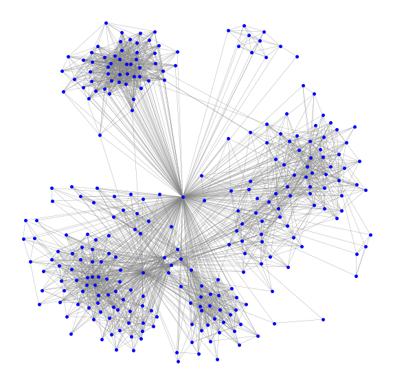
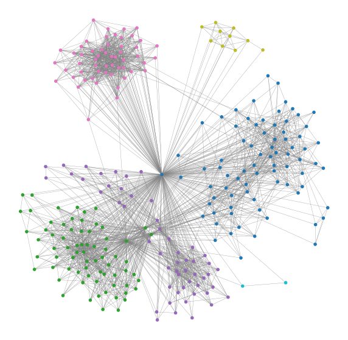
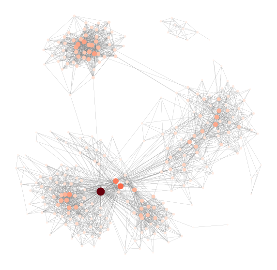
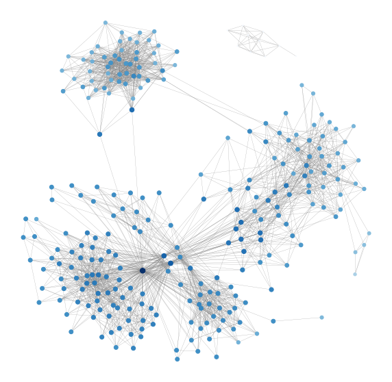
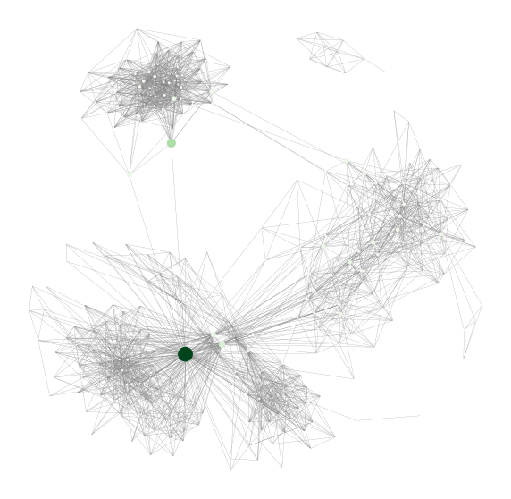

I have recently been asked to generate a social network graph to show how friends on Facebook are connected. This type of network graph can be used to identify communities as well as the gatekeepers of each community in the network, the value of which has been explained in the iconic paper [The Strength of Weak Ties](https://www.jstor.org/stable/2776392?seq=1#page_scan_tab_contents) by Mark Granovetter. [Here](https://www.forbes.com/sites/jacobmorgan/2014/03/11/every-employee-weak-ties-work/) is a more accessible article about this idea. 

I hope this post can serve as a guide to a quick and simple exploratory of social network and its basic metrics. There are three parts: Part I is about retrieving the friend data we need for building the network. Part II and Part III are the more exciting parts where we will run some analyses on the network. So here it goes.

## Part I: Retrieve Facebook Friend Data

It used to be much easier to generate graphs like this (through some 3rd part apps or the Facebook API) but Facebook is getting increasingly strict about what data can be accessed through the API. The `all_mutual_friends`, `mutual_friends`, and `three_degree_mutual_friends` context edges of the Facebook Social Context API were deprecated on April 4, 2018, and immediately started returning empty data sets. They have now been fully removed. This post presents an alternative way to retrieve Facebook friend network with the help of Python and Selenium Webdriver.

### Step 1: Set up Selenium ChromeDriver

In order to make the script work, we will need to set up Selenium ChromeDriver first. ChromeDriver is a web automation framework that allows you to control the behaviours of the Chrome browser using a programming language (Python in this case). I found [this guide from Chris Kenst](https://www.kenst.com/2015/03/installing-chromedriver-on-mac-osx) particularly useful for making the ChromeDriver work on macOS.

### Step 2: Set up the helper functions

Once making sure the ChromeDriver, the following script by [Lucas Allen](https://github.com/lgallen/twitter-graph) and modified by [Eliot Andres](https://github.com/EliotAndres/facebook-friend-graph) can be used to scrap the friend network. First, we will need to load a couple of useful packages. Note that I have used Python 3 to build the script below. You might need to set up a virtual environment to make it works. I would recommend [Pipenv](https://docs.pipenv.org/en/latest/) for future-proofing your virtual environment management workflow.

Below are a couple of key modules that we will use in the script:

* `html.parser`: for parsing HTML
* `webdriver`: for controlling the ChromeDriver
* `tqdm`: for showing a progress bar while scrapping
* `pickle`: for backing up the checkpoint and storing the scraped friend network
* `getpass`: for the login prompt

```python
from html.parser import HTMLParser
import re
import time
from selenium import webdriver
from selenium.webdriver.common.keys import Keys
import os
from tqdm import tqdm
import pickle
import getpass
```

Now, we will need to code up several functions that help to navigate through Facebook pages. Facebook pages are not static and many of them are using AJAX (Asynchronous JavaScript And XML), which allows web pages to be updated asynchronously by exchanging data with a web server behind the scenes. This means that it is possible to update parts of a web page, without reloading the whole page. For example, when visiting the friend page, only the first few friends are listed. But more friends will be loaded once the user scrolls down to the bottom of the page. The `get_fb_page` function does exactly that. Given a page, the function will determine the height of the body to calculate the scrolling distance, scroll down to the bottom, wait for a while for the AJAX to load new content, calculate new scrolling distance and scroll down again. It will stop when no new content can be loaded.

```python
def get_fb_page(url):
    time.sleep(5)
    driver.get(url)

    # Get scroll height
    last_height = driver.execute_script("return document.body.scrollHeight")

    while True:
        # Scroll down to bottom
        driver.execute_script("window.scrollTo(0, document.body.scrollHeight);")

        # Wait to load page
        time.sleep(SCROLL_PAUSE_TIME)

        # Calculate new scroll height and compare with last scroll height
        new_height = driver.execute_script("return document.body.scrollHeight")
        if new_height == last_height:
            break
        last_height = new_height
    html_source = driver.page_source
    return html_source
```

`MyHTMLParser` is a class which help us to find the URLs to friends' home page. `find_friend_from_url` function simply direct us to a friend's home page by a given URL.

```python
def find_friend_from_url(url):
    if re.search('com\/profile.php\?id=\d+\&', url) is not None:
        m = re.search('com\/profile.php\?id=(\d+)\&', url)
        friend = m.group(1)
    else:
        m = re.search('com\/(.*)\?', url)
        friend = m.group(1)
    return friend

class MyHTMLParser(HTMLParser):
    urls = []

    def error(self, message):
        pass

    def handle_starttag(self, tag, attrs):
        # Only parse the 'anchor' tag.
        if tag == "a":
            # Check the list of defined attributes.
            for name, value in attrs:
                # If href is defined, print it.
                if name == "href":
                    if re.search('\?href|&href|hc_loca|\?fref', value) is not None:
                        if re.search('.com/pages', value) is None:
                            self.urls.append(value)
```

### Step 3: Execute the scrapping plan

Once we have loaded all the functions and packages above, we can use the following script to log in to Facebook. It will prompt you to input username and password for the login.

```python
username = input("Facebook username:")
password = getpass.getpass('Password:')

chrome_options = webdriver.ChromeOptions()
prefs = {"profile.default_content_setting_values.notifications": 2}
chrome_options.add_experimental_option("prefs", prefs)
driver = webdriver.Chrome(chrome_options=chrome_options)

driver.get('http://www.facebook.com/')

# authenticate to facebook account
elem = driver.find_element_by_id("email")
elem.send_keys(username)
elem = driver.find_element_by_id("pass")
elem.send_keys(password)
elem.send_keys(Keys.RETURN)
time.sleep(5)
print("Successfully logged in Facebook!")

SCROLL_PAUSE_TIME = 2
```

The ChromeDriver will open a new Chrome instance and log in Facebook. Once successfully log in. Execute the codes below to get the URLs to your friends' homepage. It will also store the friend list into a Pickle object `uniq_urls.pickle`, so we don't need to replace the same process when a network failure occurs. As we are not using a well-supported API, this can happen quite often so be prepared.

```python
my_url = 'http://www.facebook.com/' + username + '/friends'

UNIQ_FILENAME = 'uniq_urls.pickle'
if os.path.isfile(UNIQ_FILENAME):
    with open(UNIQ_FILENAME, 'rb') as f:
        uniq_urls = pickle.load(f)
    print('We loaded {} uniq friends'.format(len(uniq_urls)))
else:
    friends_page = get_fb_page(my_url)
    parser = MyHTMLParser()
    parser.feed(friends_page)
    uniq_urls = set(parser.urls)

    print('We found {} friends, saving it'.format(len(uniq_urls)))

    with open(UNIQ_FILENAME, 'wb') as f:
        pickle.dump(uniq_urls, f)
```

Next, we will use the URLs collected above to access the mutual friend page of each friend and retrieve the list of mutual friends. This is a slightly tricky part as Facebook are not happy with repetitive activities even you check your own friend list. It could temporarily ban you from accessing friend pages if you request more than 100 pages in one go. As such, the script is set to pause for half an hour at every 100 pages. If you are still uncomfortable with this rate, I would suggest further reduce the rate and leave the script running overnight. It will get the job done eventually.

{}
You can set up the script so that it won't constantly refreshing the page, which may get you temporarily ban from accessing the friends page.
{}

```python
# need to pause every 100 friends
friend_graph = {}
GRAPH_FILENAME = 'friend_graph.pickle'

if os.path.isfile(GRAPH_FILENAME):
    with open(GRAPH_FILENAME, 'rb') as f:
        friend_graph = pickle.load(f)
    print('Loaded existing graph, found {} keys'.format(len(friend_graph.keys())))

count = 0
for url in tqdm(uniq_urls):

    count += 1
    if count % 100 == 0:
        print ("Too many queries, pause for a while...")
        time.sleep(1800)

    friend_username = find_friend_from_url(url)
    if (friend_username in friend_graph.keys()) and (len(friend_graph[friend_username]) >1):
        continue

    friend_graph[friend_username] = [username]
    mutual_url = 'https://www.facebook.com/{}/friends_mutual'.format(friend_username)
    mutual_page = get_fb_page(mutual_url)

    parser = MyHTMLParser()
    parser.urls = []
    parser.feed(mutual_page)
    mutual_friends_urls = set(parser.urls)
    print('Found {} urls'.format(len(mutual_friends_urls)))

    for mutual_url in mutual_friends_urls:
        mutual_friend = find_friend_from_url(mutual_url)
        friend_graph[friend_username].append(mutual_friend)

    with open(GRAPH_FILENAME, 'wb') as f:
        pickle.dump(friend_graph, f)

    time.sleep(5)
```

It will take a while to retrieve all the friends but when it is done, friend names and their connections should be stored in the pickle file `friend_graph.pickle`.  In the next part, we will have some fun analysing the friend network.

## Part II: Plotting the Social Network and Basic Analysis

### Step 1: Load packages and data

Below are a couple of key modules we will use in the script:

* `community`: implements community detection by using the louvain method
* `networkx`: for the creation, manipulation, and study of the structure, dynamics, and functions of complex networks
* `pickle`: for loading the pickle object that stores the friend network

```python
# Setting for plotting graph in the Jupyter Notebook
%matplotlib inline
import matplotlib.pyplot as plt
# Set the size of the graph
plt.rcParams['figure.figsize'] = [10, 10]

import community
import networkx as nx
import colorlover as cl
import numpy as np
import pickle

py.init_notebook_mode(connected=True)

# This is your Facebook id. It can also be a number
CENTRAL_ID = 'FACEBOOK_ID'

# This is the pickle file containing the raw graph data
GRAPH_FILENAME = 'friend_graph.pickle'

# Load the friend_graph picklefile
with open(GRAPH_FILENAME, 'rb') as f:
    friend_graph = pickle.load(f)
```

`friend_graph` is a dictionary of lists in the form of {'friend1': ['friend2, 'friend3']}, where the keys are each of your friends and the value lists have all your mutual friends.

### Step 2: Clean the data and reshape it to a suitable network data structure

Before plotting and analysing the network, we need to do some pre-work. First, we may want to get rid of the friends which whom we do not have any mutual friend. After all, we are interested in groups and communities so friends without mutual friends do not add much value. Of course, you can skip this step if you want to keep them.

```python
# Only keep friends with at least 2 common friends
central_friends = {}

for k, v in friend_graph.items():
    # This contains the list number of mutual friends.
    # Doing len(v) does not work because ometimes instead of returning mutual
    # friends, Facebook returns all the person's friends
    intersection_size = len(np.intersect1d(list(friend_graph.keys()), v))
    if intersection_size > 2:
        central_friends[k] = v

print('Firtered out {} items'.format(len(friend_graph.keys()) - len(central_friends.keys())))
```

When storing network data, two types of data structure are commonly used: adjacency matrix and edge list. An adjacency matrix is a square matrix used to represent a finite graph. The elements of the matrix indicate whether pairs of vertices are adjacent or not in the graph. In our case, the vertices are friends and the elements of the matrix represent friendship ties. Edge list, as its name suggests, contains a list of all the edges in the network. Edge List can be more efficient for storing data when the network is large and sparse. We will convert the `friend_graph` object to an edge list.

```python
# Extract edges from graph

edges = []
nodes = [CENTRAL_ID]

for k, v in central_friends.items():
    for item in v:
        if item in central_friends.keys() or item == CENTRAL_ID:
            edges.append((k, item))
```

### Step 3: Create a network object and visualise the network

Now, we will use the `networkx` module to create a network object out of the edge list.

```python
G = nx.Graph()
G.add_nodes_from([CENTRAL_ID])
G.add_nodes_from(central_friends.keys())

G.add_edges_from(edges)
print('Added {} edges'.format(len(edges) ))
```

The `nx.draw_networkx` function can then be called to draw the graph. It use `matplotlib` under the hood. The default plot has axis so don't forget to remove them.

```python
pos = nx.spring_layout(G) # get the position using the spring layout algorithm

plt.rcParams['figure.figsize'] = [10, 10]
nx.draw_networkx(G, pos = pos, with_labels=False, 
                 node_size=15, width=0.3, node_color='blue', edge_color='grey')
limits=plt.axis('off') # turn of axis
```

Below is the network graph generated. Blue dots (call "nodes") are friends and the lines (called "edges") are friendship ties. Since this is my Facebook friend network, everyone is connected to me (the central node). This visualisation uses a force-directed layout function to calculate the position of each node. Force-directed layouts work like springs (hence the name `spring_layout`). Imagine there are two types force: 1) spring-like attractive forces (based on Hooke's law) which attract pairs of endpoints of the graph's edges towards each other and 2) simultaneously repulsive forces (like those of electrically charged particles based on Coulomb's law) which separate all pairs of nodes. In equilibrium states for this system of forces, the edges tend to have uniform length (because of the spring forces), and nodes that are not connected by an edge tend to be drawn further apart (because of the electrical repulsion).



The visualisation is already quite illuminating as it shows the different communities in my friend network. I can roughly tell where their boundaries are. However, let's be more precise and use a mathematical algorithm to do the job.

### Step 4: Detect communities

In this step, we'll colour the different friend communities. We'll use the louvain method described in Fast unfolding of communities in large networks, Vincent D Blondel, Jean-Loup Guillaume, Renaud Lambiotte, Renaud Lefebvre, Journal of Statistical Mechanics: Theory and Experiment 2008(10), P10008 (12pp). Codes are [here](https://github.com/taynaud/python-louvain) and the details of the method can be found in [this Wikipedia page](https://en.wikipedia.org/wiki/Louvain_modularity).

```python
part = community.best_partition(G)
values = [part.get(node) for node in G.nodes()]

plt.rcParams['figure.figsize'] = [10, 10]
nx.draw_networkx(G, pos = pos, 
                 cmap = plt.get_cmap('tab10'), node_color = values,
                 node_size=20, width=0.3, edge_color='grey', with_labels=False)
limits=plt.axis('off') # turn of axisb
```



6 communities have emerged and they correspond to my friends from school, undergraduate, postgraduate and work. I have removed all the labels for privacy but you could add them in yourselves. You might find a couple of interesting links between groups of friends that you were not aware of before!

## Part III: Centrality

In network analysis, indicators of centrality identify the most important node within a network. Some useful applications of this kind of measures include identifying the most influential person(s) in a social network, key infrastructure nodes in the Internet or urban networks, and super-spreaders of disease. Now, let's go through some popular measures of network centrality.

### Degree Centrality

Degree Centrality is simply defined as the total number of direct contact. In directed networks (i.e. the connections between nodes have direction), Degree Centrality can be calculated as In-degree or Out-degree. But for my Facebook network, the connections work both ways hence we will only deal with one Degree Centrality. In addition to a measure of popularity, it can be seen as an index of exposure to what is flowing through the network. For example, in a gossip network, a central actor more likely to hear a given bit of gossip. It can also be interpreted as the opportunity to influence and be influenced directly. Let's calculate the Degree Centrality for each node in my Facebook network and visualise it. Note that I will remove myself from the network for the centrality calculation below since by definition I am connected to everyone in my friend network, which is kind of meaningless.

```python
# remove myself from the graph
G_f = copy.deepcopy(G)
G_f.remove_node(CENTRAL_ID)

# keep the position
pos_f = copy.deepcopy(pos)
pos_f.pop(CENTRAL_ID, None)

# Degree centrality
degree = nx.degree_centrality(G_f)
values = [degree.get(node)*500 for node in G_f.nodes()]

plt.rcParams['figure.figsize'] = [10, 10]
nx.draw_networkx(G_f, pos =pos_f,
                 cmap = plt.get_cmap('Reds'),
                 node_color = values, node_size=values,
                 width=0.2, edge_color='grey', with_labels=False)
limits=plt.axis('off') # turn of axisb
```



The result is illuminating as it highlights my friends who have the most mutual friends with me. Note that they are not necessarily the people who have the largest number of friends on Facebook as the network is biased towards me. Also, note that the Degree Centrality calculated by `networkx` has been normalised by the total number of possible connections in the network.

### Closeness Centrality

Closeness Centrality is defined as the sum of geodesic distances (shortest path) to all other nodes. It is an inverse measure of centrality as the higher the metric, the further apart the node from other nodes. It can be seen as the index of the expected time of arrival for whatever is flowing through the network for a given node. For example in a gossip network, the central player tends to hear things first.

```python
#  Closeness centrality
close = nx.closeness_centrality(G_f)
values = [close.get(node)*100 for node in G_f.nodes()]

nx.draw_networkx(G_f, pos = pos_f,
                 cmap = plt.get_cmap('Blues'),
                 node_color = values, node_size=values,
                 width=0.2, edge_color='grey', with_labels=False)

limits=plt.axis('off') # turn of axisb
```



The graph above shows my friend network with the size of the nodes reflects the Closeness Centrality. Since the sum of distances depends on the number of nodes in the graph, closeness is normalized by the sum of the minimum possible distances n-1. Nothing too interesting here and we would possibly need a bigger more complete network to see the difference.

### Betweenness Centrality

Betweenness Centrality is a measure of how often a node lies along the shortest path between two other nodes. It can be seen as an index of potential for gatekeeping, brokering, controlling the flow, and also of liaising otherwise separate parts of the network. it often indicates power and access to the diversity of whatever flows in the network and the potential for synthesizing. Nodes with high Betweenness Centrality are usually bridges between groups or k-local bridges.

```python
#  Betweeness centrality
between = nx.betweenness_centrality(G_f)
values = [between.get(node)*500 for node in G_f.nodes()]

nx.draw_networkx(G_f, pos = pos_f,
                 cmap = plt.get_cmap('Greens'),
                 node_color = values, node_size=values,
                 width=0.2, edge_color='grey', with_labels=False)

limits=plt.axis('off') # turn of axisb
```



`networkx` normalises Betweenness Centrality by for a node v by calculating the sum of the fraction of all-pairs shortest paths that pass through v. The few nodes that have been highlighted by this metrics are my friends who belong to more than one communities. For example, they could be my high school friends who also went to the same uni as me.

There are also other types of Centrality. The [networkx](https://networkx.github.io/documentation/networkx-1.10/reference/algorithms.centrality.html) documentation list a few more. Eigenvector Centrality is a useful one. The idea behind it is that a node must have a high score if connected to nodes that are themselves well connected. Google's PageRank algorithm for their earlier search engine is a variant of Eigenvector Centrality. Feel free to check it out.

That is all for now on social network analysis. Many interesting things haven't been covered here. I will revisit this topic in the future if time permits.
