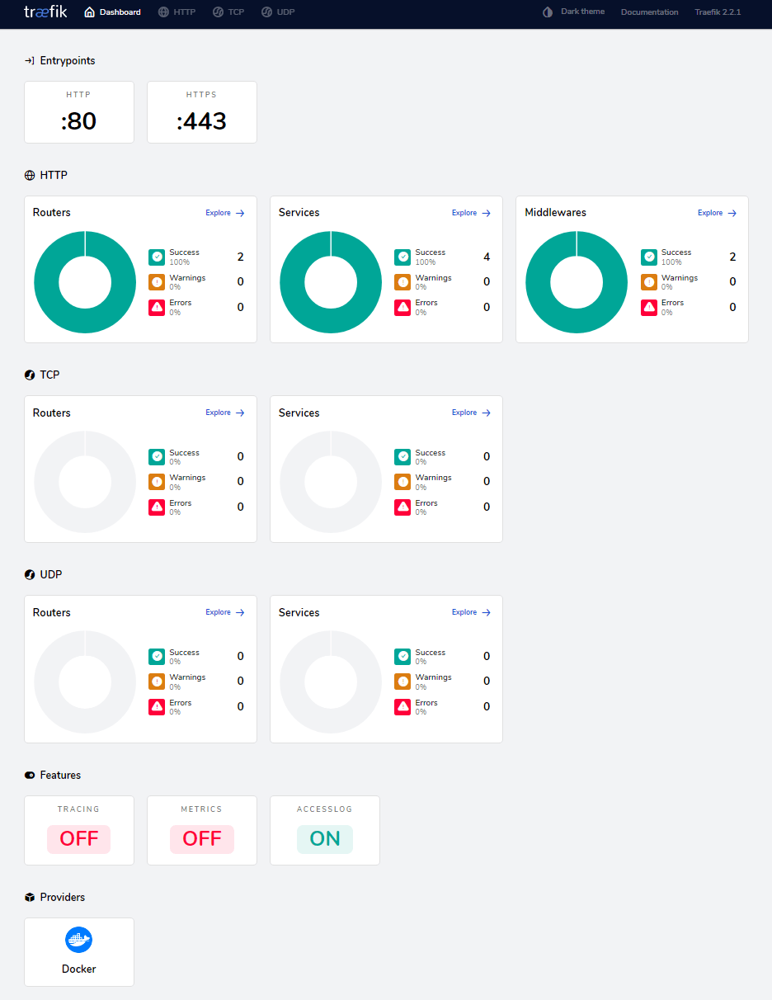

## Deploying apps on the local machine

### Step 1: Installing Docker

Simply follow the instruction on [this page](https://docs.docker.com/docker-for-windows/install/) to download the latest Docker Windows Desktop from Docker (Mac users please see [here](https://docs.docker.com/docker-for-mac/install/); for Linux users, this [installation script](https://get.docker.com/) is very handy, which we will be relying on when deploying the apps on AWS). Docker is a really powerful tool but I will only cover basic commands and tools in this post. So if you are interested, please check the tutorials online.

Please note the following system requirement:

* Windows 10 64-bit: Pro, Enterprise, or Education (Build 15063 or later).
* Hyper-V and Containers Windows features must be enabled.
* The following hardware prerequisites are required to successfully run Client Hyper-V on Windows 10:
  * 64-bit processor with [Second Level Address Translation (SLAT)](https://en.wikipedia.org/wiki/Second_Level_Address_Translation)
  * 4GB system RAM
  * BIOS-level hardware virtualization support must be enabled in the BIOS settings. For more information, see [Virtualization](https://docs.docker.com/docker-for-windows/troubleshoot/#virtualization-must-be-enabled).

If you are using Windows 7 or older version of macOS, you can try the [Docker Toolbox](https://docs.docker.com/toolbox/toolbox_install_windows/). It will create a small Linux VM (VirtualBox). This VM hosts Docker Engine for you on your Windows system. If you have a newer OS, then chances are you can use its native virtualization and does not require VirtualBox to run Docker.

### Step 2: Building and running the Streamlit GAN demo app

Streamlit is a popular open-source framework for creating machine learning and visualisation apps in Python. Since this post is about deployment, we won't be creating apps from scratch but using their [GAN Face Generator demo app](https://github.com/streamlit/demo-face-gan/) instead. The app calls on TensorFlow to generate photorealistic faces, using Nvidia's Progressive Growing of GANs and Shaobo Guan's Transparent Latent-space GAN method for tuning the output face's characteristics.

First, let's clone the demo repo.

```{sh}
git clone https://github.com/streamlit/demo-face-gan.git
```

The `demo-face-gan` folder contains the data and the trained GAN models (`pg_gan` and `tl_gan`), the app script `app.py` and the `requirement.txt`. Normally, we would create a virtual environment and install the modules specified in the `requirement.txt`. But let's do in in the Docker way! Docker provides the ability to package and run an application in a loosely isolated environment called a container. Docker container is nothing but an environment virtualized during run-time to allow users to isolate applications from the system underpinning it. To spin off containers, we need Docker images, which are non-changeable file containing libraries, source code, tools and other files needed to run applications. Let's start by creating a Docker image for the demo app.

We will need to create a file called `Dockerfile`. You can think it as a set of instructions or blueprint to build the image. Copy the `Dockerfile` below to the `demo-face-gan` folder. Note that I have included comments in the file to explain each part. This is probably one of the simplest Dockerfile. For details of other options available, please see the [official document](https://docs.docker.com/engine/reference/builder/).

<details>
<summary>Dockerfile</summary>
<p>
```{Dockerfile}
# Dockerfile to create a Docker image for the demo-face-gan Streamlit app

# Creates a layer from the python:3.7 Docker image
FROM python:3.7

# Copy all the files from the folders the Dockerfile is in to the container root folder
COPY . .

# Install the modules specified in the requirements.txt
RUN pip3 install -r requirements.txt

# The port on which a container listens for connections
EXPOSE 8501

# The command that run the app
CMD streamlit run app.py
```
</p>
</details>

---

Make sure Docker Desktop (daemon) is running and you have cd to the directory where the Dockerfile is and then run:

```{sh}
docker build -f Dockerfile -t streamlit-demo:latest .
```

It will take a while to set up the image. Once it is done, we can run the demo in Docker by:

```{sh}
docker run -p 8501:8501 streamlit-demo
```

Visit http://localhost:8501 to view the app.

## Deploying the demo app on the cloud with Docker Swarm

We have successfully ran the app locally. But in order to make it easily accessible to other users, we'd need to deploy it to the cloud using a container orchestration framework called Docker Swarm. You can think it as a cluster of machines on the cloud that host your app. You probably wonder why you need Docker Swarm rather than just deploying containers as we did locally, particularly if you only have one server/node/instance. Docker Captain Bret Fisher explained it well [here](https://github.com/BretFisher/ama/issues/8). I summarised a couple of key benefits of Docker Swarm below:

* Docker Swarm is fully supported by Docker Engine, which means 1) it only takes a single line of command to create a Swarm and 2) it saves you time to manually install docker-compose, which is not available in the standard Docker Engine.
* You are future-proofed. If you want to become highly-available and scale out your app, you won't need to start from scratch. Again, with Docker Swarm, it is just a few commands away from adding more nodes.
* docker-compose is only designed for development, not production, as it lacks a couple of important features out-of-the-box: 1) handling secret (that stores your keys and passwords securely) 2) auto-recovery of services, 3) rollbacks and 4) healtchecks. The last one is particularly crucial for production.
* You are able to do rolling update with Docker Swarm, which means no downtime for your app.
* Finally, if you are already using docker-compose.yml file, it is just a couple tweaks away to make it Docker Swarm friendly!

In terms of container orchestration tools, Kubernetes is more popular. It covers almost all the use cases and can be more flexible than Docker Swarm. Plus, many vendors adopt the 'Kubernetes first' support strategy and some clouds even manage/deploy Kubernetes for you. However, I'd still argue that Docker Swarm is adequate for 80% of the use cases and way much easier to set up. This means you can have your app running in hours rather than days!

### Step 1: Setting up the manager node

 There are many cloud computing providers. In this tutorial, I will use AWS EC2 but the following steps can be easily implemented in other platforms. First, please refer to [this post](https://towardsdatascience.com/how-to-host-a-r-shiny-app-on-aws-cloud-in-7-simple-steps-5595e7885722) for launching an AWS EC2 instance if you are new to EC2. Since the app is actually quite computational intensive, I chose the `t3a.medium` instance (2 vCPU, 4 GiB memory) and pick the `Ubuntu Server 18.04 LTS (HVM), SSD Volume Type` AMI. Unfortunately this is not eligible for the free tier and will incur some cost (at $0.0376 per hour). If you prefer not to spend any money, try the other platforms (such as Digital Ocean or GCP) as they all tend to offer free credits to new customers. Alternatively, you can switch to a light app and stick with the free-tier EC2 instance.

ou also need to set the relevant ports so the Swarm nodes can communicate with each other and allow traffic to your app. You should use the AWS Security Group (or equivalent from other Clouds) for easy setup and management. Below are the specific settings:

<details>
<summary>SHOW AWS security group settings</summary>
<p>

Swarm Manager Security Group (Inbound Rules):

| TYPE            | PROTOCOL | PORTS | SOURCE                     |
|-----------------|----------|-------|----------------------------|
| Custom TCP Rule | TCP      | 2377  | Swarm managers and workers |
| Custom TCP Rule | TCP      | 7946  | Swarm managers and workers |
| Custom UDP Rule | UDP      | 7946  | Swarm managers and workers |
| Custom UDP Rule | UDP      | 4789  | Swarm managers and workers |
| Custom Protocol | 50       | all   | Swarm managers and workers |
| SSH             | TCP      | 22    | Your ip                    |
| HTTP            | TCP      | 80    | Anywhere                   |
| HTTPS           | TCP      | 443   | Anywhere                   |

Swarm Worker Security Group (Inbound Rules):

| TYPE            | PROTOCOL | PORTS | SOURCE                     |
|-----------------|----------|-------|----------------------------|
| Custom TCP Rule | TCP      | 7946  | Swarm managers and workers |
| Custom UDP Rule | UDP      | 7946  | Swarm managers and workers |
| Custom UDP Rule | UDP      | 4789  | Swarm managers and workers |
| Custom Protocol | 50       | all   | Swarm managers and workers |
| SSH             | TCP      | 22    | Your ip                    |

</p>
</details>

---

We will first set up a manager node. Once you have launched the instance with the relevant ports opened, we will install Docker Engine using the setup script.

```{sh}
curl -fsSL https://get.docker.com -o get-docker.sh
sh get-docker.sh
```

After installing Docker, I'd suggest that you add your user to the 'docker' group so that you could use Docker as a non-root user.

```{sh}
sudo usermod -aG docker ubuntu
```

And don't forget the logout and back in for this change to take effect. Then you should be able to run docker commands without using `sudo`.

### Setting up Docker Swarm

As mentioned, you just need one line of command to initiate a Docker Swarm, as it is built into the standard Docker Engine.

```{sh}
docker swarm init
```

You will see something like this:

```{sh}
Swarm initialized: current node (xxxx) is now a manager.
```

We then need to get the join token for managers and workers.

```{sh}
docker swarm join-token worker
docker swarm join-token manager
```

Note down the join commands. To add nodes to the current Swarm as a manager or worker, you simply need to launch another instance, install Docker Engine and run the join commands. However, we don't need to set them up for now.

### Step 2: Setting up domains for your app and system dashboards

Let's say you own the domain `example.com` and you want to use the subdomain `app.example.com` for your app. You need to create the following DNS records for your app and Traefik dashboard:

| RECORD TYPE | NAME                        | VALUE                            |
|-------------|-----------------------------|----------------------------------|
| A           | app.example.com             | IP of your Swarm Master instance |
| A           | traefik.sys.app.example.com | IP of your Swarm Master instance |

### Step 3: Setting up Traefik stack

Our next task is to set up the proxy/load balancer Traefik. If you have read my previous post [Securing and monitoring ShinyProxy deployment of R Shiny apps](), you may wonder why I switched away from Nginx to Traefik. This is mainly due to the ease of set up. Nginx settings can end up in huge config maps that are hard to read and manage. This is not an issue with Traefik, which allows you to use Docker labels to manage configs. We will see this later in the tutorial.

[Docker Swarm Rocks](https://dockerswarm.rocks/traefik/) has a wonderful tutorial for it. I have summarised the key steps here. First, we need to create an `overlay` network shared with Traefik and allow nodes on the Swarm to communicate with each other. Note that this is different from the host-specific networks we create using the default `bridge` driver, which only allows networking between containers in one server. The `overlay` network sits on top of (overlays) the host-specific networks and allows containers connected to it to communicate securely when encryption is enabled.

```{sh}
docker network create --driver=overlay traefik-public
```

Get the Swarm node ID of this node and store it in an environment variable.

```{sh}
export NODE_ID=$(docker info -f '{{.Swarm.NodeID}}')
```

Create a tag in this node, so that Traefik is always deployed to the same node and uses the same volume.

```{sh}
docker node update --label-add traefik-public.traefik-public-certificates=true $NODE_ID
```

Create an environment variable with your email, to be used for the generation of Let's Encrypt certificates.

```{sh}
export EMAIL=admin@example.com
```

Create an environment variable with the domain you want to use for the Traefik dashboard. If you specified a different domain name before, you need to update the below code accordingly. You will access the Traefik dashboard at this domain.

```{sh}
export DOMAIN=traefik.sys.app.example.com
```

Create an environment variable with a username (you will use it for the HTTP Basic Auth for Traefik dashboard).

```{sh}
export USERNAME=admin
```

Create an environment variable that stores the hashed password. Note that the below command will allow you to enter the password into an interactive prompt, which is safer just typing into the shell (which will be stored in the shell history).

```{sh}
export HASHED_PASSWORD=$(openssl passwd -apr1)
```

Check if you have successfully created a password:

```{sh}
echo $HASHED_PASSWORD
```

It will look like:

```{sh}
$apr1$HOr/xJFw$uUY15r1qS.5AA2hk.ssda1
```

Now, let's deploy the first stack - Traefik. The author at Docker Swarm Rocks did an amazing job of making this process as easy as possible. You simply need to download the yaml file.

```{sh}
curl -L dockerswarm.rocks/traefik.yml -o traefik.yml
```

If you want to edit the yaml file, I have copied them below. Note that there are some useful comments inline that tell you what each part of code does.

<details>
<summary>SHOW traefik.yml</summary>
<p>

```{yml}
version: '3.3'

services:

  traefik:
    # Use the latest Traefik image
    image: traefik:v2.2
    ports:
      # Listen on port 80, default for HTTP, necessary to redirect to HTTPS
      - 80:80
      # Listen on port 443, default for HTTPS
      - 443:443
    deploy:
      placement:
        constraints:
          # Make the traefik service run only on the node with this label
          # as the node with it has the volume for the certificates
          - node.labels.traefik-public.traefik-public-certificates == true
      labels:
        # Enable Traefik for this service, to make it available in the public network
        - traefik.enable=true
        # Use the traefik-public network (declared below)
        - traefik.docker.network=traefik-public
        # Use the custom label "traefik.constraint-label=traefik-public"
        # This public Traefik will only use services with this label
        # That way you can add other internal Traefik instances per stack if needed
        - traefik.constraint-label=traefik-public
        # admin-auth middleware with HTTP Basic auth
        # Using the environment variables USERNAME and HASHED_PASSWORD
        - traefik.http.middlewares.admin-auth.basicauth.users=${USERNAME?Variable not set}:${HASHED_PASSWORD?Variable not set}
        # https-redirect middleware to redirect HTTP to HTTPS
        # It can be re-used by other stacks in other Docker Compose files
        - traefik.http.middlewares.https-redirect.redirectscheme.scheme=https
        - traefik.http.middlewares.https-redirect.redirectscheme.permanent=true
        # traefik-http set up only to use the middleware to redirect to https
        # Uses the environment variable DOMAIN
        - traefik.http.routers.traefik-public-http.rule=Host(`${DOMAIN?Variable not set}`)
        - traefik.http.routers.traefik-public-http.entrypoints=http
        - traefik.http.routers.traefik-public-http.middlewares=https-redirect
        # traefik-https the actual router using HTTPS
        # Uses the environment variable DOMAIN
        - traefik.http.routers.traefik-public-https.rule=Host(`${DOMAIN?Variable not set}`)
        - traefik.http.routers.traefik-public-https.entrypoints=https
        - traefik.http.routers.traefik-public-https.tls=true
        # Use the special Traefik service api@internal with the web UI/Dashboard
        - traefik.http.routers.traefik-public-https.service=api@internal
        # Use the "le" (Let's Encrypt) resolver created below
        - traefik.http.routers.traefik-public-https.tls.certresolver=le
        # Enable HTTP Basic auth, using the middleware created above
        - traefik.http.routers.traefik-public-https.middlewares=admin-auth
        # Define the port inside of the Docker service to use
        - traefik.http.services.traefik-public.loadbalancer.server.port=8080
    volumes:
      # Add Docker as a mounted volume, so that Traefik can read the labels of other services
      - /var/run/docker.sock:/var/run/docker.sock:ro
      # Mount the volume to store the certificates
      - traefik-public-certificates:/certificates
    command:
      # Enable Docker in Traefik, so that it reads labels from Docker services
      - --providers.docker
      # Add a constraint to only use services with the label "traefik.constraint-label=traefik-public"
      - --providers.docker.constraints=Label(`traefik.constraint-label`, `traefik-public`)
      # Do not expose all Docker services, only the ones explicitly exposed
      - --providers.docker.exposedbydefault=false
      # Enable Docker Swarm mode
      - --providers.docker.swarmmode
      # Create an entrypoint "http" listening on address 80
      - --entrypoints.http.address=:80
      # Create an entrypoint "https" listening on address 80
      - --entrypoints.https.address=:443
      # Create the certificate resolver "le" for Let's Encrypt, uses the environment variable EMAIL
      - --certificatesresolvers.le.acme.email=${EMAIL?Variable not set}
      # Store the Let's Encrypt certificates in the mounted volume
      - --certificatesresolvers.le.acme.storage=/certificates/acme.json
      # Use the TLS Challenge for Let's Encrypt
      - --certificatesresolvers.le.acme.tlschallenge=true
      # Enable the access log, with HTTP requests
      - --accesslog
      # Enable the Traefik log, for configurations and errors
      - --log
      # Enable the Dashboard and API
      - --api
    networks:
      # Use the public network created to be shared between Traefik and
      # any other service that needs to be publicly available with HTTPS
      - traefik-public

volumes:
  # Create a volume to store the certificates, there is a constraint to make sure
  # Traefik is always deployed to the same Docker node with the same volume containing
  # the HTTPS certificates
  traefik-public-certificates:

networks:
  # Use the previously created public network "traefik-public", shared with other
  # services that need to be publicly available via this Traefik
  traefik-public:
    external: true
```

</p>
</details>

---

When you have the file in your server, cd to the file directory and use the following command to deploy a Docker Swarm stack.

```{sh}
docker stack deploy -c traefik.yml traefik
```

There is only one service in this stack. You can check the status of this service using:

```{sh}
docker service ls
```

You will see something like below:

```{sh}
ID                  NAME                MODE                REPLICAS            IMAGE               PORTS
moybzwb7mq15        traefik_traefik     replicated          1/1                 traefik:v2.2        *:80->80/tcp, *:443->443/tcp
```

It is named as `traefik_traefik` because it is deployed into a stack called `traefik` and the service name is also called `traefik`. You can customise them if you like. Also, note that the `REPLICAS` variable shows you the number of copy of this service. '1/1' means we want only one copy and there is one up and running. You can check the log using:

```{sh}
docker service logs traefik_traefik
```

A few minutes after deploying the stack, Traefik should set up the SSL certificate for your site using Let' Encrypt. You may find this is much easier and cleaner than my previous solution. Now, check out traefik.sys.app.example.com. You should see the Traefik dashboard (use the username and password you just set to log in).



There are some key concepts, which I have summarised below:

* **Providers**: Discover the services that live on your infrastructure (their IP, health, ...). We are using Docker here.
* **Entrypoints**: Listen for incoming traffic (ports, ...). We have the 80 and 443 open for HTTP and HTTPS traffic.
* **Routers**: Analyse the requests (host, path, headers, SSL, ...). Currently, we only route relevant to `traefik.sys.app.example.com`. We can set up other routers later.
* **Services**: Forward the request to your services (load balancing, ...).
* **Middlewares**: May update the request or make decisions based on the request (authentication, rate limiting, headers, ...)

These were created using the commands and labels in the `traefik.yml` file. For details, you may want to check the [official Traefik documentation](https://docs.traefik.io/).

### Step 4: Setting up the Streamlit GAN demo app stack

Now that we have set up the reverse proxy and load balancer, we can simply launch the demo Streamlit GAN app as a service in the Swarm. Please clone [my GitHub repo](https://github.com/presstofan/shinyproxy-docker-swarm-demo).

```{sh}
git clone https://github.com/presstofan/shinyproxy-docker-swarm-demo.git
```

The `standalonestapp.yml` file is what we need. This yaml file instructs Docker to set up a service in the Swarm. Unlike containers, a service can have many replicas (containers from the same image) to make sure the demand for the app can be met. These replicas will be deployed to different nodes of the Docker Swarm cluster and Traefik will make sure they are load balanced. I have copied `standalonestapp.yml` file below and there are something you should know:

1. There is only one service in this stack, which is called `stapp`, which you can customise.
2. `image` is set to point to the Streamlit demo app uploaded to my Docker Hub repo. Using Docker Hub (or other similar services) to store images will make the deployment workflow much easier. If you want to deploy your own app, simply register a Docker Hub account and push the local image to it. You can find the quick start guide [here](https://docs.docker.com/docker-hub/).
3. The port for the `stapp` service is set to 8501. This is because when we create the image, we set it to open this port as default. It could be something else but we need to change the Dockerfile for the `streamlit-demo` image accordingly. Note that the port under the labels also need to be update.
4. Two overlay network need to be specified. `traefik-public` is used by the Traefik service, which will route the public HTTP/HTTPS requests to relevant services. `sp-net` is used
4. I commented out the `- node.role==manager` under the `placement: constraints:`. Because this service is the app itself, we don't need to limit it to the manager node. When we launch new workers, we want the load balancer to work and deploy the replicas of the app service to the new workers. I actually prefer to set it up to only deploy on worker nodes and let the manager node to handle just the Traefik stack. In this way, we can avoid the manager being overloaded with app requests.
5. `APP_DOMAIN` is what we set up earlier (e.g. app.example.com). If you want to host multiple apps you could set up different domains (e.g. app1.example.com, app2.example.com). You then need to set up a service for each app and specify the domain in the labels section of that service (e.g. replacing `APP_DOMAIN`). Traefik will route the visitors to different app services based on the domain specified.
6. Note that `replicas` has been set up to one. You may want to tweak it to find the right number given your Swarm cluster and the demand. Of course, you can scale it up and down afterwards.

<details>
<summary>SHOW standalonestapp.yml</summary>
<p>

```{yml}
version: '3.3'

services:

  stapp:
    image: presstofan/streamlit-demo
    # The labels section is where you specify configuration values for Traefik.
    # Docker labels don’t do anything by themselves, but Traefik reads these so
    # it knows how to treat containers.
    ports:
      - 8501
    networks:
      - traefik-public
    #  - sp-net
    deploy:
      replicas: 1
      restart_policy:
        condition: on-failure
      # placement:
      #   constraints:
      #     - node.role==manager
      labels:
          - traefik.enable=true # enable traefik
          - traefik.docker.network=traefik-public # put it in the same network as traefik
          - traefik.constraint-label=traefik-public # assign the same label as traefik so it can be discovered
          - traefik.http.routers.stapp.rule=Host(`${APP_DOMAIN?Variable not set}`) # listen to port 80 for request to APP_DOMAIN (use together with the line below)
          - traefik.http.routers.stapp.entrypoints=http
          - traefik.http.middlewares.stapp.redirectscheme.scheme=https # redirect traffic to https
          - traefik.http.middlewares.stapp.redirectscheme.permanent=true # redirect traffic to https
          - traefik.http.routers.stapp-secured.rule=Host(`${APP_DOMAIN?Variable not set}`) # listen to port 443 for request to APP_DOMAIN (use together with the line below)
          - traefik.http.routers.stapp-secured.entrypoints=https
          - traefik.http.routers.stapp-secured.tls.certresolver=le # use the Let's Encrypt certificate we set up earlier
          - traefik.http.services.stapp-secured.loadbalancer.server.port=8501 # ask Traefik to search for port 8501 of the stapp service container
    volumes:
      - /var/run/docker.sock:/var/run/docker.sock

networks:
  traefik-public:
    external: true
  # sp-net:
  #  external: true
```

</p>
</details>

---

Before deploying the app service, let's set up the environment variable `APP_DOMAIN`. This should be the domain of your app you set up earlier with your DNS provider (e.g. app.example.com). When users visiting this domain, Traefik will route it to the app service.

```{sh}
export APP_DOMAIN=app.example.com
```

Then, let's deploy the service with the `standaloneapp.yml` file and call it `app`.

```{sh}
docker stack deploy -c standalonestapp.yml app
```

We can check the status of the service using:

```{sh}
docker service ls
```

You will see the following services (it can take a few minutes to download the images for the first time):

```{sh}
ID                  NAME                MODE                REPLICAS            IMAGE                              PORTS
leqx49lfktgl        app_stapp           replicated          1/1                 presstofan/streamlit-demo:latest   *:30000->8501/tcp
2eu098a9usi6        traefik_traefik     replicated          1/1                 traefik:v2.2                       *:80->80/tcp, *:443->443/tcp
```

Give it a minute and check `app.example.com` and you will see the `streamlit-demo` app. If you go to the Traefik dashboard, you can now find the additional router, service and middleware related to ShinyProxy.

This is only one replica of this service so users will share the resource from the same container. We can scale up the number of replicas:

```{sh}
docker service update app_euler --replicas 2
```
Now if you run:

```{sh}
docker stats
```

You will see two containers:

```{sh}
CONTAINER ID        NAME                                          CPU %               MEM USAGE / LIMIT     MEM %               NET I/O             BLOCK I/O           PIDS
847576f23b02        app_stapp.2.tcwdyysex8sh346zncbor5m3l         2.09%               580.9MiB / 3.797GiB   14.94%              187MB / 819kB       11.5MB / 0B         21
9017e6efae0d        app_stapp.1.qs5nv8w6pl2vy26ugmmf9g18p         2.36%               1.133GiB / 3.797GiB   29.82%              187MB / 7.13MB      12MB / 0B           21
552b874cbe5d        traefik_traefik.1.34r1hky0knrxw6eglwosby1zw   0.04%               15.27MiB / 3.797GiB   0.39%               7.02MB / 9.5MB      213kB / 45.1kB      8
```

There are many things we can tweak using the `service update`, such as cpu and memory limit. Please see [here](https://docs.docker.com/engine/reference/commandline/service_update/) for details.

