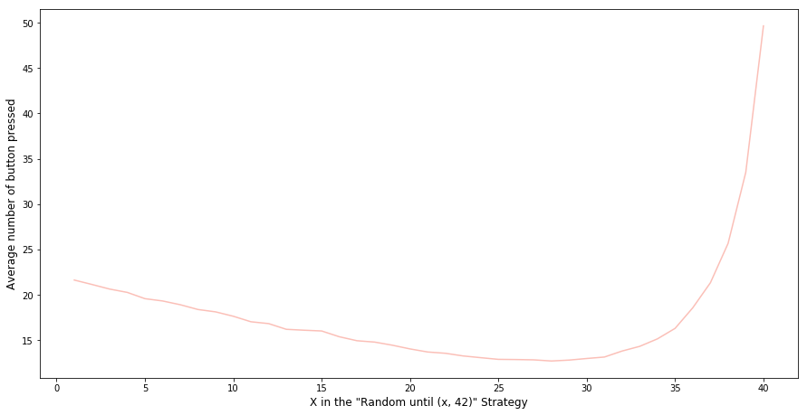

I came across an interesting question from the Riddler column of the famous FiveThirtyEight [website](https://fivethirtyeight.com/tag/the-riddler/).

> From Austin Chen comes a riddle of efficiently finding a song:
>
> You have a playlist with exactly 100 tracks (i.e., songs), numbered 1 to 100. To go to another track, there are two buttons you can press: (1) "Next," which will take you to the next track in the list or back to song 1 if you are currently on track 100, and (2) "Random," which will take you to a track chosen uniformly from among the 100 tracks. Pressing "Random" can restart the track you’re already listening to — this will happen 1 percent of the time you press the "Random" button.
>
> For example, if you started on track 73, and you pressed the buttons in the sequence "Random, Next, Random, Random, Next, Next, Random, Next," you might get the following sequence of track numbers: 73, 30, 31, 67, 12, 13, 14, 89, 90. You always know the number of the track you’re currently listening to.
>
> Your goal is to get to your favorite song (on track 42, of course) with as few button presses as possible. What should your general strategy be? Assuming you start on a random track, what is the average number of button presses you would need to make to reach your favorite song?

I immediately thought of two baseline strategies. One is to only press the "Random" button until we get to Song 42. This is essentially sampling-with-replacement and we would expect to get to the song with an average of 100 button presses (1 / 0.01). The other strategy is to only hit the "Next" button. Since we will get a random song each time we start searching for Song 42, we would expect to reach the song with an average of 49.5 button presses ((0+1+2+3+...+99) / 100). So the best strategy is probably to combine these two in some way. As my friend and fellow Data Scientist [Dinesh] (<http://dvatvani.github.io/)> correctly pointed out during a lunch break (with some awesome Korean fried chicken), the best approach would be to press the "Random" button until we get reasonably close to Song 42 and then hit the "Next" button till we finally get there. For example, we hit "Next" when we are k or fewer tracks away from track 42 and to hit Random otherwise. If we suppose the average number of button presses using this strategy is B, this can be translated into a mathematical question, i.e. we need to determine how B depends on k and then select the k that minimizes B. FiveThirtyEight offers clear reasoning which I quoted below:

> First off, our random starting point might already be within k of 42, which would be fantastic! For these k+1 tracks (we’re adding one because of the possibility of starting on track 42 itself), the average distance from track 42 will be k/2. For the remaining 100−(k+1), or 99−k, tracks, we’ll press the Random button and once again find ourselves in a situation where the average number of remaining button presses — after the one we just made — is B. Putting these two scenarios together, we have our equation for B:
>
> B = (k+1)/100 · k/2 + (99−k)/100 · (B+1)
>
> Notice this equation has a B on both sides. With a little algebraic manipulation, we can find an expression for B in terms of k:
>
> B = k/2 + 100/(k+1) − 1
>
> Great! Now it’s just a matter of finding which value of k minimizes B. And Riddler Nation was up to the task. Quoc Tran generated a graph of how B depends on k, and sure enough, there’s a minimum around k = 13.14. Using calculus, Hector found the exact minimum occurs when k = 10√2 − 1.
>
> But wait a second — k represents the number of tracks away from 42 beyond which you’d start pressing the Random button. In other words, it has to be a whole number, not 13.14. The optimal value of k is, in fact, 13 (very close to 13.14). So that answers the first part of the riddle: Your best strategy is to press the Next button whenever you’re on tracks 29 through 41 and to press the Random button on tracks 1 through 28 and 43 through 100. On track 42, just kick back, relax and enjoy the music.
>
> As for the average number of button presses you’d have to make, which was B in our equations above, we can find that by plugging in the value of 13 for k. It turns out that B is 177/14, or about 12.64 button presses on average.

The explanation is clear and the math is not hard to figure out at all. Although part of me wonders if we can simply brute force the question by running Monte Carlo simulations. Let see what we can do. First, we need to create some functions that simulate the button press.

```python
%matplotlib inline
import random
import matplotlib.pyplot as plt
import numpy as np

# press random button function
def press_random_button(in_state):
    number_of_button_pressed = in_state['number_of_button_pressed'] + 1
    next_song_number = random.randint(1,101)
    out_state = {'number_of_button_pressed': number_of_button_pressed,
                 'song_number': next_song_number}
    return(out_state)

# press next button function
def press_next_button(in_state):
    number_of_button_pressed = in_state['number_of_button_pressed'] + 1
    next_song_number = in_state['song_number'] + 1
    if next_song_number == 101:
        next_song_number = 1
    out_state = {'number_of_button_pressed': number_of_button_pressed,
                 'song_number': next_song_number}
    return(out_state)
```

Then we need to set up a function that simulates the strategy: Press "Random" button until we reach the song that falls between Song X and Song 42, then keep pressing the "Next" button until we reach Song 42.

```python
# function that press the random botton until we get to a song which
# falls into the range of X and 42 and then press next button till we reach Song 42
def random_until_range_strategy_2(start_state, interim_target_range):
    state = start_state
    while state["song_number"] != 42:
        #print(state["song_number"])
        if state["song_number"] > interim_target_range and state["song_number"] < 42:
            while state["song_number"] != 42:
                state = press_next_button(state)
                #print("next")
                #print(state["song_number"])
        else:
            state = press_random_button(state)
            #print("random")
    return(state)
```

Now, let's wrap this function into a loop that can run this strategy multiple times from a random starting song.

```python
# function that simulate the random until range strategy given a random starting song
# and record the number of times a button was pressed
def sim_random_untill_range_strategy_2(interim_target_range, n = 10000):
    sim_result = []
    for i in range(n):
        start_state = {'number_of_button_pressed': 0,
                       'song_number': random.randint(1,101)}
        number_of_button_pressed = random_until_range_strategy_2(start_state, interim_target_range)["number_of_button_pressed"]
        sim_result.append(number_of_button_pressed)
    return(sim_result)
```

Let's say we think Song 20 is the threshold. I.e. the best strategy is pressing the "Random" button until we reach the song that falls between Song 20 and Song 42, then keep pressing the "Next" button until we reach Song 42. Putting everything together, we can run the function to simulate this strategy 10,000 times and plot the number of button presses in a histogram.

```python
def plot_histogram(plot_data):
    result = plt.hist(plot_data, bins=20, color='c', edgecolor='k', alpha=0.65)
    plt.axvline(np.mean(plot_data), color='k', linestyle='dashed', linewidth=1)
    min_ylim, max_ylim = plt.ylim()
    plt.text(np.mean(plot_data)*1.1, max_ylim*0.9, 'Mean: {:.2f}'.format(np.mean(plot_data)))

random_untill_range_skip_song_ls_2 = sim_random_untill_range_strategy_2(20)


plot_histogram(random_untill_range_skip_song_ls_2)
```


This looks like a Poisson distribution with an average number of button presses of 49.6. However, (20,42) is probably not the optimal threshold to achieve the fewest button presses. Let's loop through 1 to 41 to find the best cut-off point.

```python
# loop through different x value (from 1 to 40)
sim_results_2 = []
for x in range(40):
    print("simulating: " + str(x+1))
    random_untill_range_skip_song_ls_2 = sim_random_untill_range_strategy_2(x + 1)
    sim_results_2.append(random_untill_range_skip_song_ls_2)

means_2 = [np.mean(item) for item in sim_results_2]

plt.plot(list(range(1, 41)), means_2)
plt.xlabel('X in the Random until [x, 42] Strategy', fontsize=12)
plt.ylabel('Average number of button pressed', fontsize=12)
```

The graph below suggests that the optimal threshold is 29, which is consistent with what we got from solving the calculus above. The curve is intuitive: If you are too far away from Song 42 when you start to hit the "Next" button, you may not capitalise on the "Random" button enough. If you try to hit a range that is too small, it will take many button presses to land there randomly. Both the math and the Monte Carlo simulation point out the balance point.


