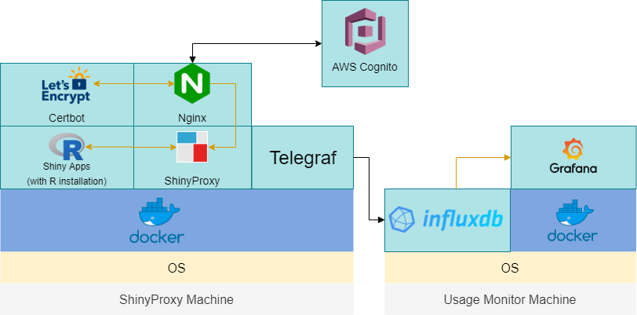
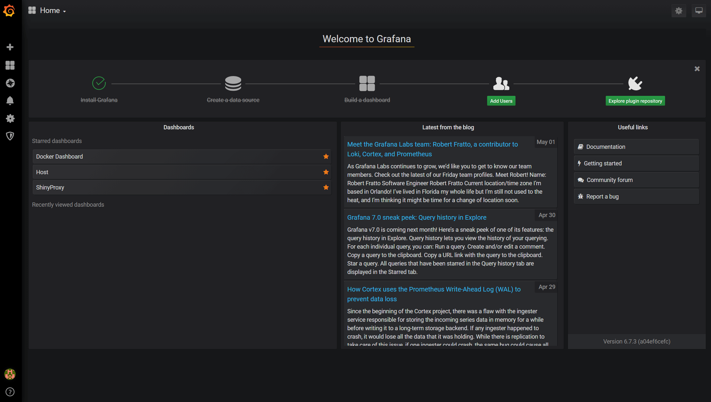
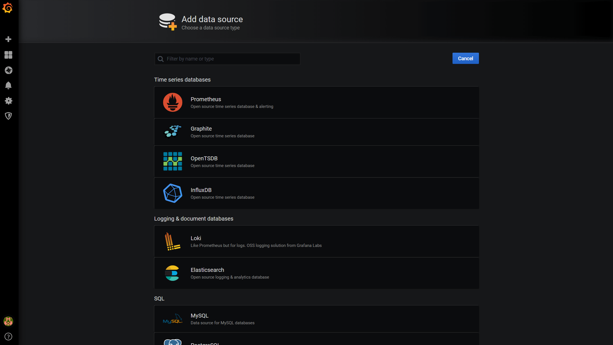
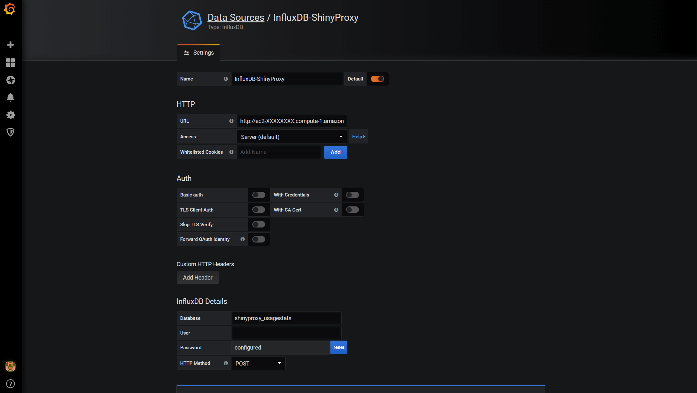
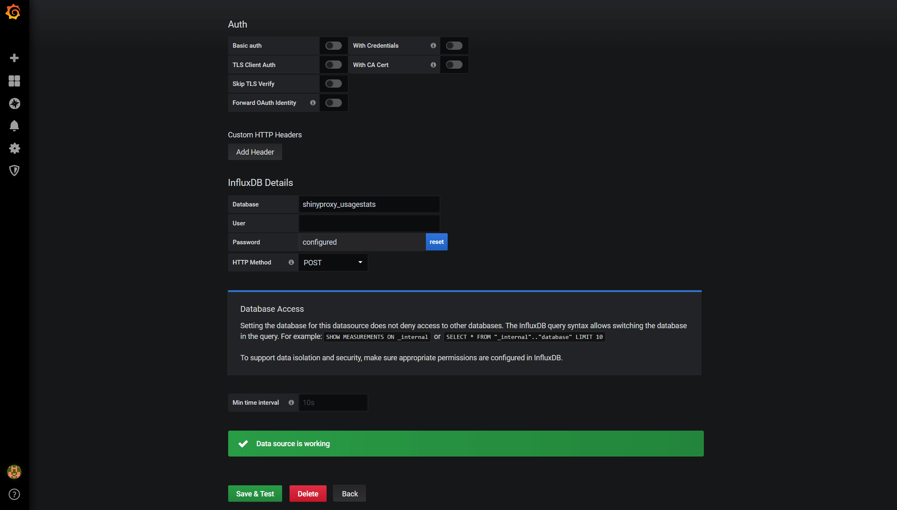
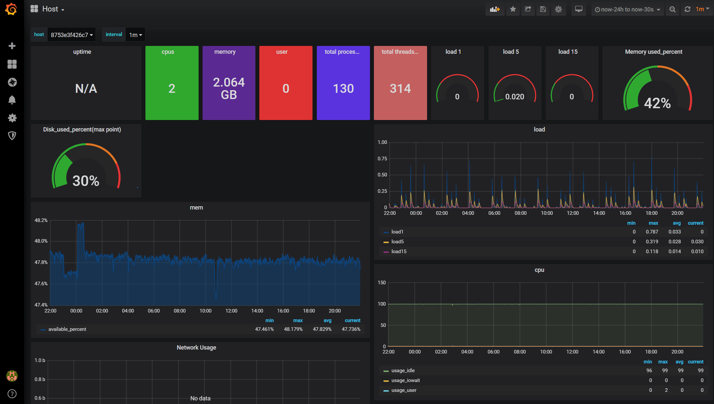
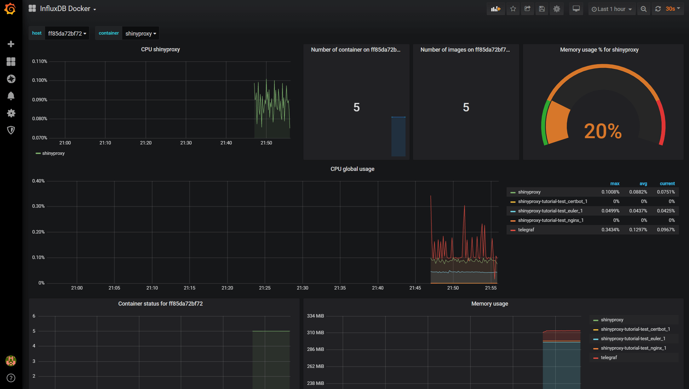
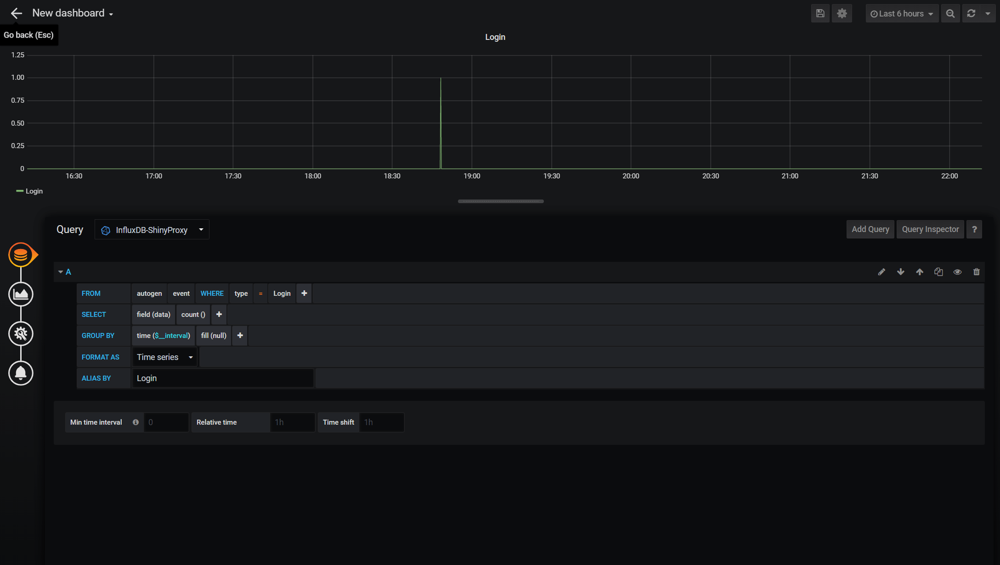

{}
Depending on what you are looking for and your experience with Docker technology and ShinyProxy, you may want to check my other tutorials:

* For learning the framework and testing containerised Shiny apps locally: [Deploying R Shiny apps using ShinyProxy on Windows 10]()

* For securely deploying Shiny apps on Clouds (single node, the docker-compose way): This post

* For deploying secure, scalable, production-grade Shiny apps with Docker Swarm: [Effectively Deploying and Scaling Shiny Apps with ShinyProxy, Traefik and Docker Swarm]()

{}

{}

## Introduction

A while ago I have written a [tutorial]() on deploying R Shiny apps using ShinyProxy. Following it, you should be able to deploy a functional Shiny app on AWS EC2 instance that can serve multiple users simultaneously. However, the app is not really production quality due to a couple of flaws. First, the authentication method of ShinyProxy was set to 'Simple', meaning that the username and password were stored as plain text in the `application.yml`. Second, the communication between users and the AWS instance is not secured as we didn't set up the HTTPS. Third, we were using the default AWS domain, which is hardly user friendly. Finally, we need a proper function to log usage statistics and system metrics in order to maintain the apps in the long-term. In this tutorial, I will address these four issues by extending the current deployment framework utilising a couple of easy-to-set-up services.

In nutshell, we will use [Certbot(Let's Encrypt)](https://certbot.eff.org/) together with a valid domain name to set up the HTTPS site and use [Nginx](https://www.nginx.com/) as a proxy to route HTTP traffic to HTTPS. For authentication, we will use [AWS Cognito](https://aws.amazon.com/cognito/), a service provided by AWS that uses OpenID Connect protocol, which ShinyProxy also supports. For logging and monitoring, we will use [InfluxDB](https://www.influxdata.com/products/influxdb-overview/), an open-source time-series database, to store the usage statistics from ShinyProxy. We will use [Telegraf](https://www.influxdata.com/time-series-platform/telegraf/) to collect other metrics about the host machine and Docker containers and feed those to InfluxDB. Finally, we will use [Grafana](https://grafana.com/), a well-established database analytics and monitoring platform to visualise the metrics. The graph below illustrates the framework.



This may sound like a lot but I will try to break it down into different parts. Also, you don't need to implement all of these in one go as they are largely independent, except for AWS Cognito, which depends on setting up the HTTPS first. However, if you are not familiar with ShinyProxy, you'd find this tutorial make more sense after checking out my previous post [Deploying R Shiny apps using ShinyProxy on Windows 10]().

## Prerequisites

Before we diving into the tutorial, there are a couple of things that need to be done first, which I won't cover in much details here.

### Step 1: Setting up Docker

Setting up Docker engine on your local machine for development is important for this tutorial. Please check [this section]() for details on how to set up Docker engine on Windows 10. If you are using other OS, please check the [official Docker installation guide](https://docs.docker.com/get-docker/).

{}
You may find the shell script from [get.docker.com](https://get.docker.com/) particularly useful.
{}

### Step 2: Building the demo Shiny app and containerised ShinyProxy Docker images

You can skip this step if you already have a function Docker image. Otherwise, please follow [this section](). You should have an image called `shiny-euler-app` (or a name of your choice).

Now, we need to build a Docker image that contains the ShinyProxy engine. Follow [this section]() to build a Docker image called `shinyproxy-example` (or a name of your choice). Don't worry about the settings in `application.yml`, as we will override them when we docker-compose it. Also, you don't need to set up the `container-network` mentioned in that tutorial either.

Now, we will push the two images to DockerHub.

```{sh}
docker login
```

Type your username and password when prompted. You will see 'Login Succeeded' in the console. Now, tag and push the images to your DockerHub repo:

```{sh}
docker tag shinyproxy-example YOUR_USERNAME/shinyproxy-example
docker tag shiny-euler-app YOUR_USERNAME/shiny-euler-app
docker push YOUR_USERNAME/shinyproxy-example
docker push YOUR_USERNAME/shiny-euler-app
```

Now, you should able to pull this image from anywhere using the command below. Of course, you will need to log in first if you set the repo to private.

```{sh}
docker pull YOUR_USERNAME/shiny-euler-app
docker pull YOUR_USERNAME/shinyproxy-example
```

### Step 3: Launching AWS EC2 instances

Following this framework, we will need two AWS EC2 instances, one for hosting ShinyProxy and one for logging and monitoring usage statistics. Below are the minimal specs:

*ShinyProxy Machine:*

* Ubuntu 16.04 LTS (although other versions may also work)
* Open port 22 (SSH), 80 (HTTP) and 443 (HTTPS)
* Minimal 1 GiB of Memory
* Minimal 8 GB of Storage
* Install Docker Engine and docker-compose

*Usage Monitor Machine:*

* Ubuntu 16.04 LTS (although other versions may also work)
* Open port 22 (SSH), 3000 (Grafana) and 8086 (InfluxDB)
* Minimal 0.5 GiB of Memory
* Minimal 8 GB of Storage
* Install Docker Engine

Later in this tutorial, I will refer to the two AWS instances as `ShinyProxy Instance` and `Usage Monitor Instance`. Theoretically, we can use one instance to host both of the ShinyProxy and the usage monitor tools but we won't get much flexibility if we decide to launch another ShinyProxy in future.

The installation of Docker Engine and docker-compose on Ubuntu won't be covered here. You can check out the official guides: [Install Docker Engine on Ubuntu](https://docs.docker.com/engine/install/ubuntu/) and [Install docker-compose](https://docs.docker.com/compose/install/).

According to my experience, containerised ShinyProxy tend to be memory-hungry. It uses about 300 MiB even when idle. The total memory usage depends on your Shiny app but I think we should aim to get at least 1 GiB Memory for it to run smoothly. In production, making sure you have enough memory and adding sway memory are always good ideas. Fortunately, an AWS `t2.micro` instance is enough for the demo, and it is on the free tier!

### Step 4: Setting up a domain name (Optional)

If you already own a domain name (e.g. example.com), it is easy to set up a subdomain (e.g. app.example.com) to host your Shiny app. You will need to set up an A record with your domain registrar and point it to the IP address of the `ShinyProxy Instance`. Using the [DNS Checker](https://dnschecker.org/) to check your newly set up domain name before continue to the next steps.

### Step 5: Setting up AWS Cognito (Optional)

If you decide to use AWS Cognito for authentication (which I highly recommend), you will need to set up a Cognito User Pool in advance. This is relatively straightforward and the official guide can be found [here](https://docs.aws.amazon.com/cognito/latest/developerguide/cognito-user-pool-as-user-directory.html). Step 1 and 2 in the guide are essential for this tutorial. Once you have set the user pool, you will need to do a couple of things:

1. Take a note of your `Pool Id`, which follows the format Pool {region}_{id} (e.g. us-east-1_XXXXXXXXX). From here, you can also get the `region` of your user pool, which will be useful later.
2. Create a test user account for yourself under the `Users and groups` tab. Create a group called `admins` and assign the test account to that group.
3. Create a `App client` called 'shiny-simulator-test' (or a name of your choice). Note down the `App client id` and `App client secret`.
4. Under the `App integration/App client settings`, check `Cognito User Pool` as the `Enabled Identity Providers`. You can also use other `Identity providers` such as Facebook or Google but I won't cover them here.
5. On the same page, set the `Callback URL(s)` to 'https://{your_domain}/login/oauth2/code/shinyproxy' and the `Sign out URL(s)` to 'https://{your_domain}'. In the tutorial, I will use 'app.example.com' as a placeholder.
6. Again, on the same page, under `OAuth 2.0`, check `Authorization code grant`, `Implicit grant` for `Allowed OAuth Flows` and then check everything except for `phone` for `Allowed OAuth Scopes`.
7. On the `App integration/Domain name`, set the `Domain prefix` of your choice and note down the whole `Amazon Cognito domain`. This is the domain name of the sign-in page users will be redirected to when they visit your website. You have a choice of setting up your own domain for the sign-in page.

## Setting up HTTPS (SSL / TLS)

### Step 1: Preparing configuration files

For the core services (e.g. ShinyProxy, Nginx and Certbot), we will use docker-compose to set them up in one go. I have prepared a template for this based on this wonderful [tutorial](https://medium.com/@pentacent/nginx-and-lets-encrypt-with-docker-in-less-than-5-minutes-b4b8a60d3a71). I have tailored it to work with ShinyProxy but feel free to check the original post for technical details, which I won't cover here.

First, fork (and clone) the template repo:

`https://github.com/presstofan/shinyproxy-docker-compose-demo.git`

Below is the structure of the directory `shinyproxy-docker-compose-demo`:

```{sh}
|   docker-compose.yml
|   init-letsencrypt.sh
|
+---application
|       application.yml
|
\---data
    \---nginx
            app.conf
```

Now, we will need to update a couple of configuration files before docker-compose it. First, let's take a look of the `application.yml`

application.yml

```{yml}
proxy:
  title: My Awesome Shiny Portal
  port: 8080 # use Port 8080 for ShinyProxy
  
  container-wait-time: 30000 # how long should we wait for the container to spin up (30s as default as this is enough for our Shiny apps)
  heartbeat-rate: 10000 # the user's browser will send a heartbeat call every heartbeat-rate milliseconds (10s as default)
  heartbeat-timeout: 60000 # if the server does not receive a heartbeat for heartbeat-timeout milliseconds, the relevant proxy will be released (60s as default)

  usage-stats-url: http://{your_InfluxDB_instance_domain}:8086/write?db=shinyproxy_usagestats # use InfluxDB to store usage statistics; can be in a different server
  # usage-stats-username: xxxx # influxdb username if needed
  # usage-stats-password: xxxx # influxdb password if needed

  #### OpenID Connect Authentication ####
  authentication: openid # use openid auth framework
  openid:
    roles-claim: cognito:groups # use the groups value passed by AWS cognito to identify user groups
    auth-url: # https://{cognito_domain_prefix}.auth.{region}.amazoncognito.com/oauth2/authorize
    token-url: # https://{cognito_domain_prefix}.auth.{region}.amazoncognito.com/oauth2/token
    jwks-url: # https://cognito-idp.{region}.amazonaws.com/{userPoolId}/.well-known/jwks.json
    logout-url: # https://{cognito_domain_prefix}.auth.{region}.amazoncognito.com/logout?client_id={client_id}&logout_uri={your_host_url}
    client-id:  # get this from AWS Cognito user pool management page
    client-secret:  # get this from AWS Cognito user pool management page
  
  #### Simple Authentication ####
  # authentication: simple
  # admin-groups: admins
  # users:
  # - name: admin
  #   password: admin
  #   groups: admins
  
  docker:
      internal-networking: true
  
  # Below is a list of Shiny app and their config (including who can access to which)
  specs:
    - id: euler
      display-name: Euler's number
      container-cmd: ["R", "-e", "shiny::runApp('/root/euler')"]
      container-image: shiny-euler-app
      access-groups: admins
      container-network: sp-net

server:
  useForwardHeaders: true # this is very important to make the AWS Cognito auth working

logging:
  file:
    shinyproxy.log
```

I won't go into details for the `application.yml` set up as ShinyProxy has a comprehensive [guide](https://www.shinyproxy.io/configuration/) on this. However, I will point out a couple of important things:

1. The default `port` for ShinyProxy is 8080 and we use it. If this is changed, the docker-compose files below need to be updated accordingly.
2. `usage-stats-url` need to updated to point to the AWS EC2 instance hosting the usage statistics tools. The ':8086/write?db=shinyproxy_usagestats' bit is important as it specifies the port of the InfluxDB and the name of the database (which we will create later).
3. All the items under `openid` need to be updated if you have set up AWS Cognito User Pool (i.e. replace the content in {} with the information you noted down from the AWS Cognito User Pool setting page). If you are not using it, simply comment out this block and uncomment the 'Simple Authentication' block and set it up accordingly.
4. Under the `specs` is the place you specify what Shiny apps should be available in your ShinyProxy portal. The `container-cmd` would depend on the name of the directory that contains your R Shiny app (e.g. the server.R and ui.R). `container-image` needs to be consistent with the name of the image you pushed to DockerHub. Note that when you pull, it will add `YOUR_USERNAME/` to the image by default. Finally `access-groups` defines who can access to the app. Make sure you include the group that the test account is in (e.g. admins).
5. Under `server`, the `useForwardHeaders` need to be set to 'true' to make AWS Cognito works properly.

Now, let's move to `app.conf`, which is the Nginx configuration file.

app.conf

```{conf}
server {
    listen 80;
    server_name app.example.com;
    server_tokens off;

    location /.well-known/acme-challenge/ {
        root /var/www/certbot;
    }

    location / {
        return 301 https://$host$request_uri;
    }
}

server {
    listen                443 ssl;
    server_name           app.example.com;
    access_log            /var/log/nginx/shinyproxy.access.log;
    error_log             /var/log/nginx/shinyproxy.error.log error;
    server_tokens off;
    ssl_protocols TLSv1 TLSv1.1 TLSv1.2;

    ssl_certificate       /etc/letsencrypt/live/app.example.com/fullchain.pem;
    ssl_certificate_key   /etc/letsencrypt/live/app.example.com/privkey.pem;
    include /etc/letsencrypt/options-ssl-nginx.conf;
    ssl_dhparam /etc/letsencrypt/ssl-dhparams.pem;

    location / {
        proxy_pass          http://shinyproxy:8080;

        proxy_http_version 1.1;
        proxy_set_header Upgrade $http_upgrade;
        proxy_set_header Connection "upgrade";
        proxy_read_timeout 600s;

        proxy_redirect    off;
        proxy_set_header  Host             $http_host;
        proxy_set_header  X-Real-IP        $remote_addr;
        proxy_set_header  X-Forwarded-For  $proxy_add_x_forwarded_for;
        proxy_set_header  X-Forwarded-Proto $scheme;
        }

}
```

You will need to change all the instances of `app.example.com` (4 in total) to your own domain name and that's it! This configuration file instructs Nginx to listen port 80 (HTTP) for challenges (an important step for setting up the SSL certificate) and redirect traffic to port 443 (HTTPS), which has the certificate. Then the traffic will be directed to port 8080 of the local `shinyproxy` service where the magic happens. The full Nginx set up is fairly complicated and you can check the [official guide](https://www.nginx.com/resources/wiki/start/topics/examples/full/) to tailor it for your need.

Next, we will set up `docker-compose.yml`, which link everything together.

docker-compose.yml

```{yml}
version: '3.5'

services:
  nginx:
    image: nginx:1.15-alpine
    depends_on:
     - shinyproxy
     - certbot
    restart: unless-stopped
    volumes:
      - ./data/nginx:/etc/nginx/conf.d
      - ./data/certbot/conf:/etc/letsencrypt
      - ./data/certbot/www:/var/www/certbot
    ports:
      - "80:80"
      - "443:443"
    networks:
      - sp-net
    command: "/bin/sh -c 'while :; do sleep 6h & wait $${!}; nginx -s reload; done & nginx -g \"daemon off;\"'"
  certbot:
    image: certbot/certbot
    restart: unless-stopped
    volumes:
      - ./data/certbot/conf:/etc/letsencrypt
      - ./data/certbot/www:/var/www/certbot
    networks:
      - sp-net
    entrypoint: "/bin/sh -c 'trap exit TERM; while :; do certbot renew; sleep 12h & wait $${!}; done;'"
  shinyproxy:
    image: YOUR_USERNAME/shinyproxy-example
    depends_on:
      - euler
    container_name: shinyproxy
    expose:
      - 8080
    volumes:
      - ./application/application.yml:/opt/shinyproxy/application.yml
      - /var/run/docker.sock:/var/run/docker.sock
    networks:
      - sp-net
  euler:
    image: YOUR_USERNAME/shiny-euler-app

networks:
  sp-net:
    name: sp-net
```

The details of this set up (especially for Nginx and Certbot services) can be found in [this post](https://medium.com/@pentacent/nginx-and-lets-encrypt-with-docker-in-less-than-5-minutes-b4b8a60d3a71). A couple of key things to point out:

1. You will need to update the two images `YOUR_USERNAME/shiny-euler-app` and `YOUR_USERNAME/shinyproxy-example`.
2. We need to link the Certbot and Nginx together by using two shared volumes `./data/certbot/conf:/etc/letsencrypt` and `./data/certbot/www:/var/www/certbot`. In this way, when Certbot obtains the certificate, Nginx is able to access it.
3. The code after `entrypoint` under the Certbot service is to make sure Certbot check if your certificate is up for renewal every 12 hours as recommended by Let’s Encrypt.
4. The code after `command` under the Nginx service is to make that Nginx reloads the newly obtained certificates every 6 hours.
5. We need to instruct docker-compose to create a container network called `sp-net` that links all the services together.

Finally, We need Nginx to perform the Let’s Encrypt validation. However, Nginx won’t start if the certificates are missing. The author of [this post](https://medium.com/@pentacent/nginx-and-lets-encrypt-with-docker-in-less-than-5-minutes-b4b8a60d3a71) proposed a solution. That is, we first create a dummy certificate, start Nginx, delete the dummy and request the real certificates using Certbot. This progress is automated with the below shell script.

init-letsencrypt.sh

```{sh}
#!/bin/bash

if ! [ -x "$(command -v docker-compose)" ]; then
  echo 'Error: docker-compose is not installed.' >&2
  exit 1
fi

domains=(app.example.com)
rsa_key_size=4096
data_path="./data/certbot"
email="YOUR_EMAIL" # Adding a valid address is strongly recommended
staging=0 # Set to 1 if you're testing your setup to avoid hitting request limits

if [ -d "$data_path" ]; then
  read -p "Existing data found for $domains. Continue and replace existing certificate? (y/N) " decision
  if [ "$decision" != "Y" ] && [ "$decision" != "y" ]; then
    exit
  fi
fi


if [ ! -e "$data_path/conf/options-ssl-nginx.conf" ] || [ ! -e "$data_path/conf/ssl-dhparams.pem" ]; then
  echo "### Downloading recommended TLS parameters ..."
  mkdir -p "$data_path/conf"
  curl -s https://raw.githubusercontent.com/certbot/certbot/master/certbot-nginx/certbot_nginx/_internal/tls_configs/options-ssl-nginx.conf > "$data_path/conf/options-ssl-nginx.conf"
  curl -s https://raw.githubusercontent.com/certbot/certbot/master/certbot/certbot/ssl-dhparams.pem > "$data_path/conf/ssl-dhparams.pem"
  echo
fi

echo "### Creating dummy certificate for $domains ..."
path="/etc/letsencrypt/live/$domains"
mkdir -p "$data_path/conf/live/$domains"
docker-compose run --rm --entrypoint "\
  openssl req -x509 -nodes -newkey rsa:1024 -days 1\
    -keyout '$path/privkey.pem' \
    -out '$path/fullchain.pem' \
    -subj '/CN=localhost'" certbot
echo


echo "### Starting nginx ..."
docker-compose up --force-recreate -d nginx
echo

echo "### Deleting dummy certificate for $domains ..."
docker-compose run --rm --entrypoint "\
  rm -Rf /etc/letsencrypt/live/$domains && \
  rm -Rf /etc/letsencrypt/archive/$domains && \
  rm -Rf /etc/letsencrypt/renewal/$domains.conf" certbot
echo


echo "### Requesting Let's Encrypt certificate for $domains ..."
#Join $domains to -d args
domain_args=""
for domain in "${domains[@]}"; do
  domain_args="$domain_args -d $domain"
done

# Select appropriate email arg
case "$email" in
  "") email_arg="--register-unsafely-without-email" ;;
  *) email_arg="--email $email" ;;
esac

# Enable staging mode if needed
if [ $staging != "0" ]; then staging_arg="--staging"; fi

docker-compose run --rm --entrypoint "\
  certbot certonly --webroot -w /var/www/certbot \
    $staging_arg \
    $email_arg \
    $domain_args \
    --rsa-key-size $rsa_key_size \
    --agree-tos \
    --force-renewal" certbot
echo

echo "### Reloading nginx ..."
docker-compose exec nginx nginx -s reload
```

In this shell script, you will need to change `app.example.com` with your own domain name and enter your email address, so Let's Encrypt can contact you if your certificate is about to expire or has any issue.

Once you are happy with the configuration files, you may want to commit and push it to your own GitHub repo for easy access. Now we have everything we need. Let's log in to our `ShinyProxy Machine` and try it out!

### Step 2: Setting up `ShinyProxy Machine`

SSH to the `ShinyProxy Machine` and git pull your own configuration repo `shinyproxy-docker-compose-demo` (or some other name you specified). The structure of the files and directory should remain the same. You should already have the Docker Engine and docker-compose installed. Start the Docker service:

```{sh}
sudo service docker start
```

And check the services are running:

```{sh}
sudo docker version
sudo docker-compose version
```

And pull the Docker images. Note that you may need to login here (if you images are in private repos).

```{sh}
sudo docker pull YOUR_USERNAME/shiny-euler-app
sudo docker pull YOUR_USERNAME/shinyproxy-example
```

If all is running fine, CD into `shinyproxy-docker-compose-demo`. First, we will run the `init-letsencrypt.sh`, but not before we make it executable first. Follow the command line prompt to complete the progress, during which all the services will be up using docker-compose and if this is the first time you are running the script, it will take some time to build the images for Certbot and Nginx.

```{sh}
chmod +x init-letsencrypt.sh
```

Then run it with

```{sh}
sudo ./init-letsencrypt.sh
```

You will see something like below if the certificate is successfully issued.

```{console}
Congratulations! You have successfully enabled https://example.com and https://www.example.com

-------------------------------------------------------------------------------------
IMPORTANT NOTES:

Congratulations! Your certificate and chain have been saved at:
/etc/letsencrypt/live/example.com/fullchain.pem
Your key file has been saved at:
/etc/letsencrypt/live/example.com//privkey.pem
Your cert will expire on 2017-12-12.
```

Then, if you check the Docker containers using the command below, you will find `shinyproxy`, `nginx` and `certbot` running.

```{sh}
sudo docker stats
```

If not, simply docker-compose it up.

```{sh}
sudo docker-compose up
```

Give it a few seconds and visit `app.example.com`. You should either see the AWS Cognito login page or the ShinyProxy login page depending on your setup.

If you decide to take the site down, just use the following command and everything will be nice and clean.

```{sh}
sudo docker-compose down
```

## Setting up InfluxDB, Telegraf and Grafana for usage statistics logging

Setting up the usage statistics monitoring tools is relatively straightforward and can be done without scheduling downtime of your `ShinyProxy Machine`.

### Step 1: Setting up Telegraf on `ShinyProxy Machine`

ShinyProxy has a built-in function that sends the basic usage information (login, sign-out, start/stop apps etc.) to InfluxDB. However, we also need to collect metrics (such as memory and CPU usage) from the host machine and Docker Engine. To achieve this, we will need to use [Telegraf](https://www.influxdata.com/time-series-platform/telegraf/).

Again, we need to SSH to `ShinyProxy Machine` and create a new folder called `telegraf` in `etc` directory.

```{sh}
sudo mkdir -p /etc/telegraf
```

Now we will need to make sure the Docker service is running:

```{sh}
sudo service docker start
```

Similar to other services, Telegraf needs a configuration file to work properly and it can be quite complicated. Fortunately, we can create a template configuration file by running the `config` command from the Telegraf's Docker container. The following command will download the `telegraf` image and run it to generate the default configuration file.

```{sh}
sudo docker run --rm telegraf telegraf config | sudo tee /etc/telegraf/telegraf.conf &lt; /dev/null
```

Now, time to test your vim skill. We need to open the `telegraf.conf` and do two things. First, locate the `[[outputs.influxdb]]` section and update the `urls` to the ip/domain address of the `Usage Monitor Machine`. Don't forget to specify the port 8086.

```{sh}
urls = ["http://{domain_name}:8086"]
```

Then locate the `HTTP Basic Auth` section and modify the credentials accordingly if you do plan to set up credentials for your InfluxDB

```{sh}
username = ""
password = ""
```

Finally, locate the `[[inputs.docker]]` section, uncomment the block and set it up with the following settings:

```{sh}
# Read metrics about docker containers
[[inputs.docker]]
  ## Docker Endpoint
  ##   To use TCP, set endpoint = "tcp://[ip]:[port]"
  ##   To use environment variables (ie, docker-machine), set endpoint = "ENV"
  endpoint = "unix:///var/run/docker.sock"

  ## Set to true to collect Swarm metrics(desired_replicas, running_replicas)
  ## Note: configure this in one of the manager nodes in a Swarm cluster.
  ## configuring in multiple Swarm managers results in duplication of metrics.
  gather_services = false

  ## Only collect metrics for these containers. Values will be appended to
  ## container_name_include.
  ## Deprecated (1.4.0), use container_name_include
  container_names = []

  ## Set the source tag for the metrics to the container ID hostname, eg first 12 chars
  source_tag = false

  ## Containers to include and exclude. Collect all if empty. Globs accepted.
  container_name_include = []
  container_name_exclude = []

  ## Container states to include and exclude. Globs accepted.
  ## When empty only containers in the "running" state will be captured.
  ## example: container_state_include = ["created", "restarting", "running", "removing", "paused", "exited", "dead"]
  ## example: container_state_exclude = ["created", "restarting", "running", "removing", "paused", "exited", "dead"]
  ## container_state_include = []
  ## container_state_exclude = []

  ## Timeout for docker list, info, and stats commands
  timeout = "5s"

  ## Whether to report for each container per-device blkio (8:0, 8:1...) and
  ## network (eth0, eth1, ...) stats or not
  perdevice = true

  ## Whether to report for each container total blkio and network stats or not
  total = false

  ## docker labels to include and exclude as tags.  Globs accepted.
  ## Note that an empty array for both will include all labels as tags
  docker_label_include = []
  docker_label_exclude = []

  ## Which environment variables should we use as a tag
  tag_env = ["JAVA_HOME", "HEAP_SIZE"]

  ## Optional TLS Config
  ## tls_ca = "/etc/telegraf/ca.pem"
  ## tls_cert = "/etc/telegraf/cert.pem"
  ## tls_key = "/etc/telegraf/key.pem"
  ## Use TLS but skip chain & host verification
  ## insecure_skip_verify = false
```

Then we run the following command. Since telegraf is run within a container, the unix socket will need to be exposed within the telegraf container. This can be done in the docker CLI by add the option `-v /var/run/docker.sock:/var/run/docker.sock`.

```{sh}
sudo docker run -d -p 998:998 --name=telegraf \
      --net=sp-net \
      -e HOST_PROC=/host/proc \
      -v /var/run/docker.sock:/var/run/docker.sock \
      -v /proc:/host/proc:ro \
      -v /etc/telegraf/telegraf.conf:/etc/telegraf/telegraf.conf:ro \
      telegraf
```

Run the command below to check if telegraf container is running.

```{sh}
sudo docker container logs -f --since 10m telegraf
```

### Step 2: Setting up InfluxDB on `Usage Monitor Machine`

Now, SSH to the `Usage Monitor Machine`, which should already have Docker Engine running. InfluxDB installation should be fairly easy. If you launched your AWS EC2 instance using an Ubuntu 16.04 LTS system, InfluxDB can be downloaded and installed with the following commands:

```{sh}
wget https://dl.influxdata.com/influxdb/releases/influxdb_1.8.0_amd64.deb
sudo dpkg -i influxdb_1.8.0_amd64.deb
```

You can also use Docker image to build InfluxDB or even docker-compose to set up, but I found the standalone version simple enough to set up and maintain. Once the installation is competed, start the service by:

```{sh}
sudo service influxdb start
```

And check if the service is running properly.

```{sh}
sudo service influxdb status
```

Now, let's create two databases, one for ShinyProxy and one for Telegraf. Note that the name of the databases needs to be consistent with the settings in ShinyProxy `application.yml` and `telegraf.conf`. Open the InfluxDB CLI with:

```{sh}
influx
```

And then

```{sh}
CREATE DATABASE shinyproxy_usagestats
CREATE DATABASE telegraf
```

If everything is working fine and your `ShinyProxy Machine` is running. You will be able to see data appears in the two databases shortly. Note that to see the data in `shinyproxy_usagestats` you may need to log in to your app once. The query language InfluxDB uses is not so different from SQL but the data structure is different since it is a time-series database. [Here](https://gist.github.com/tomazursic/6cc217e2644c619ceceefb8ce824925b) are some commands to get you started. I have also listed some below:

```{sh}
USE telegraf
SHOW FIELD KEYS
SHOW SERIES
USE shinyproxy_usagestats
SHOW FIELD KEYS
SHOW SERIES
SELECT * FROM event
quit
```

Of course, we are not going to monitor our apps using the InfluxDB CLI client, so let's move on to the next part to set up Grafana!

### Step 3: Setting up Grafana on `Usage Monitor Machine`

In the `Usage Monitor Machine`, let's run Grafana using Docker.

```{sh}
sudo docker run -d --name=grafana -p 3000:3000 grafana/grafana
```

Now, open your browser and head over to your Grafana homepage. If you are using AWS EC2 instance, it should be something like this: 'http://ec2-XX-XX-XX-XX.compute-1.amazonaws.com:3000'. Don't forget the specify the port 3000 as that is the one listened by Grafana. You will then see the following login UI. The default username and password are both 'admin'. When you log in for the first time, it will prompt you to change your password.


Once you have signed in, you will see the home page below. Now, click the `Add data source` button and choose InfluxDB when prompted.





Below is the data source settings. The bare minimal settings we need to specify is the `Name`, `URL` and `Database`. `URL` should point to the address of your `Usage Monitor Machine`, followed by the 8086 port. 'http://ec2-XX-XX-XX-XX.compute-1.amazonaws.com:8086'. Let's set the ShinyProxy first. So we will need to put `shinyproxy_usagestats` for `Database`.



Once it is done, click the `Save & Test` button at the end of the page and you will see something like below that says your database is connected. Now, repeat the same process to connect to the Telegraf database (which is called `telegraf` if you have followed the tutorial), which stores the host system metrics and Docker stats.



The next step is to build the dashboards to visualise the data. There are two ways we can do this. We can either build them from scratch or use the official & community built dashboards. For Docker and host metrics, there are well-established dashboards. To add them, you need to hover on the 'Plus' sign on the left and then 'Import'. Then enter the dashboard ID, which you can find [here](https://grafana.com/grafana/dashboards?orderBy=name&direction=asc). Below are the two dashboards I like (1443 for host and 1150 for Docker). Once you have picked the dashboard you like, you need to specify the InfluxDB data source, which we have just set up.





At the time of the writing, there is no available Grafana dashboard for ShinyProxy. So we need to build one from scratch. To do so, hover on the 'Plus' sign again and then click 'Dashboard'. A dashboard contains one or more panels and each panel consist of the query part and the visualisation part. We will start by clicking 'Add Query'. Below is the panel editor. It contains a query builder that helps you to get started. Below is a simple query to monitor the login. You can also switch to the query text editing mode, which is more flexible in my opinion. There isn't much information recorded by ShinyProxy but you have the basic such as login, sign-out, start and stop apps. More complicated queries can be built to show the number of users at the moment, how long each of them uses the apps and etc. I will look into this in the future. Meanwhile, feel free to explore yourself and contribute to the Grafana community by sharing your ShinyProxy dashboards!



## Next Steps

That concludes this tutorial. We now have a functional Shiny app served by ShinyProxy with a secured host and monitoring capability. One thing we can further improve is the scalability of the app. Currently, it is served by a single AWS EC2 instance. Depending on the size of memory and number of vCPUs, it can serve one to a few dozen users simultaneously. However, we usually don't expect users 24/7. As such, building a scalable app using Docker Swarm or Kubernetes would be much more cost-efficient. In the next post, I will explore this route. So stay tuned!

{}
1 June 2020 Update:

New tutorials in this series are available:

* [Effectively Deploying and Scaling Shiny Apps with ShinyProxy, Traefik and Docker Swarm]()

{}
