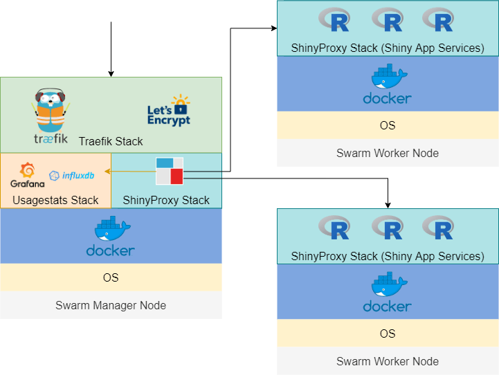
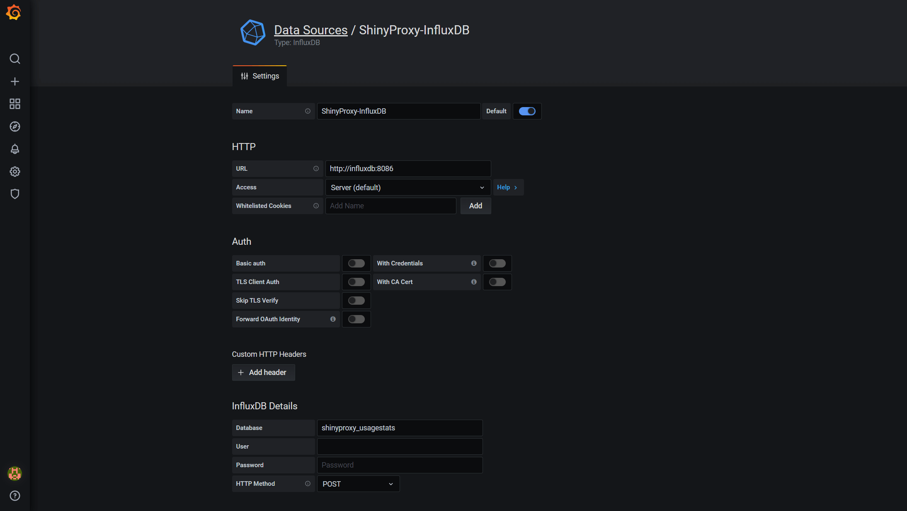
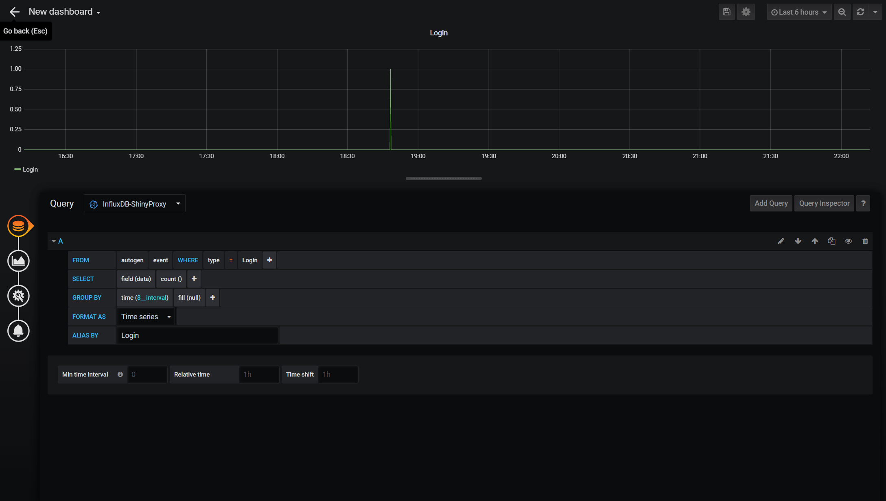

{}
Depending on what you are looking for and your experience with Docker technology and ShinyProxy, you may want to check my other tutorials:

* For learning the framework and testing containerised Shiny apps locally: [Deploying R Shiny apps using ShinyProxy on Windows 10]()

* For securely deploying Shiny apps on Clouds (single node, the docker-compose way): [Securing and Monitoring ShinyProxy Deployment of R Shiny Apps]()

* For deploying secure, scalable, production-grade Shiny apps with Docker Swarm: This post

{}

{}
24 Aug 2020 Update:

I have added a section to show how we can deploy Shiny apps in the Swarm without the ShinyProxy stack.

{}

{}

## Introduction

If you search for R Shiny apps deployment and landed on this post, chances are you are like me - a data scientist who just want to build a decent app to host a dashboard or a prediction model without going down to the rabbit hole of DevOps or the frontend/backend development. Don't worry, this is just the thing you need and I promise nothing below is too complicated. You can probably go through the following tutorial in half an hour. Now. let's start.

In this post, we will build a scalable, production-grade Shiny app powered by ShinyProxy and Docker Swarm and use Traefik to handle the SSL certificate (which gives you the little padlock in front of your domain name), reverse proxy (for routing traffic from the 80 and 443 ports to your Shiny app and other places if needed) and load balancing.



If you are not familiar with ShinyProxy and wonder why you should use it over the other options, I have written another post titled [Deploying R Shiny apps using ShinyProxy on Windows 10]() that explains it in more detail. If you haven't used Docker technology before, it is also a good idea to check out that post first. In the interest of space, I won't cover too many details regarding Docker in this tutorial.

### Docker Swarm vs standard Docker containers

You probably wonder why you need Docker Swarm rather than just using docker-compose to deploy containers, particularly if you only have one server/node/instance. Docker Captain Bret Fisher explained it well [here](https://github.com/BretFisher/ama/issues/8). I summarised a couple of key benefits of Docker Swarm below:

* Docker Swarm is fully supported by Docker Engine, which means 1) it only takes a single line of command to create a Swarm and 2) it saves you time to manually install docker-compose, which is not available in the standard Docker Engine.
* You are future-proofed. If you want to become highly-available and scale out your app, you won't need to start from scratch. Again, with Docker Swarm, it is just a few commands away from adding more nodes.
* docker-compose is only designed for development, not production, as it lacks a couple of important features out-of-the-box: 1) handling secret (that stores your keys and passwords securely) 2) auto-recovery of services, 3) rollbacks and 4) healtchecks. The last one is particularly crucial for production.
* You are able to do rolling update with Docker Swarm, which means no downtime for your app.
* Finally, if you are already using docker-compose.yml file, it is just a couple tweaks away to make it Docker Swarm friendly!

### Docker Swarm vs Kubernetes

In terms of container orchestration tools, Kubernetes is more popular. It covers almost all the use cases and can be more flexible than Docker Swarm. Plus, many vendors adopt the 'Kubernetes first' support strategy and some clouds even manage/deploy Kubernetes for you. However, I'd still argue that Docker Swarm is adequate for 80% of the use cases and way much easier to set up. This means you can have your app running in hours rather than days!

### Traefik vs Nginx

If you have read my previous post [Securing and monitoring ShinyProxy deployment of R Shiny apps](), you may wonder why I switched away from Nginx to Traefik. This is mainly due to the ease of set up. Nginx settings can end up in huge config maps that are hard to read and manage. This is not an issue with Traefik, which allows you to use Docker labels to manage configs. We will see this later in the tutorial.

## Prerequisites

In order to go through the tutorial, you need at least one server with the following specs:

* Ubuntu Server 18.04 LTS LTS (although other versions may also work)
* Minimal 1 GiB of memory
* Minimal 8 GB of storage
* Install Docker Engine

If you have an AWS Free Tier account, a free t2.micro instance would be fine. However, I'd recommend you go for something with 2 GiB of memory (e.g. t3a.small) if you also want to try out the monitoring/managing tools (e.g. Swarmpit, Grafana, etc.) mentioned later in this tutorial. My experience is that ShinyProxy uses about 200-300 MiB of memory and the demo Shiny app uses about 100 MiB. On top of that, if you count the Traefik stack, you probably don't have enough remaining memory for the additional services.

You also need to set the relevant ports so the Swarm nodes can communicate with each other and allow traffic to your app. You should use the AWS Security Group (or equivalent from other Clouds) for easy setup and management. Below are the specific settings:

<details>
<summary>SHOW AWS security group settings</summary>
<p>

Swarm Manager Security Group (Inbound Rules):

| TYPE            | PROTOCOL | PORTS | SOURCE                     |
|-----------------|----------|-------|----------------------------|
| Custom TCP Rule | TCP      | 2377  | Swarm managers and workers |
| Custom TCP Rule | TCP      | 7946  | Swarm managers and workers |
| Custom UDP Rule | UDP      | 7946  | Swarm managers and workers |
| Custom UDP Rule | UDP      | 4789  | Swarm managers and workers |
| Custom Protocol | 50       | all   | Swarm managers and workers |
| SSH             | TCP      | 22    | Your ip                    |
| HTTP            | TCP      | 80    | Anywhere                   |
| HTTPS           | TCP      | 443   | Anywhere                   |

Swarm Worker Security Group (Inbound Rules):

| TYPE            | PROTOCOL | PORTS | SOURCE                     |
|-----------------|----------|-------|----------------------------|
| Custom TCP Rule | TCP      | 7946  | Swarm managers and workers |
| Custom UDP Rule | UDP      | 7946  | Swarm managers and workers |
| Custom UDP Rule | UDP      | 4789  | Swarm managers and workers |
| Custom Protocol | 50       | all   | Swarm managers and workers |
| SSH             | TCP      | 22    | Your ip                    |

</p>
</details>

---

We will first set up a manager node. Once you have launched the instance with the relevant ports opened, we will install Docker Engine using the setup script.

```{sh}
curl -fsSL https://get.docker.com -o get-docker.sh
sh get-docker.sh
```

After installing Docker, I'd suggest that you add your user to the 'docker' group so that you could use Docker as a non-root user.

```{sh}
sudo usermod -aG docker ubuntu
```

And don't forget the logout and back in for this change to take effect. Then you should be able to run docker commands without using `sudo`.

## Setting up Docker Swarm

As mentioned, you just need one line of command to initiate a Docker Swarm, as it is built into the standard Docker Engine.

```{sh}
docker swarm init
```

You will see something like this:

```{sh}
Swarm initialized: current node (xxxx) is now a manager.
```

We then need to get the join token for managers and workers.

```{sh}
docker swarm join-token worker
docker swarm join-token manager
```

Note down the join commands. To add nodes to the current Swarm as a manager or worker, you simply need to launch another instance, install Docker Engine and run the join commands. However, we don't need to set them up for now.

## Setting up domains for your app and system dashboards

Let's say you own the domain `example.com` and you want to use the subdomain `app.example.com` for your app. You need to create the following DNS records for your app and Traefik dashboard:

| RECORD TYPE | NAME                        | VALUE                            |
|-------------|-----------------------------|----------------------------------|
| A           | app.example.com             | IP of your Swarm Master instance |
| A           | traefik.sys.app.example.com | IP of your Swarm Master instance |

## Setting up Traefik stack

Our next task is to set up the proxy/load balancer Traefik. [Docker Swarm Rocks](https://dockerswarm.rocks/traefik/) has a wonderful tutorial for it. I have summarised the key steps here. First, we need to create an `overlay` network shared with Traefik and allow nodes on the Swarm to communicate with each other. Note that this is different from the host-specific networks we create using the default `bridge` driver, which only allows networking between containers in one server. The `overlay` network sits on top of (overlays) the host-specific networks and allows containers connected to it to communicate securely when encryption is enabled.

```{sh}
docker network create --driver=overlay traefik-public
```

Get the Swarm node ID of this node and store it in an environment variable.

```{sh}
export NODE_ID=$(docker info -f '{{.Swarm.NodeID}}')
```

Create a tag in this node, so that Traefik is always deployed to the same node and uses the same volume.

```{sh}
docker node update --label-add traefik-public.traefik-public-certificates=true $NODE_ID
```

Create an environment variable with your email, to be used for the generation of Let's Encrypt certificates.

```{sh}
export EMAIL=admin@example.com
```

Create an environment variable with the domain you want to use for the Traefik dashboard. If you specified a different domain name before, you need to update the below code accordingly. You will access the Traefik dashboard at this domain.

```{sh}
export DOMAIN=traefik.sys.app.example.com
```

Create an environment variable with a username (you will use it for the HTTP Basic Auth for Traefik dashboard).

```{sh}
export USERNAME=admin
```

Create an environment variable that stores the hashed password. Note that the below command will allow you to enter the password into an interactive prompt, which is safer just typing into the shell (which will be stored in the shell history).

```{sh}
export HASHED_PASSWORD=$(openssl passwd -apr1)
```

Check if you have successfully created a password:

```{sh}
echo $HASHED_PASSWORD
```

It will look like:

```{sh}
$apr1$HOr/xJFw$uUY15r1qS.5AA2hk.ssda1
```

Now, let's deploy the first stack - Traefik. The author at Docker Swarm Rocks did an amazing job of making this process as easy as possible. You simply need to download the yaml file.

```{sh}
curl -L dockerswarm.rocks/traefik.yml -o traefik.yml
```

If you want to edit the yaml file, I have copied them below. Note that there are some useful comments inline that tell you what each part of code does.

<details>
<summary>SHOW traefik.yml</summary>
<p>

```{yml}
version: '3.3'

services:

  traefik:
    # Use the latest Traefik image
    image: traefik:v2.2
    ports:
      # Listen on port 80, default for HTTP, necessary to redirect to HTTPS
      - 80:80
      # Listen on port 443, default for HTTPS
      - 443:443
    deploy:
      placement:
        constraints:
          # Make the traefik service run only on the node with this label
          # as the node with it has the volume for the certificates
          - node.labels.traefik-public.traefik-public-certificates == true
      labels:
        # Enable Traefik for this service, to make it available in the public network
        - traefik.enable=true
        # Use the traefik-public network (declared below)
        - traefik.docker.network=traefik-public
        # Use the custom label "traefik.constraint-label=traefik-public"
        # This public Traefik will only use services with this label
        # That way you can add other internal Traefik instances per stack if needed
        - traefik.constraint-label=traefik-public
        # admin-auth middleware with HTTP Basic auth
        # Using the environment variables USERNAME and HASHED_PASSWORD
        - traefik.http.middlewares.admin-auth.basicauth.users=${USERNAME?Variable not set}:${HASHED_PASSWORD?Variable not set}
        # https-redirect middleware to redirect HTTP to HTTPS
        # It can be re-used by other stacks in other Docker Compose files
        - traefik.http.middlewares.https-redirect.redirectscheme.scheme=https
        - traefik.http.middlewares.https-redirect.redirectscheme.permanent=true
        # traefik-http set up only to use the middleware to redirect to https
        # Uses the environment variable DOMAIN
        - traefik.http.routers.traefik-public-http.rule=Host(`${DOMAIN?Variable not set}`)
        - traefik.http.routers.traefik-public-http.entrypoints=http
        - traefik.http.routers.traefik-public-http.middlewares=https-redirect
        # traefik-https the actual router using HTTPS
        # Uses the environment variable DOMAIN
        - traefik.http.routers.traefik-public-https.rule=Host(`${DOMAIN?Variable not set}`)
        - traefik.http.routers.traefik-public-https.entrypoints=https
        - traefik.http.routers.traefik-public-https.tls=true
        # Use the special Traefik service api@internal with the web UI/Dashboard
        - traefik.http.routers.traefik-public-https.service=api@internal
        # Use the "le" (Let's Encrypt) resolver created below
        - traefik.http.routers.traefik-public-https.tls.certresolver=le
        # Enable HTTP Basic auth, using the middleware created above
        - traefik.http.routers.traefik-public-https.middlewares=admin-auth
        # Define the port inside of the Docker service to use
        - traefik.http.services.traefik-public.loadbalancer.server.port=8080
    volumes:
      # Add Docker as a mounted volume, so that Traefik can read the labels of other services
      - /var/run/docker.sock:/var/run/docker.sock:ro
      # Mount the volume to store the certificates
      - traefik-public-certificates:/certificates
    command:
      # Enable Docker in Traefik, so that it reads labels from Docker services
      - --providers.docker
      # Add a constraint to only use services with the label "traefik.constraint-label=traefik-public"
      - --providers.docker.constraints=Label(`traefik.constraint-label`, `traefik-public`)
      # Do not expose all Docker services, only the ones explicitly exposed
      - --providers.docker.exposedbydefault=false
      # Enable Docker Swarm mode
      - --providers.docker.swarmmode
      # Create an entrypoint "http" listening on address 80
      - --entrypoints.http.address=:80
      # Create an entrypoint "https" listening on address 80
      - --entrypoints.https.address=:443
      # Create the certificate resolver "le" for Let's Encrypt, uses the environment variable EMAIL
      - --certificatesresolvers.le.acme.email=${EMAIL?Variable not set}
      # Store the Let's Encrypt certificates in the mounted volume
      - --certificatesresolvers.le.acme.storage=/certificates/acme.json
      # Use the TLS Challenge for Let's Encrypt
      - --certificatesresolvers.le.acme.tlschallenge=true
      # Enable the access log, with HTTP requests
      - --accesslog
      # Enable the Traefik log, for configurations and errors
      - --log
      # Enable the Dashboard and API
      - --api
    networks:
      # Use the public network created to be shared between Traefik and
      # any other service that needs to be publicly available with HTTPS
      - traefik-public

volumes:
  # Create a volume to store the certificates, there is a constraint to make sure
  # Traefik is always deployed to the same Docker node with the same volume containing
  # the HTTPS certificates
  traefik-public-certificates:

networks:
  # Use the previously created public network "traefik-public", shared with other
  # services that need to be publicly available via this Traefik
  traefik-public:
    external: true
```

</p>
</details>

---

When you have the file in your server, cd to the file directory and use the following command to deploy a Docker Swarm stack.

```{sh}
docker stack deploy -c traefik.yml traefik
```

There is only one service in this stack. You can check the status of this service using:

```{sh}
docker service ls
```

You will see something like below:

```{sh}
ID                  NAME                MODE                REPLICAS            IMAGE               PORTS
moybzwb7mq15        traefik_traefik     replicated          1/1                 traefik:v2.2        *:80->80/tcp, *:443->443/tcp
```

It is named as `traefik_traefik` because it is deployed into a stack called `traefik` and the service name is also called `traefik`. You can customise them if you like. Also, note that the `REPLICAS` variable shows you the number of copy of this service. '1/1' means we want only one copy and there is one up and running. You can check the log using:

```{sh}
docker service logs traefik_traefik
```

A few minutes after deploying the stack, Traefik should set up the SSL certificate for your site using Let' Encrypt. You may find this is much easier and cleaner than my previous solution. Now, check out traefik.sys.app.example.com. You should see the Traefik dashboard (use the username and password you just set to log in).


There are some key concepts, which I have summarised below:

* **Providers**: Discover the services that live on your infrastructure (their IP, health, ...). We are using Docker here.
* **Entrypoints**: Listen for incoming traffic (ports, ...). We have the 80 and 443 open for HTTP and HTTPS traffic.
* **Routers**: Analyse the requests (host, path, headers, SSL, ...). Currently, we only route relevant to `traefik.sys.app.example.com`. We can set up other routers later.
* **Services**: Forward the request to your services (load balancing, ...).
* **Middlewares**: May update the request or make decisions based on the request (authentication, rate limiting, headers, ...)

These were created using the commands and labels in the `traefik.yml` file. For details, you may want to check the [official Traefik documentation](https://docs.traefik.io/).

## Setting up ShinyProxy stack

Let's move on to set up our main ShinyProxy stack. Just a reminder that this stack includes the ShinyProxy (acts like a container manager for Shiny apps) and your Shiny apps. First, clone [my GitHub repo](https://github.com/presstofan/shinyproxy-docker-swarm-demo):

```{sh}
git clone https://github.com/presstofan/shinyproxy-docker-swarm-demo.git
```

There are two important files that I want to point out here.

`application.yml` in the 'application' folder is the config file for ShinyProxy. I have already set it up to work with Docker Swarm. I have added comments in the file but just want to flag out a couple of things:

1. `title` can be changed to whatever you like.
2. Please keep the default port 8080 for ShinyProxy to make things easier.
3. Note that the `Usage Statistics Monitoring` section has been commented out. Please check the optional sections below if you want to set it up.
4. To make the demo easy, it is set to simple authentication. However, I strongly advise you to change to a stronger authentication in production. Again, please check the optional sections later in this tutorial where I provided some guidance to set up the OpenID Connect authentication with AWS Cognito.
5. `container-backend` need to be set to 'docker-swarm' to make it compatible with Swarm mode.
6. Under `specs`, you can specify the Shiny apps you want to serve. Here I set it up to use a demo app `euler` from my Docker Hub repo. Please check this post for how to build a Shiny app image to use in ShinyProxy.

<details>
<summary>SHOW application.yml</summary>
<p>

```{yml}
proxy:
  title: My Awesome Shiny Portal
  port: 8080 # use Port 8080 for ShinyProxy
  
  container-wait-time: 30000 # how long should we wait for the container to spin up (30s as default as this is enough for our Shiny apps)
  heartbeat-rate: 10000 # the user's browser will send a heartbeat call every heartbeat-rate milliseconds (10s as default)
  heartbeat-timeout: 60000 # if the server does not receive a heartbeat for heartbeat-timeout milliseconds, the relevant proxy will be released (60s as default)

  #### Set Up Usage Statistics Monitoring
  # usage-stats-url: http://influxdb:8086/write?db=shinyproxy_usagestats # use InfluxDB to store usage statistics; can be in a different server
  # usage-stats-username: xxxx # influxdb username if needed
  # usage-stats-password: xxxx # influxdb password if needed

  #### OpenID Connect Authentication ####
  # authentication: openid # use openid auth framework
  # openid:
  #   roles-claim: cognito:groups # use the groups value passed by AWS cognito to identify user groups
  #   auth-url: # https://{cognito_domain_prefix}.auth.{region}.amazoncognito.com/oauth2/authorize
  #   token-url: # https://{cognito_domain_prefix}.auth.{region}.amazoncognito.com/oauth2/token
  #   jwks-url: # https://cognito-idp.{region}.amazonaws.com/{userPoolId}/.well-known/jwks.json
  #   logout-url: # https://{cognito_domain_prefix}.auth.{region}.amazoncognito.com/logout?client_id={client_id}&logout_uri={your_host_url}
  #   client-id:  # get this from AWS Cognito user pool management page
  #   client-secret:  # get this from AWS Cognito user pool management page
  
  #### Simple Authentication (for demo only, don't use in production) ####
  authentication: simple
  admin-groups: admins
  users:
  - name: admin
    password: admin
    groups: admins
  - name: test
    password: test
    groups: admins
  
  # Set the container backend: The container-backend can be one of docker (default), docker-swarm or Kubernetes
  container-backend: docker-swarm
  
  docker:
      internal-networking: true
  
  # Below is a list of Shiny apps and their config
  specs:
    - id: euler
      display-name: Euler's number
      container-cmd: ["R", "-e", "shiny::runApp('/root/euler')"]
      container-image: presstofan/shiny-euler-app # this need to be replaced with your own Shiny app in production
      access-groups: admins # give specific access right to a group
      container-network: sp-net

server:
  useForwardHeaders: true # this is very important to make the AWS Cognito auth works

logging:
  file:
    shinyproxy.log
```

</p>
</details>

---

`shinyproxy.yml` is the docker-compose file that we will use to deploy the ShinyProxy stack. Again, I have set it up for the tutorial but please note that:

1. There are two services, `shinyProxy` and then demo Shiny app `euler`. You can add more Shiny apps to be served but don't forget to update the `application.yml` file.
2. The `shinyProxy` service is on two overlay networks, `traefik-public` and `sp-net`. You can think of these are the frontend network and backend network to ensure better security. We will need to set up the `sp-net` network shortly. `euler` and other Shiny apps only need to be on the `sp-net` network, not exposing to the internet directly.
3. Similar to the `traefik` service, we want to only place the `shinyproxy` service on Swarm Manager nodes. We will start with only one replica.
4. The labels section is where we specify configuration values for Traefik. Docker labels don’t do anything by themselves, but Traefik reads these so it knows how to treat containers. Note that this need to be service-level labels rather than container-level (i.e. under the `deploy` tag). In a nutshell, the labels instruct Traefik to watch out for requests for a particular domain (specified by the environment variable `APP_DOMAIN`, which we will set shortly) and route the traffic to port 8080 of the `shinyproxy` service.

<details>
<summary>SHOW shinyproxy.yml</summary>
<p>

```{yml}
version: '3.3'

services:

  shinyproxy:
    image: presstofan/shinyproxy-example
    # The labels section is where you specify configuration values for Traefik.
    # Docker labels don’t do anything by themselves, but Traefik reads these so
    # it knows how to treat containers.
    ports:
      - 8080
    networks:
      - traefik-public
      - sp-net
    deploy:
      replicas: 1
      restart_policy:
        condition: on-failure
      placement:
        constraints:
          - node.role==manager
      labels:
          - traefik.enable=true # enable traefik
          - traefik.docker.network=traefik-public # put it in the same network as traefik
          - traefik.constraint-label=traefik-public # assign the same label as traefik so it can be discovered
          - traefik.http.routers.shinyproxy.rule=Host(`${APP_DOMAIN?Variable not set}`) # listen to port 80 for request to APP_DOMAIN (use together with the line below)
          - traefik.http.routers.shinyproxy.entrypoints=http
          - traefik.http.middlewares.shinyproxy.redirectscheme.scheme=https # redirect traffic to https
          - traefik.http.middlewares.shinyproxy.redirectscheme.permanent=true # redirect traffic to https
          - traefik.http.routers.shinyproxy-secured.rule=Host(`${APP_DOMAIN?Variable not set}`) # listen to port 443 for request to APP_DOMAIN (use together with the line below)
          - traefik.http.routers.shinyproxy-secured.entrypoints=https
          - traefik.http.routers.shinyproxy-secured.tls.certresolver=le # use the Let's Encrypt certificate we set up earlier
          - traefik.http.services.shinyproxy-secured.loadbalancer.server.port=8080 # ask Traefik to search for port 8080 of the shinyproxy service container
    volumes:
      - ./application/application.yml:/opt/shinyproxy/application.yml
      - /var/run/docker.sock:/var/run/docker.sock
  
  euler:
    image: presstofan/shiny-euler-app
    networks:
      - sp-net

networks:
  traefik-public:
    external: true
  sp-net:
    external: true
```

</p>
</details>

---

After cloning the repo, cd into `shinyproxy-docker-swarm-demo`

```{sh}
cd shinyproxy-docker-swarm-demo/
```

Don't forget to set up the environment variable `APP_DOMAIN`. This should be the domain of your app you set up earlier with your DNS provider.

```{sh}
export APP_DOMAIN=app.example.com
```

And set up the overlay network `sp-net`:

```{sh}
docker network create --driver=overlay sp-net
```

Then, you can deploy the ShinyProxy stack.

```{sh}
docker stack deploy -c shinyproxy.yml shinyproxy
```

We can check the status of the service using:

```{sh}
docker service ls
```

You will see the following services (it can take a few minutes to download the images for the first time):

```{sh}
ID                  NAME                    MODE                REPLICAS            IMAGE                                  PORTS
llqkqa5fjymj        shinyproxy_euler        replicated          1/1                 presstofan/shiny-euler-app:latest
dgiss3o277q2        shinyproxy_shinyproxy   replicated          1/1                 presstofan/shinyproxy-example:latest   *:30000->8080/tcp
moybzwb7mq15        traefik_traefik         replicated          1/1                 traefik:v2.2                           *:80->80/tcp, *:443->443/tcp
```

Give it a minute and check `app.example.com` and you will see the login screen. Log in with the password you set in `application.yml` to see the demo app.


If you go to the Traefik dashboard, you can now find the additional router, service and middleware related to ShinyProxy.

## (Optional) Deploying R Shiny apps without ShinyProxy

ShinyProxy is designed in the way that each user is assigned a separate container (or docker service in the Swarm mode). Because R is single-threaded, separating users into different containers/services allows users to enjoy the whole R process. This is particularly beneficial if the app is computationally intensive. If one user is using the app and performing some heavy computation, the other users who share the R process might find it hard to even navigate through the UI (as most of the dynamic UI in Shiny apps is rendered in R). ShinyProxy also provides a couple more enterprise-grade benefits. For example, it acts as a portal and can host multiple Shiny apps and grant access right to different user groups. It also integrates well with most of the common authentication frameworks (e.g. OpenID Connect, SAML 2.0 and social authentications).

However, if the app we want to deploy is lightweight. The overhead of ShinyProxy (about 2-300 MB of RAM) is hard to justify. In this case, we can simply launch the app as a service in the Swarm. Below is a short guide on how to do this. Please clone [my GitHub repo](https://github.com/presstofan/shinyproxy-docker-swarm-demo) if you haven't done so (note that I have added a new file `standaloneapp.yml` on 24 Aug 2020):

```{sh}
git clone https://github.com/presstofan/shinyproxy-docker-swarm-demo.git
```

The `standaloneapp.yml` file is very similar to the `shinyproxy.yml` file we went through earlier, except that I have replaced the `ShinyProxy` service with the `euler` service. There are also some other changes to note:

1. The port for the `euler` service is set to 3838. This is because when we create the image, we set it to open the port as default. It could be something else but we need to change the Dockerfile for the `euler` image accordingly. Note that the port under the labels also need to be update.
2. I commented out the `- node.role==manager` under the `placement: constraints:`. Because this service is the app itself, we don't need to limit it to the manager node. When we launch new workers, we want the load balancer to work and deploy the replicas of the app service to the new workers. I actually prefer to set it up to only deploy on worker nodes and let the manager node to handle just the Traefik stack. In this way, we can avoid the manager being overloaded with app requests.
3. `APP_DOMAIN` is what we set up earlier (e.g. app.example.com). If you want to host multiple apps you could set up different domains (e.g. app1.example.com, app2.example.com). You then need to set up a service for each app and specify the domain in the labels section of that service (e.g. replacing `APP_DOMAIN`). Traefik will route the visitors to different app services based on the domain specified.
4. Note that `replicas` has been set up to one. You may want to tweak it to find the right number given your Swarm cluster and the demand. Of course, you can scale it up and down afterwards.

<details>
<summary>SHOW standaloneapp.yml</summary>
<p>

```{yml}
version: '3.3'

services:

  euler:
    image: presstofan/shiny-euler-app
    # The labels section is where you specify configuration values for Traefik.
    # Docker labels don’t do anything by themselves, but Traefik reads these so
    # it knows how to treat containers.
    ports:
      - 3838
    networks:
      - traefik-public
      - sp-net
    deploy:
      replicas: 1
      restart_policy:
        condition: on-failure
      # placement:
      #   constraints:
      #     - node.role==manager
      labels:
          - traefik.enable=true # enable traefik
          - traefik.docker.network=traefik-public # put it in the same network as traefik
          - traefik.constraint-label=traefik-public # assign the same label as traefik so it can be discovered
          - traefik.http.routers.euler.rule=Host(`${APP_DOMAIN?Variable not set}`) # listen to port 80 for request to APP_DOMAIN (use together with the line below)
          - traefik.http.routers.euler.entrypoints=http
          - traefik.http.middlewares.euler.redirectscheme.scheme=https # redirect traffic to https
          - traefik.http.middlewares.euler.redirectscheme.permanent=true # redirect traffic to https
          - traefik.http.routers.euler-secured.rule=Host(`${APP_DOMAIN?Variable not set}`) # listen to port 443 for request to APP_DOMAIN (use together with the line below)
          - traefik.http.routers.euler-secured.entrypoints=https
          - traefik.http.routers.euler-secured.tls.certresolver=le # use the Let's Encrypt certificate we set up earlier
          - traefik.http.services.euler-secured.loadbalancer.server.port=3838 # ask Traefik to search for port 3838 of the euler app service container
    volumes:
      - /var/run/docker.sock:/var/run/docker.sock

networks:
  traefik-public:
    external: true
  sp-net:
    external: true
```

</p>
</details>

---

First, we need to remove the `ShinyProxy` service if we have it up and running.

```{sh}
docker service rm shinyproxy_shinyproxy
```

Then, deploy the service with the new yaml file. We will call it `app`.

```{sh}
docker stack deploy -c standaloneapp.yml app
```

We can check the status of the service using:

```{sh}
docker service ls
```

You will see the following services (it can take a few minutes to download the images for the first time):

```{sh}
ID                  NAME                MODE                REPLICAS            IMAGE                               PORTS
djk0kq5hbxvh        app_euler           replicated          1/1                 presstofan/shiny-euler-app:latest   *:30001->3838/tcp
owkw6bd01nkg        traefik_traefik     replicated          1/1                 traefik:v2.2                        *:80->80/tcp, *:443->443/tcp
```

Give it a minute and check `app.example.com` and you will see the `euler` app.

We can scale up the number of replicas:

```{sh}
docker service update app_euler --replicas 2
```

There are many things we can tweak using the `service update`, such as cpu and memory limit. Please see [here](https://docs.docker.com/engine/reference/commandline/service_update/) for details.

## Scaling your Swarm cluster

Now comes to the interesting part. Let's say if your app is getting popular and you want to launch an additional server to share the workload. You can easily add nodes to your Swarm.

First, we need to launch another AWS instance (or server from other Clouds). Repeat the steps above but this time we want to use the security group settings for Swarm Workers.

<details>
<summary>SHOW AWS security group settings</summary>
<p>

Swarm Worker Security Group (Inbound Rules):

| TYPE            | PROTOCOL | PORTS | SOURCE                     |
|-----------------|----------|-------|----------------------------|
| Custom TCP Rule | TCP      | 7946  | Swarm managers and workers |
| Custom UDP Rule | UDP      | 7946  | Swarm managers and workers |
| Custom UDP Rule | UDP      | 4789  | Swarm managers and workers |
| Custom Protocol | 50       | all   | Swarm managers and workers |
| SSH             | TCP      | 22    | Your ip                    |

</p>
</details>

---

SSH into the new instance and install Docker Engine as above. When that is done, we need to join the Swarm we set up and the join token we got from the Manager node would come in handy. Run it in the new instance. The token would look like something below:

```{sh}
docker swarm join --token SWMTKN-1-xxxxxxxxxxxxxxxxxxx-xxxxxxxxxxxxxxx 172.x.x.x:2377
```

If successful, you would see the message 'This node joined a swarm as a worker.' If you now switch to the Manager node shell and run:

```{sh}
docker node ls
```

You would see:

```{sh}
ID                            HOSTNAME            STATUS              AVAILABILITY        MANAGER STATUS      ENGINE VERSION
5b6py13brdoihrcct9oy68wpq *   ip-172-31-49-53     Ready               Active              Leader              19.03.10
3j3ecsf4fhz3cwhu98w5cv1bo     ip-172-31-71-189    Ready               Active                                  19.03.10
```

Congratulations! You have just created your two-node Swarm. Traefik and ShinyProxy only get deployed on the Manager node as we instructed but the Shiny apps can be deployed to the Worker nodes. Docker as the load balancer will manage that automatically. You can verify this by launching the app and `docker service ls` the services. The Shiny app is hosted by the new service `sp-service-xxxxxx`. You can use `docker service ps SERVICE` to check the node the service is on. Note that the first time you deploy a service to a node it will take some time to download the images. But it won't be a problem later on as it should have the images in the cache. Another point I want to mention is that you may have to launch the app with another username created in the `application.yml` to see two Shiny services. This is because ShinyProxy assigns service/container by the user, not session. When a user signs out, the service/container is removed.

```{sh}
ID                  NAME                                              MODE                REPLICAS            IMAGE                                  PORTS
llqkqa5fjymj        shinyproxy_euler                                  replicated          1/1                 presstofan/shiny-euler-app:latest
dgiss3o277q2        shinyproxy_shinyproxy                             replicated          1/1                 presstofan/shinyproxy-example:latest   *:30000->8080/tcp
4y0yljabbwld        sp-service-1d6329ff-1f03-47d5-a297-efd1d2e20f88   replicated          1/1                 presstofan/shiny-euler-app
moybzwb7mq15        traefik_traefik                                   replicated          1/1                 traefik:v2.2                           *:80->80/tcp, *:443->443/tcp

```

### Choosing the number of nodes

Here are some notes on choosing the number of nodes. In theory, you can set up more than one Manager nodes (e.g. three or even five). However, the community edition of Traefik won't support distributed Let's Encrypt certificate, meaning that only one of the node can be your gateway and your DNS need to point the domain to that node. If you are building a complex app that requires HA, you want to check [Traefik Enterprise Edition](https://containo.us/traefikee/). For many use cases, making your primary Manager node sufficiently powerful (e.g. 2 GiB of memory) and offload Shiny apps to the workers would be good enough. There is less constraint in choosing the number of worker nodes and the specs depend on the app you serve.

### Rebalancing nodes

When you add a new node to a Swarm or a node reconnects to the Swarm after a period of unavailability, the Swarm does not automatically give a workload to the idle node. According to Docker, this is a design decision.

> If the swarm periodically shifted tasks to different nodes for the sake of balance, the clients using those tasks would be disrupted. The goal is to avoid disrupting running services for the sake of balance across the swarm. When new tasks start, or when a node with running tasks becomes unavailable, those tasks are given to less busy nodes. The goal is eventual balance, with minimal disruption to the end user.

If needed, we could force the nodes to rebalance by using the command below:

```{sh}
docker service update --force
```

This is pretty handy if you have just added or removed many nodes. However, the update causes the service tasks to restart. Client applications may be disrupted.

## (Optional) Monitoring Docker Swarm with Swarmpit

{}
Your Manager node may need 2 GiB of memory to handle the additional monitoring stack.
{}

[Swarmpit](https://github.com/swarmpit/swarmpit) provides simple and easy to use interface for your Docker Swarm cluster. You can manage your stacks, services, secrets, volumes, networks etc. To set this up, we first need to create another A record with our DNS provider to point to the Manager node ip address.

| RECORD TYPE | NAME                        | VALUE                            |
|-------------|-----------------------------|----------------------------------|
| A           |swarmpit.sys.app.example.com | IP of your Swarm Master instance |

The process of deploying the Swarmpit stack is very similar to how we deployed the Traefik stack.

Set up the environment variables:

```{sh}
export DOMAIN=swarmpit.sys.app.example.com
export NODE_ID=$(docker info -f '{{.Swarm.NodeID}}')
```

Create a label in this node, so that the CouchDB database used by Swarmpit is always deployed to the same node and uses the existing volume:

```{sh}
docker node update --label-add swarmpit.db-data=true $NODE_ID
```

Create another label in this node, so that the Influx database used by Swarmpit is always deployed to the same node and uses the existing volume:

```{sh}
docker node update --label-add swarmpit.influx-data=true $NODE_ID
```

Download the `swarmpit.yml`

```{sh}
curl -L dockerswarm.rocks/swarmpit.yml -o swarmpit.yml
```

Or create one in the Manager node yourself with the template below:

<details>
<summary>SHOW swarmpit.yml</summary>
<p>

```{yml}
version: '3.3'

services:
  app:
    image: swarmpit/swarmpit:latest
    environment:
      - SWARMPIT_DB=http://db:5984
      - SWARMPIT_INFLUXDB=http://influxdb:8086
    volumes:
      - /var/run/docker.sock:/var/run/docker.sock:ro
    ports:
      - 888:8080
    networks:
      - net
      - traefik-public
    deploy:
      resources:
        limits:
          cpus: '0.50'
          memory: 1024M
        reservations:
          cpus: '0.25'
          memory: 512M
      placement:
        constraints:
          - node.role == manager
      labels:
        - traefik.enable=true
        - traefik.docker.network=traefik-public
        - traefik.constraint-label=traefik-public
        - traefik.http.routers.swarmpit-http.rule=Host(`${DOMAIN?Variable not set}`)
        - traefik.http.routers.swarmpit-http.entrypoints=http
        - traefik.http.routers.swarmpit-http.middlewares=https-redirect
        - traefik.http.routers.swarmpit-https.rule=Host(`${DOMAIN?Variable not set}`)
        - traefik.http.routers.swarmpit-https.entrypoints=https
        - traefik.http.routers.swarmpit-https.tls=true
        - traefik.http.routers.swarmpit-https.tls.certresolver=le
        - traefik.http.services.swarmpit.loadbalancer.server.port=8080

  db:
    image: couchdb:2.3.0
    volumes:
      - db-data:/opt/couchdb/data
    networks:
      - net
    deploy:
      resources:
        limits:
          cpus: '0.30'
          memory: 512M
        reservations:
          cpus: '0.15'
          memory: 256M
      placement:
        constraints:
          - node.labels.swarmpit.db-data == true
  influxdb:
    image: influxdb:1.7
    volumes:
      - influx-data:/var/lib/influxdb
    networks:
      - net
    deploy:
      resources:
        reservations:
          cpus: '0.3'
          memory: 128M
        limits:
          cpus: '0.6'
          memory: 512M
      placement:
        constraints:
          - node.labels.swarmpit.influx-data == true
  agent:
    image: swarmpit/agent:latest
    environment:
      - DOCKER_API_VERSION=1.35
    volumes:
      - /var/run/docker.sock:/var/run/docker.sock:ro
    networks:
      - net
    deploy:
      mode: global
      resources:
        limits:
          cpus: '0.10'
          memory: 64M
        reservations:
          cpus: '0.05'
          memory: 32M

networks:
  net:
    driver: overlay
    attachable: true
  traefik-public:
    external: true

volumes:
  db-data:
    driver: local
  influx-data:
    driver: local
```

</p>
</details>

---

When ready, deploy the stack using:

```{sh}
docker stack deploy -c swarmpit.yml swarmpit
```

Check if it is running:

```{sh}
docker stack ps swarmpit
```

It will show something like below:

```{sh}
ID             NAME                       IMAGE                      NODE                DESIRED STATE   CURRENT STATE          ERROR   PORT
kkhasdfvce30   swarmpit_agent.ndasdfav5   swarmpit/agent:latest      dog.example.com     Running         Running 3 minutes ago
k8oasdfg70jm   swarmpit_agent.i9asdfjps   swarmpit/agent:latest      cat.example.com     Running         Running 3 minutes ago
kcvasdft0yzj   swarmpit_agent.3jasdfd3k   swarmpit/agent:latest      snake.example.com   Running         Running 3 minutes ago
9onasdfzopve   swarmpit_agent.r6asdfb20   swarmpit/agent:latest      snake.example.com   Running         Running 3 minutes ago
fxoasdfwjrbj   swarmpit_db.1              couchdb:2.3.0              dog.example.com     Running         Running 3 minutes ago
m4jasdf3369c   swarmpit_app.1             swarmpit/swarmpit:latest   cat.example.com     Running         Running 3 minutes ago
```

Finally, give it a minute or two and go to `swarmpit.sys.app.example.com` to access to the dashboard. You will be prompted to set up the login first time you use it.


## (Optional) Monitoring ShinyProxy with Grafana and InfluxDB

{}
Your Manager node may need 2 GiB of memory to handle the additional monitoring stack.
{}

ShinyProxy natively supports usage statistics monitoring with [InfluxDB](https://www.influxdata.com/), a time-series database. What we need to do is to set up the InfluxDB service and point ShinyProxy to it. We will then use a well-known tool [Grafana](https://grafana.com/) to visualise the data.

First, let's create the A record with your DNS provider for hosting Grafana.

| RECORD TYPE | NAME                        | VALUE                            |
|-------------|-----------------------------|----------------------------------|
| A           | grafana.sys.app.example.com | IP of your Swarm Master instance |

Then, go to the Manager node shell and navigate to the `shinyproxy-docker-swarm-demo/application` folder and open the `application.yml` file. Locate and uncomment the following line:

```{sh}
  #### Set Up Usage Statistics Monitoring
  usage-stats-url: http://influxdb:8086/write?db=shinyproxy_usagestats # use InfluxDB to store usage statistics; can be in a different server
```

This will tell ShinyProxy to send the usage statistics to port 8086 of a container called `influxdb` on the same Docker network. It also specifies the name of the target database `shinyproxy_usagestats`. Note that if you prefer, you can launch another instance to host the InfluxDB. If that is the case, the `usage-stats-url` needs to point to the new instance. See my previous tutorial for how to set up a [Monitoring Manchine]().

ShinyProxy stack won't be automatically updated after changing the `application.yml`. We need to force it to restart the service.

```{sh}
docker service update shinyproxy_shinyproxy --force
```

A minute later, the ShinyProxy service should be up again with the new settings. You can check it by visiting `app.example.com`.

Now, we need to create the InfluxDB-Grafana stack. Navigate to the `shinyproxy-docker-swarm-demo` folder and you will find a file called `usagestats.yml`. You can leave all the settings as default.

<details>
<summary>SHOW usagestats.yml</summary>
<p>

```{yml}
version: '3.3'

services:

  grafana:
    image: grafana/grafana:7.0.1
    ports:
      - 3000
    networks:
      - traefik-public
    environment:
      - GF_SECURITY_ADMIN_USER=${ADMIN_USER:-admin}
      - GF_SECURITY_ADMIN_PASSWORD=${ADMIN_PASSWORD:-admin}
      - GF_USERS_ALLOW_SIGN_UP=false
    deploy:
      mode: replicated
      replicas: 1
      placement:
        constraints:
          - node.role == manager
      resources:
        limits:
          memory: 128M
        reservations:
          memory: 64M
      labels:
          - traefik.enable=true
          - traefik.docker.network=traefik-public
          - traefik.constraint-label=traefik-public
          - traefik.http.routers.grafana.rule=Host(`${GRAFANA_DOMAIN?Variable not set}`)
          - traefik.http.routers.grafana.entrypoints=http
          - traefik.http.middlewares.grafana.redirectscheme.scheme=https
          - traefik.http.middlewares.grafana.redirectscheme.permanent=true
          - traefik.http.routers.grafana-secured.rule=Host(`${GRAFANA_DOMAIN?Variable not set}`)
          - traefik.http.routers.grafana-secured.entrypoints=https
          - traefik.http.routers.grafana-secured.tls.certresolver=le
          - traefik.http.services.grafana-secured.loadbalancer.server.port=3000
    volumes:
      - grafana:/var/lib/grafana
  
  influxdb:
    image: influxdb:1.8.0
    ports:
      - 8086
    networks:
      - traefik-public
      - sp-net
    deploy:
      resources:
        reservations:
          cpus: '0.3'
          memory: 128M
        limits:
          cpus: '0.6'
          memory: 512M
      placement:
        constraints:
          - node.role==manager
    environment:
      INFLUXDB_DB: shinyproxy_usagestats # this need to match the database specified in application.yml
      # INFLUXDB_ADMIN_USER: admin
      # INFLUXDB_ADMIN_PASSWORD: admin
      # INFLUXDB_HTTP_AUTH_ENABLED: "true" # need to delete volume if change the database environment
    volumes:
        - influxdb:/var/lib/influxdb

networks:
  traefik-public:
    external: true
  sp-net:
    external: true

volumes:
  grafana:
  influxdb:
```

</p>
</details>

---

Create an environment variable called `GRAFANA_DOMAIN` and assign it to the new subdomain you just created.

```{sh}
export GRAFANA_DOMAIN=grafana.sys.app.example.com
```

Launch the Usagestats stack with:

```{sh}
docker stack deploy -c usagestats.yml usagestats
```

Wait for a minute and check the service.

```{}
docker service ps usagestats_grafana
docker service ps usagestats_influxdb
```

And visit `grafana.sys.app.example.com`, you will see the login page. When you log in for the first time, it will prompt you to change your password. The default password and username are both `admin`.


Once you have signed in, click on the configuration symbol on the left and select `Data Source`. When prompted, choose InfluxDB.


Below is the data source settings. The bare minimal settings we need to specify is the `Name`, `URL` and `Database`. `URL` should point to InfluxDB, followed by the 8086 port. In this case, it should be 'http://influxdb:8086' (or adjust it to point to your monitor instance if you set it up separately). Then we will need to put `shinyproxy_usagestats` for `Database`.



Once it is done, click the `Save & Test` button at the end of the page and you will see a message saying 'Data source is workin'.

The next step is to build the dashboards to visualise the data. To do so, hover on the 'Plus' symbol and then click 'Dashboard'. A dashboard contains one or more panels and each panel consists of the query part and the visualisation part. We will start by clicking 'Add Query'. Below is the panel editor. It includes a query builder that helps you to get started. There is a simple query to monitor the login in the example. You can also switch to the query text editing mode, which is more flexible in my opinion. There isn't much information recorded by ShinyProxy but you have the basic information such as login, sign-out, start and stop apps. More complicated queries can be built to show the number of users at the moment, how long each of them uses the apps and etc. With a little read on the InfluxDB syntax, you should be able to do it.



## (Optional) Setting up AWS Cognito

The tutorial uses the simple authentication method provided by ShinyProxy, which store usernames and passwords in plain text in the `application.yml`. This is hardly a good choice for production. ShinyProxy natively supports most of the popular authentication framework. You can check [here](https://www.shinyproxy.io/configuration/#authentication) for details. If you decide to use AWS Cognito for authentication (which I highly recommend), you will need to set up a Cognito User Pool in advance. This is relatively straightforward and the official guide can be found [here](https://docs.aws.amazon.com/cognito/latest/developerguide/cognito-user-pool-as-user-directory.html). Step 1 and 2 in the guide are essential for this tutorial. Once you have set the user pool, you will need to do a couple of things:

1. Take a note of your `Pool Id`, which follows the format Pool {region}_{id} (e.g. us-east-1_XXXXXXXXX). From here, you can also get the `region` of your user pool, which will be useful later.
2. Create a test user account for yourself under the `Users and groups` tab. Create a group called `admins` and assign the test account to that group.
3. Create an `App client` called 'shiny-simulator-test' (or a name of your choice). Note down the `App client id` and `App client secret`.
4. Under the `App integration/App client settings`, check `Cognito User Pool` as the `Enabled Identity Providers`. You can also use other `Identity providers` such as Facebook or Google but I won't cover them here.
5. On the same page, set the `Callback URL(s)` to 'https://{your_domain}/login/oauth2/code/shinyproxy' and the `Sign out URL(s)` to 'https://{your_domain}'. In the tutorial, I will use 'app.example.com' as a placeholder.
6. Again, on the same page, under `OAuth 2.0`, check `Authorization code grant`, `Implicit grant` for `Allowed OAuth Flows` and then check everything except for `phone` for `Allowed OAuth Scopes`.
7. On the `App integration/Domain name`, set the `Domain prefix` of your choice and note down the whole `Amazon Cognito domain`. This is the domain name of the sign-in page users will be redirected to when they visit your website. You have a choice of setting up your own domain for the sign-in page.

Then you need to change the following parts of the `application.yml`, commenting/deleting the `Simple Authentication` section and uncommenting the `OpenID Connect Authentication` section. You will need the information above. This step is error-prone as I constantly find myself mistyping the url or setting values. It may be easier if you fork my GitHub repo and prepare the settings locally before uploading it to your Manager node.

```{sh}
  #### OpenID Connect Authentication ####
  # authentication: openid # use openid auth framework
  # openid:
     roles-claim: cognito:groups # use the groups value passed by AWS cognito to identify user groups
     auth-url: # https://{cognito_domain_prefix}.auth.{region}.amazoncognito.com/oauth2/authorize
     token-url: # https://{cognito_domain_prefix}.auth.{region}.amazoncognito.com/oauth2/token
     jwks-url: # https://cognito-idp.{region}.amazonaws.com/{userPoolId}/.well-known/jwks.json
     logout-url: # https://{cognito_domain_prefix}.auth.{region}.amazoncognito.com/logout?client_id={client_id}&logout_uri={your_host_url}
     client-id:  # get this from AWS Cognito user pool management page
     client-secret:  # get this from AWS Cognito user pool management page
  
  #### Simple Authentication (for demo only, don't use in production) ####
  # authentication: simple
  # admin-groups: admins
  # users:
  # - name: admin
  #   password: admin
  #   groups: admins
  # - name: test
  #   password: test
  #   groups: admins
```

Don't forget to force the service to restart to make the settings take effect.

```{sh}
docker service update shinyproxy_shinyproxy --force
```

## Next Steps

That concludes this tutorial. We should have a scalable Shiny app served by ShinyProxy with a secured host and monitoring capability. Using Docker Swarm and Traefik makes our lives much easier and the deployment should be future-proofed. One thing that is nice to have is the ability to elastically scale the app. This proves to be a non-trivial task and I will explore in future posts. Leave me a comment below if you happen to find a way to do it!
