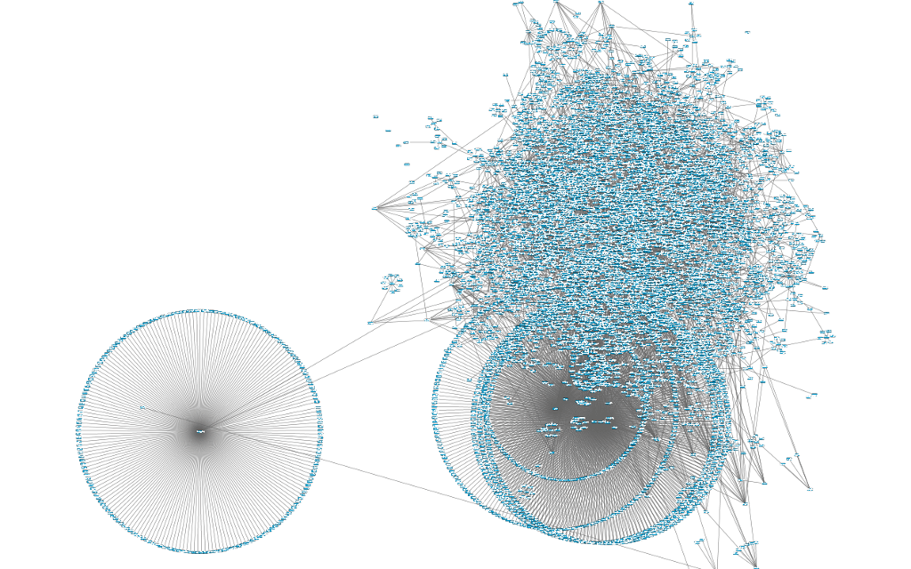

I have recently completed a small research project in which I need to check how many followers of a particular Twitter account are actual human and how many are bots. Bots are not always bad, some bots were built to be interesting and helpful. Nevertheless, there are also bots that spam you or simply do not interact with you in any healthy way. The following scripts get all the followers from a Twitter account and pass the relevant information to an online bot detector called `Botometer (formerly BotOrNot)` (click [here](https://botometer.iuni.iu.edu) for more information). It checks the activity of a Twitter account and gives it a score based on how likely the account is to be a bot. Higher scores are more bot-like. About 30% of the followers of the two accounts I have tested are bots or have some bot-like behaviours. Want to find about your account? Ok, here we go.

## Step 1: Get all the followers for your account

The following script does the trick. It utilizes the Twitter API(`tweepy`) and `MongoDB` (which needs to be set up separately). The script can also deal with Twitter API rate limit. Note that you will need Twitter API credentials.

```python
import tweepy
import time
import pymongo

#insert your Twitter keys here
consumer_key = ''
consumer_secret = ''
access_token = ''
access_token_secret = ''

auth = tweepy.auth.OAuthHandler(consumer_key, consumer_secret)
auth.set_access_token(access_token, access_token_secret)
api = tweepy.API(auth)

# configuring database
client = pymongo.MongoClient()
db = client.twitter_crawler
suspect_coll = db.suspects


if(api.verify_credentials):
    print 'We sucessfully logged in'

user = tweepy.Cursor(api.followers, screen_name="ACCOUNT_NAME").items()

while True:
    try:
        u = next(user)
        print "Registering user " + u.screen_name
        user_info = {}
        user_info["user_id"] = u.id
        user_info["screen_name"] = u.screen_name
        suspect_coll.update({'screen_name': u.screen_name}, user_info, upsert=True)

    except tweepy.error.TweepError as e:
      if 'Failed to send request:' in e.reason:
        print "Time out error caught."
        time.sleep(180)
      continue

if __name__ == '__main__':
  main()
```

## Step 2: Analyse Twitter followers using `BotOrNot`

Now you have all the follower information (IDs and screennames) stored in MongoDB. The next step is to get relevant information and pass it to the bot detector. Fortunately, `BotOrNot` also has a [Python API](https://github.com/truthy/botornot-python). Note that the logging class is not needed if you do not wish to run the code in IDE. You will also need Twitter API credentials.

```python
import os, time

import pymongo, termcolor
import tweepy,  botornot, requests

class Logging:
    flag = True

    @staticmethod
    def error(msg):
        if Logging.flag == True:
            print "".join(  [ termcolor.colored("ERROR", "red"), ": ",
                              termcolor.colored(msg, "white") ] )
    @staticmethod
    def warn(msg):
        if Logging.flag == True:
            print "".join(  [ termcolor.colored("WARN", "yellow"), ": ",
                              termcolor.colored(msg, "white") ] )
    @staticmethod
    def info(msg):
        # attrs=['reverse', 'blink']
        if Logging.flag == True:
            print "".join(  [ termcolor.colored("INFO", "magenta"), ": ",
                              termcolor.colored(msg, "white") ] )
    @staticmethod
    def debug(msg):
        if Logging.flag == True:
            print "".join(  [ termcolor.colored("DEBUG", "magenta"), ": ",
                              termcolor.colored(msg, "white") ] )
    @staticmethod
    def success(msg):
        if Logging.flag == True:
            print "".join(  [ termcolor.colored("SUCCES", "green"), ": ",
                              termcolor.colored(msg, "white") ] )

def read_account_from_config_file(config_file="credentials.ini"):
    # NOTE: The ConfigParser module has been renamed to configparser in Python 3.
    # The 2to3 tool will automatically adapt imports when converting your sources to Python 3.
    # https://docs.python.org/2/library/configparser.html
    from ConfigParser import ConfigParser
    cf = ConfigParser()
    if os.path.exists(config_file) and os.path.isfile(config_file):
        Logging.info(u"loading Twitter API credentials from %s..." % config_file)
        cf.read(config_file)

        CONSUMER_KEY = cf.get("consumer", "CONSUMER_KEY")
        CONSUMER_SECRET = cf.get("consumer", "CONSUMER_SECRET")
        OAUTH_TOKEN = cf.get("oauth", "OAUTH_TOKEN")
        OAUTH_TOKEN_SECRET = cf.get("oauth", "OAUTH_TOKEN_SECRET")
        if CONSUMER_KEY == "" or CONSUMER_SECRET == "" \
                or OAUTH_TOKEN == "" or OAUTH_TOKEN_SECRET == "":
            Logging.warn(u"missing critical information!")
            return {'consumer_key': None, 'consumer_secret': None,
                    'access_token': None, 'access_token_secret': None}
        else:
            return {'consumer_key': CONSUMER_KEY, 'consumer_secret': CONSUMER_SECRET,
                    'access_token': OAUTH_TOKEN, 'access_token_secret': OAUTH_TOKEN_SECRET}
    else:
        Logging.error(u"failed to load the ")
        return {'consumer_key': None, 'consumer_secret': None,
                'access_token': None, 'access_token_secret': None}

def get_element_from_coll(collection, element_name):
    cursor = collection.find()
    element_list = []
    for document in cursor:
        element_list.append(document[element_name])
    return element_list

def is_user_in_db(coll, screen_name):
    return coll.find_one({'screen_name': screen_name}) is not None
    #return True

def main():
    # configuring database
    client = pymongo.MongoClient()
    db = client.twitter_crawler
    suspect_coll = db.suspects
    result_coll = db.bot_results

    # configuring bot checker
    twitter_app_auth = read_account_from_config_file()
    bon = botornot.BotOrNot(**twitter_app_auth)


    #suspect_screen_names = ["marley_cruzz"]
    suspect_screen_names = get_element_from_coll(suspect_coll, "screen_name")
    print 'Start processing'
    for suspect_screen_name in suspect_screen_names:

        if is_user_in_db(result_coll, suspect_screen_name) is not True:

            print 'Processing user : {}'.format(suspect_screen_name)
            user_info = {}
            user_info["screen_name"] = suspect_screen_name
            at_screen_name = "@" + suspect_screen_name
            while True:
                try:
                    result = bon.check_account(at_screen_name)
                    try:
                        user_info["user_id"] = result["meta"]["user_id"]
                        user_info["bot_score"] = result["score"]
                        user_info["content_classification"] = result["categories"]["content_classification"]
                        user_info["content_classification"] = result["categories"]["content_classification"]
                        user_info["friend_classification"] = result["categories"]["friend_classification"]
                        user_info["network_classification"] = result["categories"]["network_classification"]
                        user_info["sentiment_classification"] = result["categories"]["sentiment_classification"]
                        user_info["temporal_classification"] = result["categories"]["temporal_classification"]
                        user_info["user_classification"] = result["categories"]["user_classification"]
                        user_info["check_status"] = "success"

                        try:
                            result_coll.update({'screen_name': user_info['screen_name']}, user_info, True)
                        except (KeyboardInterrupt, SystemExit):
                            raise
                        except:
                            Logging.error(u"Failed to add %s check results to database!" % suspect_screen_name)
                            raise

                    except (KeyboardInterrupt, SystemExit):
                        raise
                    except:
                        Logging.warn(u"Bot check for %s was failed!" % suspect_screen_name)
                        pass

                except tweepy.RateLimitError:
                    # hit rate limit, sleep for 15 minutes
                    Logging.info(u"Rate limited. Sleeping for 15 minutes")
                    time.sleep(15 * 60 + 15)
                    continue

                except tweepy.TweepError as e:
                    Logging.warn(u"Unable to access %s account info (possibly deleted)"
                                 u", moving on!" % suspect_screen_name)
                    print "Details:", e
                    #user_info["check_status"] = "deleted"
                    #result_coll.update({'screen_name': user_info['screen_name']}, user_info, True)
                    break


                except requests.HTTPError:
                    Logging.warn(u"BotOrNot site HTTP error!")
                    user_info["check_status"] = "not enough info"
                    result_coll.update({'screen_name': user_info['screen_name']}, user_info, True)
                    break

                break
        else:
            print "User %s has already been processed, continue to next in the list." % suspect_screen_name


if __name__ == '__main__':
  main()
```

Some Twitter bots also have a unique signature in their networks. For example, networks of bots tend to have a less 'organic' structure and feel more artificial. Below is a Twitter followers network graph containing a large number of bots made by [Terence Eden](https://shkspr.mobi/blog/copyright-terence-eden/). Check [this post](https://shkspr.mobi/blog/2015/03/this-is-what-a-graph-of-8000-fake-twitter-accounts-looks-like/) for some interesting analysis of this pattern.


